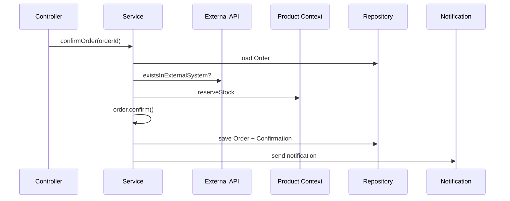

# Domain-Driven Design Architektur-Vergleich

Ein praktisches Lernprojekt, das **dieselbe Business-Domain** in vier verschiedenen Architekturstilen implementiert.

## Projektziel

Dieses Repository zeigt, wie **identische Use Cases** in unterschiedlichen Architekturmustern umgesetzt werden:

| Architektur | Ordner | Schwerpunkt |
|-------------|--------|-------------|
| **Layered** | `/layered` | Klassische Schichten: Presentation → Service → Repository → Model |
| **Onion** | `/onion` | Konzentrische Schichten, Abhängigkeiten zeigen nach innen |
| **Hexagonal** | `/hexagonal` | Input/Output Ports, austauschbare Adapter |
| **Clean** | `/clean` | Strikte Trennung: Entity → Use Case → Interface Adapter → Framework |

→ Für Vergleich und Einordnung siehe [tutorialOverview.md](tutorialOverview.md)

## Die Business-Domain

Ein einfaches **Bestellsystem** mit zwei Bounded Contexts:

```
┌─────────────────────────────────────────────────────────────────┐
│                        ORDER CONTEXT                            │
│  ┌──────────┐    ┌─────────────┐    ┌──────────────────────┐   │
│  │  Order   │───▶│  OrderItem  │───▶│  ProductId (eigene!) │   │
│  │(Aggregate│    └─────────────┘    └──────────────────────┘   │
│  │  Root)   │                              │                    │
│  └──────────┘                              │ Anti-Corruption    │
│       │                                    │ Layer              │
│       ▼                                    ▼                    │
│  ┌──────────────────┐              ┌───────────────┐           │
│  │ OrderConfirmation│              │ ProductInfo   │           │
│  └──────────────────┘              │ (read-only)   │           │
└────────────────────────────────────┴───────────────┴───────────┘
                                            │
                                            ▼
┌─────────────────────────────────────────────────────────────────┐
│                       PRODUCT CONTEXT                           │
│  ┌───────────┐                                                  │
│  │  Product  │ ← Lagerbestand, Preis, Hersteller               │
│  └───────────┘                                                  │
└─────────────────────────────────────────────────────────────────┘
```

## Implementierte Use Cases

Alle vier Architekturen implementieren dieselben Use Cases:

1. **GetOrder** - Order abrufen
2. **UpdateOrder** - Order aktualisieren
3. **ConfirmOrder** - Order bestätigen (komplexester Flow)



## Ordnerstruktur

```
ddd/
├── layered/                        # Layered Architecture
│   └── order/
│       ├── model/                  # Entities, Value Objects
│       ├── service/                # Business Logic
│       ├── repository/             # Datenzugriff (konkret!)
│       └── presentation/           # Controller
│
├── onion/                          # Onion Architecture
│   └── order/
│       ├── core/                   # Entities, Value Objects
│       ├── domainservices/         # Domain Services
│       ├── application/            # Use Cases, Interfaces
│       └── infrastructure/         # Implementierungen
│
├── hexagonal/                      # Hexagonal Architecture
│   └── order/
│       ├── domain/                 # Entities, Value Objects
│       ├── application/            # Ports, DTOs, Service
│       └── adapter/                # Input & Output Adapters
│
└── clean/                          # Clean Architecture
    └── order/
        ├── entity/                 # Entities, Value Objects
        ├── usecase/                # Interactors, Boundaries
        ├── interfaceadapter/       # Controller, Gateways
        └── framework/              # External Frameworks
```

## Technologie-Stack

- **Java 17+** (Records für Value Objects)
- **Keine Frameworks** - bewusst ohne Spring, um Architektur-Konzepte klar zu zeigen
- **In-Memory Repositories** - Fokus auf Architektur, nicht Persistenz

## Hinweise

- **Nicht ausführbar**: Lern-/Demonstrationsprojekt, kein lauffähiges System
- **Vereinfacht**: Echte Systeme hätten mehr Validierung, Error Handling, Transaktionen

---

## Tutorials

| Tutorial | Thema |
|----------|-------|
| [tutorialOverview.md](tutorialOverview.md) | **Gesamtüberblick:** Was gehört zusammen? SOLID, Übergänge, Entscheidungshilfen |
| [tutorialDDD.md](tutorialDDD.md) | **DDD-Begriffe:** Entity, Value Object, Aggregate, Bounded Context |
| [tutorialOnion.md](tutorialOnion.md) | Von Layered zu Onion - Schritt für Schritt |
| [tutorialHexagonal.md](tutorialHexagonal.md) | Hexagonal Architecture - Ports & Adapters |
| [tutorialRichVsAnemic.md](tutorialRichVsAnemic.md) | Rich vs Anemic Domain Model |
| [tutorialPackaging.md](tutorialPackaging.md) | Package-Strategien |

## Weiterführende Ressourcen

- [Domain-Driven Design](https://www.domainlanguage.com/ddd/) - Eric Evans
- [Clean Architecture](https://blog.cleancoder.com/uncle-bob/2012/08/13/the-clean-architecture.html) - Robert C. Martin
- [Hexagonal Architecture](https://alistair.cockburn.us/hexagonal-architecture/) - Alistair Cockburn
- [Onion Architecture](https://jeffreypalermo.com/2008/07/the-onion-architecture-part-1/) - Jeffrey Palermo
