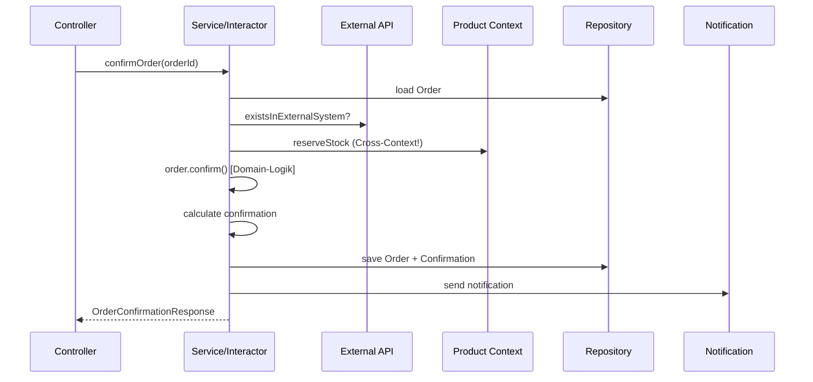

# Domain-Driven Design Architektur-Vergleich

Ein praktisches Lernprojekt, das **dieselbe Business-Domain** in vier verschiedenen Architekturstilen implementiert. Generiert mit AI, um DDD-Konzepte anhand konkreter Code-Beispiele zu demonstrieren.

## Projektziel

Dieses Repository zeigt, wie **identische Use Cases** in unterschiedlichen Architekturmustern umgesetzt werden können:

| Architektur | Ordner | Schwerpunkt |
|-------------|--------|-------------|
| **Clean Architecture** | `/clean` | Strikte Trennung: Entity → Use Case → Interface Adapter → Framework |
| **Hexagonal (Ports & Adapters)** | `/hexagonal` | Input/Output Ports, austauschbare Adapter |
| **Onion Architecture** | `/onion` | Konzentrische Schichten, Abhängigkeiten zeigen nach innen |
| **Layered Architecture** | `/layered` | Klassische Schichten: Presentation → Service → Repository → Model |

## Die Business-Domain

Das Projekt modelliert ein einfaches **Bestellsystem** mit zwei Bounded Contexts:

### Order Context
- Bestellungen erstellen und verwalten
- Bestellpositionen hinzufügen/entfernen
- Bestellungen bestätigen (mit Lagerbuchung)
- Bestätigungen per E-Mail versenden

### Product Context
- Produktkatalog verwalten
- Lagerbestand prüfen und reservieren
- Produktinformationen bereitstellen

```
┌─────────────────────────────────────────────────────────────────┐
│                        ORDER CONTEXT                            │
│  ┌──────────┐    ┌─────────────┐    ┌──────────────────────┐   │
│  │  Order   │───▶│  OrderItem  │───▶│  ProductId (eigene!) │   │
│  │(Aggregate│    └─────────────┘    └──────────────────────┘   │
│  │  Root)   │                              │                    │
│  └──────────┘                              │ Anti-Corruption    │
│       │                                    │ Layer              │
│       ▼                                    ▼                    │
│  ┌──────────────────┐              ┌───────────────┐           │
│  │ OrderConfirmation│              │ ProductInfo   │           │
│  └──────────────────┘              │ (read-only)   │           │
└────────────────────────────────────┴───────────────┴───────────┘
                                            │
                                            ▼
┌─────────────────────────────────────────────────────────────────┐
│                       PRODUCT CONTEXT                           │
│  ┌───────────┐                                                  │
│  │  Product  │ ← Lagerbestand, Preis, Hersteller               │
│  └───────────┘                                                  │
└─────────────────────────────────────────────────────────────────┘
```

## Implementierte Use Cases

Alle vier Architekturen implementieren dieselben Use Cases:

### 1. Order abrufen (`GetOrder`)
```
Controller → Service/Interactor → Repository → Domain
```

### 2. Order aktualisieren (`UpdateOrder`)
```
Controller → Service/Interactor → Domain-Logik → Repository
```

### 3. Order bestätigen (`ConfirmOrder`) - Der komplexeste Flow


## DDD-Konzepte im Code

### Value Objects
Immutable Objekte mit Wert-Semantik und Validierung:

```java
// Selbstvalidierende Value Objects
public class Money {
    private final BigDecimal amount;

    public Money(BigDecimal amount) {
        if (amount == null)
            throw new IllegalArgumentException("Money amount cannot be null");
        this.amount = amount.setScale(2, RoundingMode.HALF_UP);
    }

    public Money add(Money other) {
        return new Money(this.amount.add(other.amount));
    }
}
```

Weitere Value Objects: `OrderId`, `CustomerId`, `ProductId`, `Quantity`, `Price`, `ProductName`

### Aggregate Root
`Order` ist das Aggregate Root - alle Änderungen an `OrderItem`s laufen über die Order:

```java
public class Order {
    // Geschäftsregeln sind IN der Entity
    public void confirm() {
        ensureModifiable();
        if (items.isEmpty()) {
            throw new EmptyOrderException(id);
        }
        this.status = OrderStatus.CONFIRMED;
    }

    private void ensureModifiable() {
        if (status == OrderStatus.CONFIRMED) {
            throw new OrderAlreadyConfirmedException(id);
        }
    }
}
```

### Anti-Corruption Layer
Jeder Bounded Context hat seine **eigene `ProductId`**:

```java
// Im Order-Context
package order.domain.model;
public record ProductId(Long value) { }

// Im Product-Context
package product.domain.model;
public record ProductId(Long value) { }
```

Die Konvertierung erfolgt explizit an den Context-Grenzen.

### Domain Services
Logik, die nicht in eine einzelne Entity passt:

```java
public class OrderConfirmationCalculator {
    public OrderConfirmation calculate(Order order) {
        Money total = order.calculateTotal();
        Money tax = calculateTax(total);
        // ...
        return new OrderConfirmation(...);
    }
}
```

## Architektur-Vergleich

### Abhängigkeitsrichtung

```
LAYERED (Top-Down)          ONION/HEXAGONAL/CLEAN (Inside-Out)
┌─────────────────┐         ┌─────────────────────────────────┐
│  Presentation   │         │  Infrastructure (außen)         │
│       ↓         │         │         ↓                       │
│    Service      │         │    Application                  │
│       ↓         │         │         ↓                       │
│   Repository    │         │      Domain (Kern)              │
│       ↓         │         │                                 │
│     Model       │         │  (Abhängigkeiten zeigen         │
└─────────────────┘         │   immer nach INNEN!)            │
                            └─────────────────────────────────┘
```

### Detailvergleich

| Aspekt | Clean | Hexagonal | Onion | Layered |
|--------|-------|-----------|-------|---------|
| **Repository** | Gateway Interface | Output Port | Interface in Application | Konkrete Klasse |
| **Controller** | Interface Adapter | Primary Adapter | Infrastructure | Presentation Layer |
| **Use Cases** | Interactor Klassen | Input Ports + Service | Application Service | Service Layer |
| **Externe Services** | Gateway Interface | Output Port | Service Interface | Direkte Abhängigkeit |
| **Testbarkeit** | Sehr hoch | Sehr hoch | Hoch | Mittel |
| **Boilerplate** | Hoch | Hoch | Mittel | Niedrig |
| **Komplexität** | Hoch | Hoch | Mittel | Niedrig |
| **Flexibilität** | Sehr hoch | Sehr hoch | Hoch | Niedrig |

### Cross-Module Kommunikation

**Layered** - Direkte Abhängigkeit:
```java
// OrderService greift DIREKT auf ProductRepository zu
private final product.repository.ProductRepository productRepository;

// Und ruft Domain-Logik direkt auf
product.reserveStock(quantity);
productRepository.save(product);
```

**Clean/Hexagonal/Onion** - Über Use Cases/Ports:
```java
// Nutzt Product's Use Case Interface
private final ReserveStockUseCase reserveStockUseCase;

// Kein direkter Zugriff auf Repository oder Entity
reserveStockUseCase.reserveStock(productId, quantity);
```

## Ordnerstruktur

```
ddd/
├── clean/                          # Clean Architecture
│   └── src/main/java/
│       ├── order/
│       │   ├── entity/             # Entities & Value Objects
│       │   ├── usecase/            # Interactors & Boundaries
│       │   ├── interfaceadapter/   # Controller, Presenter, Gateways
│       │   └── framework/          # External Frameworks, Config
│       └── product/
│
├── hexagonal/                      # Hexagonal Architecture
│   └── src/main/java/
│       ├── order/
│       │   ├── domain/             # Entities, Value Objects, Domain Services
│       │   ├── application/        # Ports (input/output), DTOs, Service
│       │   └── adapter/            # Input (REST) & Output (DB, Email) Adapters
│       └── product/
│
├── onion/                          # Onion Architecture
│   └── src/main/java/
│       ├── order/
│       │   ├── core/               # Innerster Kern: Entities, Value Objects
│       │   ├── domainservices/     # Domain Services
│       │   ├── application/        # Use Cases, Interfaces, DTOs
│       │   └── infrastructure/     # Implementierungen, Web, DB
│       └── product/
│
└── layered/                        # Layered Architecture
    └── src/main/java/
        ├── order/
        │   ├── model/              # Entities, Value Objects
        │   ├── dto/                # Data Transfer Objects
        │   ├── repository/         # Datenzugriff (konkrete Klassen!)
        │   ├── service/            # Business Logic
        │   ├── presentation/       # Controller
        │   └── config/             # Konfiguration
        └── product/
```

## Wann welche Architektur?

| Szenario | Empfehlung |
|----------|------------|
| Startup/MVP, schnelle Iteration | **Layered** |
| Kleine Teams, wenig DDD-Erfahrung | **Layered** |
| Komplexe Business-Logik | **Clean** oder **Hexagonal** |
| Viele externe Integrationen | **Hexagonal** |
| Langlebiges Enterprise-System | **Clean**, **Hexagonal** oder **Onion** |
| Microservices | **Hexagonal** |
| Hohe Testanforderungen | **Clean**, **Hexagonal** oder **Onion** |

## Technologie-Stack

- **Java 17+** (Records für Value Objects)
- **Maven** (Multi-Module Build)
- **Keine Frameworks** - bewusst ohne Spring, um Architektur-Konzepte klar zu zeigen
- **In-Memory Repositories** - Fokus auf Architektur, nicht Persistenz

## Hinweise

- **Nicht ausführbar**: Dies ist ein Lern-/Demonstrationsprojekt, kein lauffähiges System
- **AI-generiert**: Der Code wurde mit AI erstellt, um DDD-Konzepte zu demonstrieren
- **Vereinfacht**: Echte Systeme hätten mehr Validierung, Error Handling, Transaktionen, etc.

## Weiterführende Ressourcen

- [Domain-Driven Design](https://www.domainlanguage.com/ddd/) - Eric Evans
- [Clean Architecture](https://blog.cleancoder.com/uncle-bob/2012/08/13/the-clean-architecture.html) - Robert C. Martin
- [Hexagonal Architecture](https://alistair.cockburn.us/hexagonal-architecture/) - Alistair Cockburn
- [Onion Architecture](https://jeffreypalermo.com/2008/07/the-onion-architecture-part-1/) - Jeffrey Palermo
