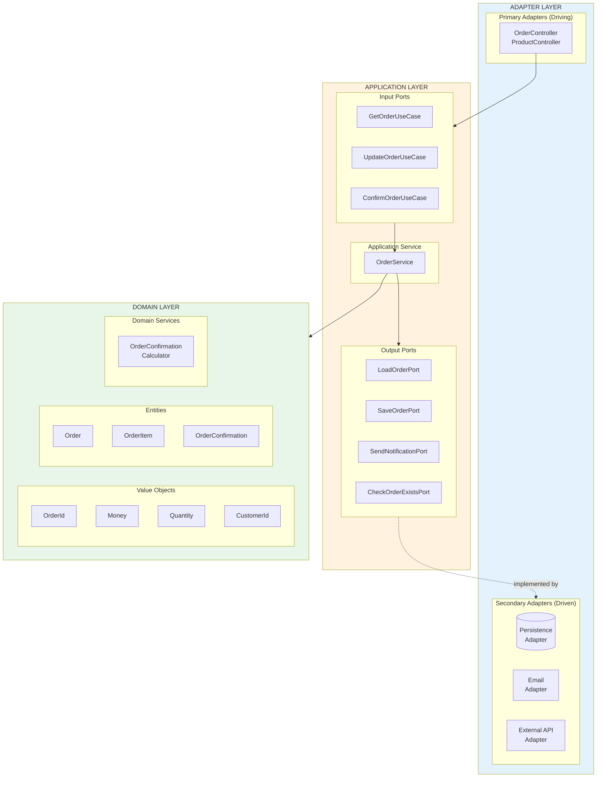
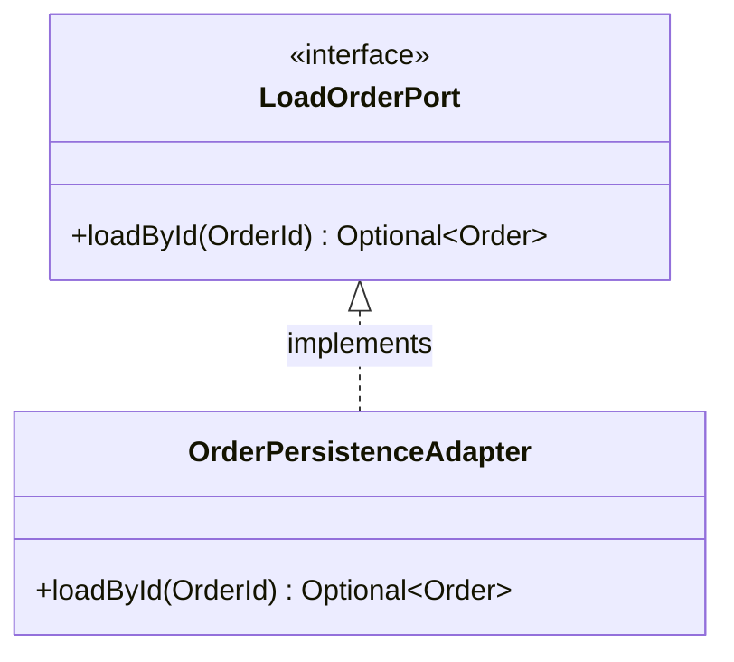
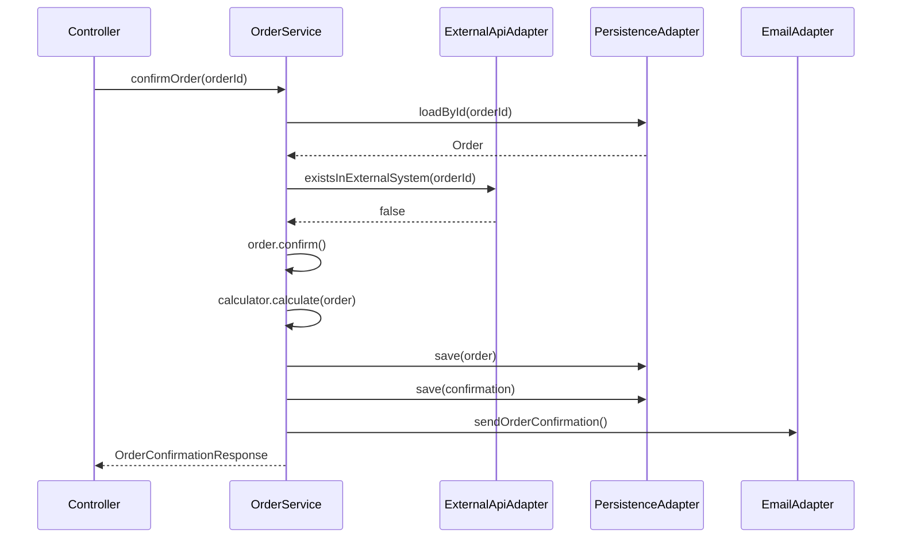

# Hexagonal Architecture (Ports & Adapters)

## Konzept

Die Hexagonale Architektur trennt die Anwendung in drei Bereiche:
- **Domain**: Geschäftslogik, Value Objects, Entities
- **Application**: Use Cases, Ports (Interfaces)
- **Adapter**: Implementierungen für I/O (REST, DB, Email, etc.)

## Architektur-Diagramm



## Dateistruktur

```
hexagonal/
├── src/main/java/
│   ├── order/                              # ORDER BOUNDED CONTEXT
│   │   ├── domain/
│   │   │   ├── model/
│   │   │   │   ├── OrderId.java            # Value Object
│   │   │   │   ├── CustomerId.java
│   │   │   │   ├── ProductId.java          # Anti-Corruption Layer
│   │   │   │   ├── Money.java
│   │   │   │   ├── Quantity.java
│   │   │   │   ├── OrderStatus.java
│   │   │   │   ├── Order.java              # Aggregate Root
│   │   │   │   ├── OrderItem.java
│   │   │   │   └── OrderConfirmation.java
│   │   │   ├── exception/
│   │   │   │   ├── OrderNotFoundException.java
│   │   │   │   └── OrderAlreadyExistsException.java
│   │   │   └── service/
│   │   │       └── OrderConfirmationCalculator.java
│   │   ├── application/
│   │   │   ├── port/
│   │   │   │   ├── input/
│   │   │   │   │   ├── GetOrderUseCase.java
│   │   │   │   │   ├── UpdateOrderUseCase.java
│   │   │   │   │   └── ConfirmOrderUseCase.java
│   │   │   │   └── output/
│   │   │   │       ├── LoadOrderPort.java
│   │   │   │       ├── SaveOrderPort.java
│   │   │   │       ├── SaveConfirmationPort.java
│   │   │   │       ├── SendNotificationPort.java
│   │   │   │       └── CheckOrderExistsPort.java
│   │   │   ├── dto/
│   │   │   │   ├── OrderItemRequest.java
│   │   │   │   ├── UpdateOrderCommand.java
│   │   │   │   ├── OrderResponse.java
│   │   │   │   ├── OrderItemResponse.java
│   │   │   │   └── OrderConfirmationResponse.java
│   │   │   ├── mapper/
│   │   │   │   └── OrderMapper.java
│   │   │   └── service/
│   │   │       └── OrderService.java
│   │   └── adapter/
│   │       ├── input/rest/
│   │       │   └── OrderController.java
│   │       ├── output/
│   │       │   ├── persistence/
│   │       │   │   ├── OrderPersistenceAdapter.java
│   │       │   │   └── ConfirmationPersistenceAdapter.java
│   │       │   ├── notification/
│   │       │   │   └── EmailNotificationAdapter.java
│   │       │   └── external/
│   │       │       └── ExternalOrderApiAdapter.java
│   │       └── config/
│   │           └── OrderConfiguration.java
│   │
│   └── product/                            # PRODUCT BOUNDED CONTEXT
│       ├── domain/model/
│       ├── application/
│       └── adapter/
│
└── pom.xml
```

## Senior-Level Patterns

### Value Objects
```java
public record OrderId(Long value) {
    public OrderId {
        Objects.requireNonNull(value);
        if (value <= 0) throw new IllegalArgumentException();
    }
    public static OrderId of(Long value) { return new OrderId(value); }
}
```

### Ports & Adapters


### Anti-Corruption Layer
- `ProductId` ist im Order-Modul definiert
- Kein Import aus dem Product-Modul
- Bounded Contexts bleiben entkoppelt

## Ablauf: Order bestätigen



## Vorteile

- **Testbar**: Ports können gemockt werden
- **Flexibel**: Adapter austauschbar (DB → In-Memory, SMTP → SendGrid)
- **Clean Dependencies**: Domain hat keine externen Abhängigkeiten
- **Use Case fokussiert**: Jeder Port = ein Use Case
