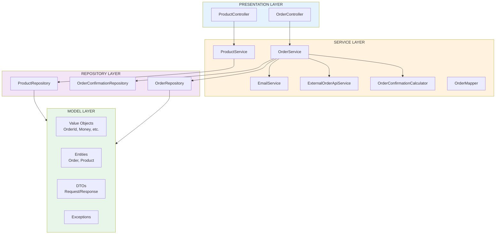
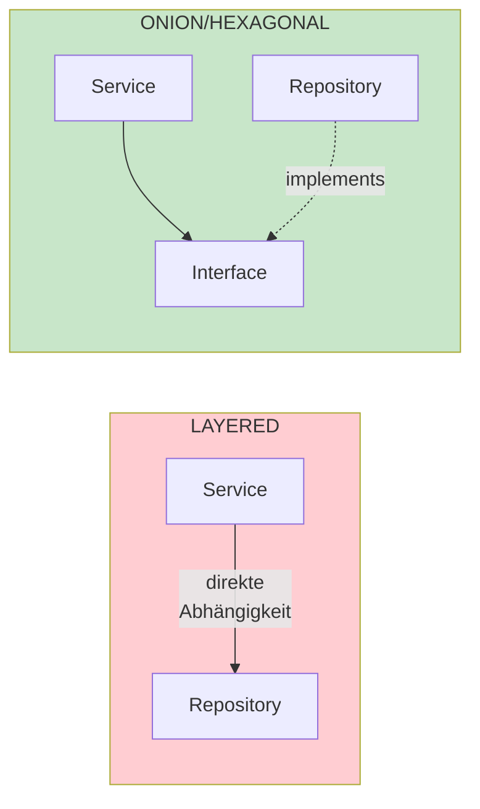
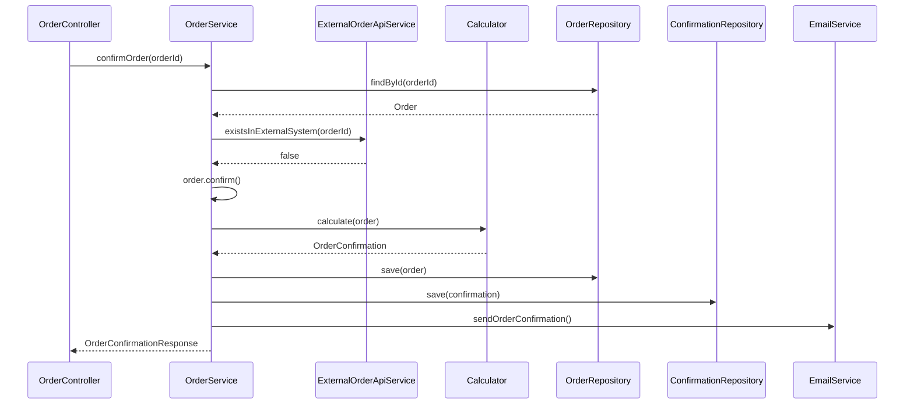

# Layered Architecture

## Konzept

Die Layered (Schichten) Architektur ist der klassische Ansatz:
- **Presentation Layer**: Controller, API-Endpunkte
- **Service Layer**: Geschäftslogik
- **Repository Layer**: Datenzugriff
- **Model Layer**: Entities, Value Objects, DTOs

**Regel**: Abhängigkeiten fließen von oben nach unten.

## Architektur-Diagramm



## Dateistruktur

```
layered/
├── src/main/java/
│   ├── order/                              # ORDER BOUNDED CONTEXT
│   │   ├── model/                          # MODEL LAYER
│   │   │   ├── OrderId.java
│   │   │   ├── CustomerId.java
│   │   │   ├── ProductId.java
│   │   │   ├── Money.java
│   │   │   ├── Quantity.java
│   │   │   ├── OrderStatus.java
│   │   │   ├── Order.java
│   │   │   ├── OrderItem.java
│   │   │   └── OrderConfirmation.java
│   │   ├── exception/
│   │   │   ├── OrderNotFoundException.java
│   │   │   └── OrderAlreadyExistsException.java
│   │   ├── dto/                            # DTOs
│   │   │   ├── OrderItemRequest.java
│   │   │   ├── UpdateOrderRequest.java
│   │   │   ├── OrderResponse.java
│   │   │   ├── OrderItemResponse.java
│   │   │   └── OrderConfirmationResponse.java
│   │   ├── repository/                     # REPOSITORY LAYER
│   │   │   ├── OrderRepository.java        # Konkrete Klasse!
│   │   │   └── OrderConfirmationRepository.java
│   │   ├── service/                        # SERVICE LAYER
│   │   │   ├── OrderService.java
│   │   │   ├── EmailService.java
│   │   │   ├── ExternalOrderApiService.java
│   │   │   ├── OrderConfirmationCalculator.java
│   │   │   └── OrderMapper.java
│   │   ├── presentation/                   # PRESENTATION LAYER
│   │   │   └── OrderController.java
│   │   └── config/
│   │       └── OrderConfiguration.java
│   │
│   └── product/                            # PRODUCT BOUNDED CONTEXT
│       ├── model/
│       ├── dto/
│       ├── repository/
│       ├── service/
│       ├── presentation/
│       └── config/
│
└── pom.xml
```

## Unterschied zu Onion/Hexagonal



| Aspekt | Layered | Onion/Hexagonal |
|--------|---------|-----------------|
| Repository | Konkrete Klasse | Interface + Impl |
| Abhängigkeiten | Direkt | Via Interfaces |
| Testbarkeit | Schwieriger | Einfacher (Mocking) |
| Komplexität | Einfacher | Aufwändiger |
| Flexibilität | Geringer | Höher |

## Senior-Level Patterns

### Value Objects (auch hier sinnvoll!)
```java
public record Money(BigDecimal amount) {
    public Money {
        Objects.requireNonNull(amount);
        if (amount.compareTo(BigDecimal.ZERO) < 0)
            throw new IllegalArgumentException();
    }
    public Money add(Money other) {
        return new Money(this.amount.add(other.amount));
    }
}
```

### DTOs für API-Grenzen
```java
public record OrderResponse(
    Long id,
    String customerId,
    String status,
    List<OrderItemResponse> items,
    BigDecimal totalAmount
) {}
```

### Mapper für Domain ↔ DTO
```java
public class OrderMapper {
    public OrderResponse toResponse(Order order) { ... }
    public List<OrderItem> toDomainItems(List<OrderItemRequest> requests) { ... }
}
```

## Ablauf: Order bestätigen



## Vorteile

- **Einfach**: Klassische, bekannte Struktur
- **Wenig Boilerplate**: Keine Interface-Schichten nötig
- **Schnell umzusetzen**: Geringerer initialer Aufwand
- **Direkter Code-Fluss**: Leicht nachvollziehbar

## Nachteile

- **Gekoppelt**: Services direkt an Implementierungen gebunden
- **Schwerer testbar**: Mocking ohne Interfaces komplizierter
- **Weniger flexibel**: Austausch von Komponenten aufwändiger

## Wann Layered verwenden?

- Kleinere Projekte
- Prototypen / MVPs
- Teams mit wenig DDD-Erfahrung
- Wenn Einfachheit wichtiger als Flexibilität ist
