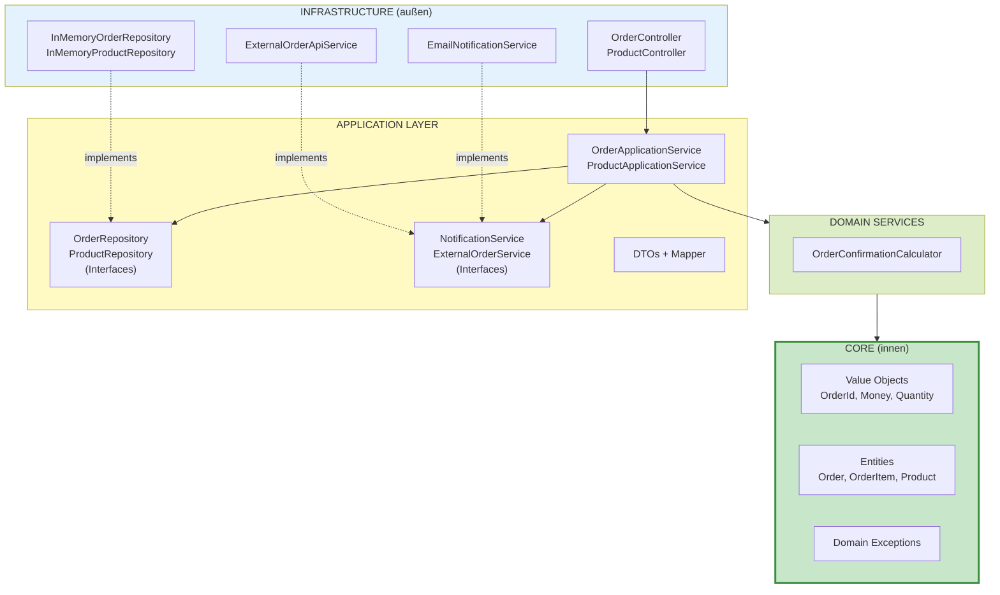
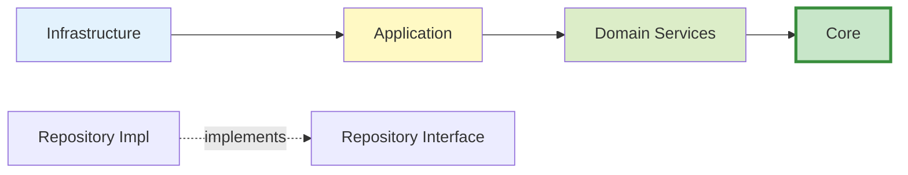
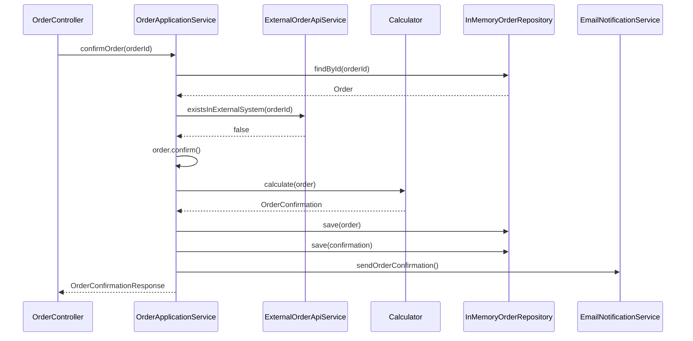

# Onion Architecture

## Konzept

Die Onion Architecture organisiert Code in konzentrischen Schichten:
- **Core (innen)**: Domain Entities, Value Objects
- **Domain Services**: Geschäftslogik
- **Application**: Use Cases, Repository-Interfaces
- **Infrastructure (außen)**: Implementierungen, Web, DB

**Regel**: Abhängigkeiten zeigen immer nach INNEN zum Kern.

## Architektur-Diagramm



## Dateistruktur

```
onion/
├── src/main/java/
│   ├── order/                              # ORDER BOUNDED CONTEXT
│   │   ├── core/                           # INNERSTER KERN
│   │   │   ├── model/
│   │   │   │   ├── OrderId.java
│   │   │   │   ├── CustomerId.java
│   │   │   │   ├── ProductId.java          # Anti-Corruption Layer
│   │   │   │   ├── Money.java
│   │   │   │   ├── Quantity.java
│   │   │   │   ├── OrderStatus.java
│   │   │   │   ├── Order.java
│   │   │   │   ├── OrderItem.java
│   │   │   │   └── OrderConfirmation.java
│   │   │   └── exception/
│   │   │       ├── OrderNotFoundException.java
│   │   │       └── OrderAlreadyExistsException.java
│   │   │
│   │   ├── domainservices/                 # DOMAIN SERVICES
│   │   │   └── OrderConfirmationCalculator.java
│   │   │
│   │   ├── application/                    # APPLICATION LAYER
│   │   │   ├── repository/
│   │   │   │   ├── OrderRepository.java          # Interface!
│   │   │   │   └── OrderConfirmationRepository.java
│   │   │   ├── service/
│   │   │   │   ├── NotificationService.java      # Interface!
│   │   │   │   └── ExternalOrderService.java     # Interface!
│   │   │   ├── dto/
│   │   │   │   ├── OrderItemRequest.java
│   │   │   │   ├── UpdateOrderCommand.java
│   │   │   │   ├── OrderResponse.java
│   │   │   │   ├── OrderItemResponse.java
│   │   │   │   └── OrderConfirmationResponse.java
│   │   │   ├── mapper/
│   │   │   │   └── OrderMapper.java
│   │   │   └── OrderApplicationService.java
│   │   │
│   │   └── infrastructure/                 # ÄUSSERSTE SCHICHT
│   │       ├── persistence/
│   │       │   ├── InMemoryOrderRepository.java
│   │       │   └── InMemoryOrderConfirmationRepository.java
│   │       ├── notification/
│   │       │   └── EmailNotificationService.java
│   │       ├── external/
│   │       │   └── ExternalOrderApiService.java
│   │       ├── web/
│   │       │   └── OrderController.java
│   │       └── config/
│   │           └── OrderModuleConfiguration.java
│   │
│   └── product/                            # PRODUCT BOUNDED CONTEXT
│       ├── core/model/
│       ├── application/
│       └── infrastructure/
│
└── pom.xml
```

## Schichten-Regel



**Wichtig**: Interfaces sind in inneren Schichten definiert, Implementierungen in äußeren.

## Unterschied zu Hexagonal

| Aspekt | Onion | Hexagonal |
|--------|-------|-----------|
| Struktur | Konzentrische Schichten | Ports & Adapters |
| Interfaces | In Application Layer | Explizite Ports |
| Fokus | Abhängigkeitsrichtung | Use Cases |
| Controller | Teil von Infrastructure | Primary Adapter |

## Senior-Level Patterns

### Repository Interface (Application Layer)
```java
public interface OrderRepository {
    Optional<Order> findById(OrderId orderId);
    Order save(Order order);
}
```

### Repository Implementation (Infrastructure)
```java
public class InMemoryOrderRepository implements OrderRepository {
    // Implementierung
}
```

## Ablauf: Order bestätigen



## Vorteile

- **Testbar**: Interfaces erlauben einfaches Mocking
- **Domain bleibt rein**: Keine Framework-Abhängigkeiten im Kern
- **Klare Abhängigkeitsrichtung**: Immer nach innen
- **Austauschbar**: Infrastructure-Komponenten leicht ersetzbar
