# Von Layered zu Hexagonal Architecture - Ein Tutorial

Dieses Tutorial erklärt **Hexagonal Architecture (Ports & Adapters)** Schritt für Schritt, ausgehend von der bekannten **Layered Architecture**. Am Ende wirst du verstehen, warum Hexagonal existiert und wie du es anwendest.

---

## Wichtig vorab: Was dieses Tutorial zeigt (und was nicht)

### Was wir vergleichen

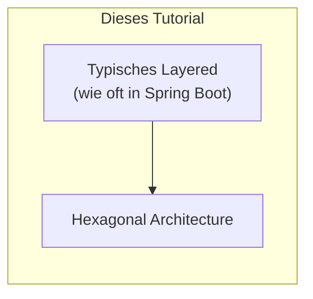

### Was du wissen solltest

| Aussage | Erklärung |
|---------|-----------|
| **Layered ≠ schlecht** | Layered Architecture ist valide und kann sauber umgesetzt werden |
| **Layered kann Interfaces haben** | Man KANN in Layered Interfaces nutzen - viele tun es nur nicht |
| **Hexagonal/Onion/Clean sind verwandt** | Alle basieren auf dem gleichen Prinzip: **Dependency Inversion** |
| **Der echte Unterschied** | Nicht "Interface vs. keine Interface", sondern **wohin zeigen die Abhängigkeiten?** |

### Hexagonal vs Onion vs Clean

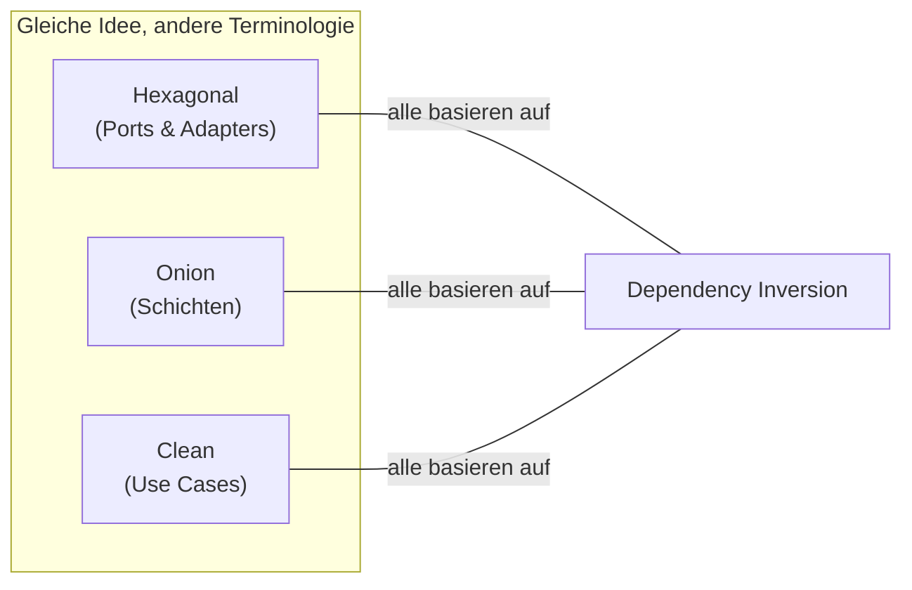

| Architektur | Fokus | Terminologie |
|-------------|-------|--------------|
| **Hexagonal** | Ports nach außen, Adapter implementieren | Ports, Adapters, Primary/Secondary |
| **Onion** | Konzentrische Schichten | Core, Domain Services, Application, Infrastructure |
| **Clean** | Use Cases explizit | Entity, Use Case, Interface Adapter, Framework |

> **Merke:** Der Kern-Unterschied zwischen Layered und Hexagonal ist nicht "Interfaces ja/nein",
> sondern **wer definiert die Interfaces** und **in welche Richtung zeigen Abhängigkeiten**.

---

## Inhaltsverzeichnis

0. [Das Demo-Szenario](#0-das-demo-szenario)
1. [Ausgangspunkt: Layered Architecture](#1-ausgangspunkt-layered-architecture)
2. [Häufige Probleme in typischem Layered](#2-häufige-probleme-in-typischem-layered)
3. [Die Kernidee von Hexagonal](#3-die-kernidee-von-hexagonal)
4. [Schicht für Schicht: Der Umbau](#4-schicht-für-schicht-der-umbau)
5. [Code-Vergleich: Vorher/Nachher](#5-code-vergleich-vorhernachher)
6. [Die Dependency Rule](#6-die-dependency-rule)
7. [Praktisches Beispiel: Order bestätigen](#7-praktisches-beispiel-order-bestätigen)
8. [Zusammenfassung](#8-zusammenfassung)
9. [Wie Hexagonal die Probleme löst](#9-wie-hexagonal-die-probleme-löst)

---

## 0. Das Demo-Szenario

Bevor wir in die Architektur einsteigen, hier das **Beispiel-Szenario**, das wir verwenden:

### Die Domäne: Ein Bestellsystem

Wir bauen ein einfaches **E-Commerce Backend** mit zwei Bereichen:

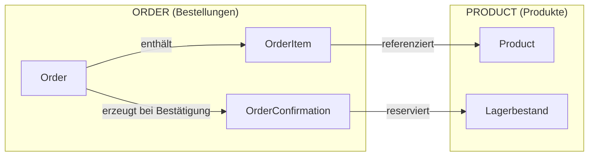

### Die Geschäftsobjekte

| Objekt | Beschreibung |
|--------|--------------|
| **Order** | Eine Bestellung mit Status (DRAFT → CONFIRMED) |
| **OrderItem** | Position in der Bestellung (Produkt + Menge + Preis) |
| **OrderConfirmation** | Bestätigungsdetails (Summe, Steuer, Versand) |
| **Product** | Artikel im Katalog mit Lagerbestand |
| **Money** | Geldbetrag (Value Object) |

### Der zentrale Use Case: Order bestätigen

Das Tutorial fokussiert auf den **komplexesten Use Case** - eine Bestellung bestätigen:

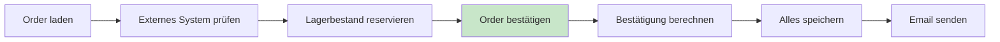

**Was passiert dabei?**

1. **Order laden** - Aus der Datenbank holen
2. **Externes System prüfen** - Gibt es die Order schon woanders?
3. **Lagerbestand reservieren** - Im Product-Modul Stock abziehen
4. **Order bestätigen** - Status auf CONFIRMED setzen
5. **Bestätigung berechnen** - Summe + Steuer + Versand
6. **Speichern** - Order und Confirmation in DB
7. **Email senden** - Kunde benachrichtigen

> Im Folgenden siehst du, wie **derselbe Use Case** in Layered vs. Hexagonal aussieht.

---

## 1. Ausgangspunkt: Layered Architecture

Die meisten Entwickler kennen Layered Architecture - sie ist der "Standard":

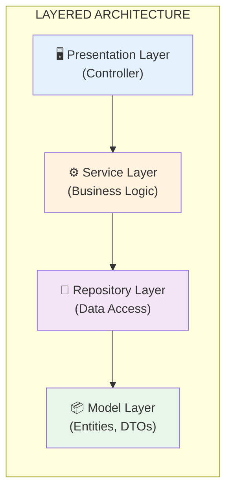

### So sieht das in unserem Projekt aus:

**Dateistruktur** ([layered/](layered/)):
```
layered/src/main/java/order/
├── presentation/          ← Presentation Layer
│   └── OrderController.java
├── service/               ← Service Layer
│   ├── OrderService.java
│   └── EmailService.java
├── repository/            ← Repository Layer
│   └── OrderRepository.java
└── model/                 ← Model Layer
    ├── Order.java
    └── Money.java
```

### Der typische Code-Fluss:

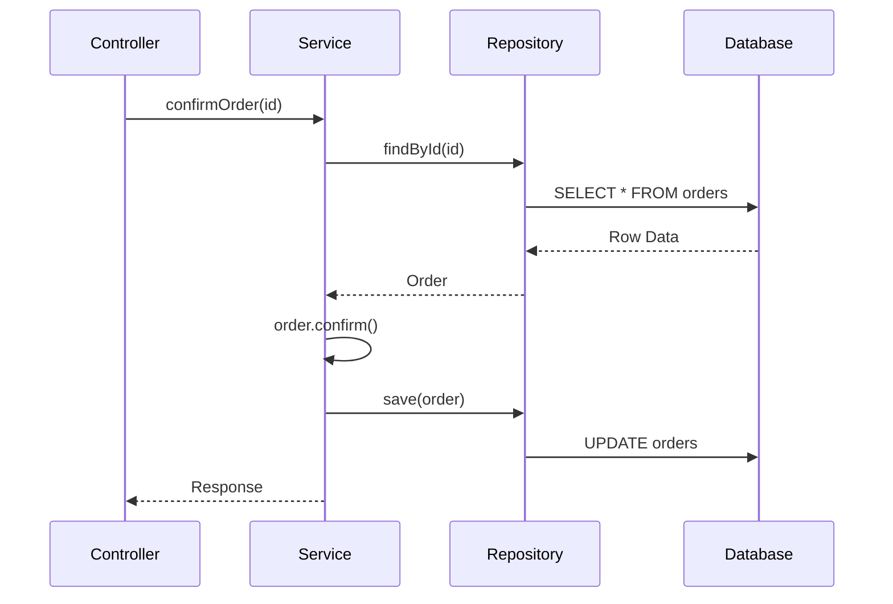

**Code-Referenz:** [layered/.../OrderService.java](layered/src/main/java/order/service/OrderService.java) (Zeile 58)

```java
public OrderConfirmationResponse confirmOrder(OrderId orderId) {
    Order order = findOrder(orderId);           // ← Holt aus Repository
    order.confirm();                            // ← Business Logic
    orderRepository.save(order);                // ← Speichert zurück
    return mapper.toResponse(savedConfirmation);
}
```

**Das funktioniert** - aber es gibt häufige Probleme...

---

## 2. Häufige Probleme in typischem Layered

> **Hinweis:** Diese Probleme sind nicht zwingend in Layered - aber sie passieren oft,
> weil Layered diese Fehler nicht aktiv verhindert. Sauberes Layered ist möglich!
>
> Die Probleme sind identisch zu [tutorialOnion.md](tutorialOnion.md#2-häufige-probleme-in-typischem-layered) - hier eine Kurzfassung:

<a id="problem-1-layered"></a>
### Problem 1: Abhängigkeiten zeigen nach UNTEN (zur Infrastruktur)
[→ Wie Hexagonal das löst](#lösung-1-abhängigkeiten-zeigen-nach-innen)

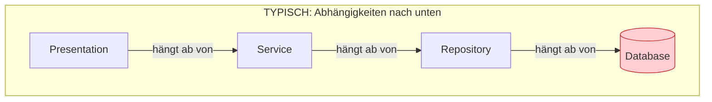

<a id="problem-2-layered"></a>
### Problem 2: Domain ist "unten" statt "zentral"
[→ Wie Hexagonal das löst](#lösung-2-business-logic-ist-der-kern)

```
Presentation  ← "oben"
    ↓
Service
    ↓
Repository
    ↓
Model         ← "unten" (Domain ist Fundament, nicht Zentrum)
```

<a id="problem-3-layered"></a>
### Problem 3: Keine erzwungenen Verträge
[→ Wie Hexagonal das löst](#lösung-3-ports-definieren-klare-verträge)

```java
public class OrderService {
    private final OrderRepository orderRepository;  // Interface? Klasse? Wer weiß...
    private final EmailService emailService;
}
```

<a id="problem-4-layered"></a>
### Problem 4: Austauschen kann teuer sein
[→ Wie Hexagonal das löst](#lösung-4-adapter-sind-austauschbar)

Was wenn du die Datenbank wechseln oder den Email-Provider ändern willst?

<a id="problem-5-layered"></a>
### Problem 5: Use Cases sind nicht explizit
[→ Wie Hexagonal das löst](#lösung-5-input-ports-machen-use-cases-explizit)

```java
// Layered: Ein großer Service mit vielen Methoden
public class OrderService {
    public OrderResponse getOrder(...) { }
    public OrderResponse updateOrder(...) { }
    public OrderConfirmationResponse confirmOrder(...) { }
    // + 20 weitere Methoden...
}
```

---

## 3. Die Kernidee von Hexagonal

### Die Revolution: Das Hexagon mit Ports!

Stell dir deine Anwendung als **Sechseck (Hexagon)** vor - mit Öffnungen (Ports) nach außen:

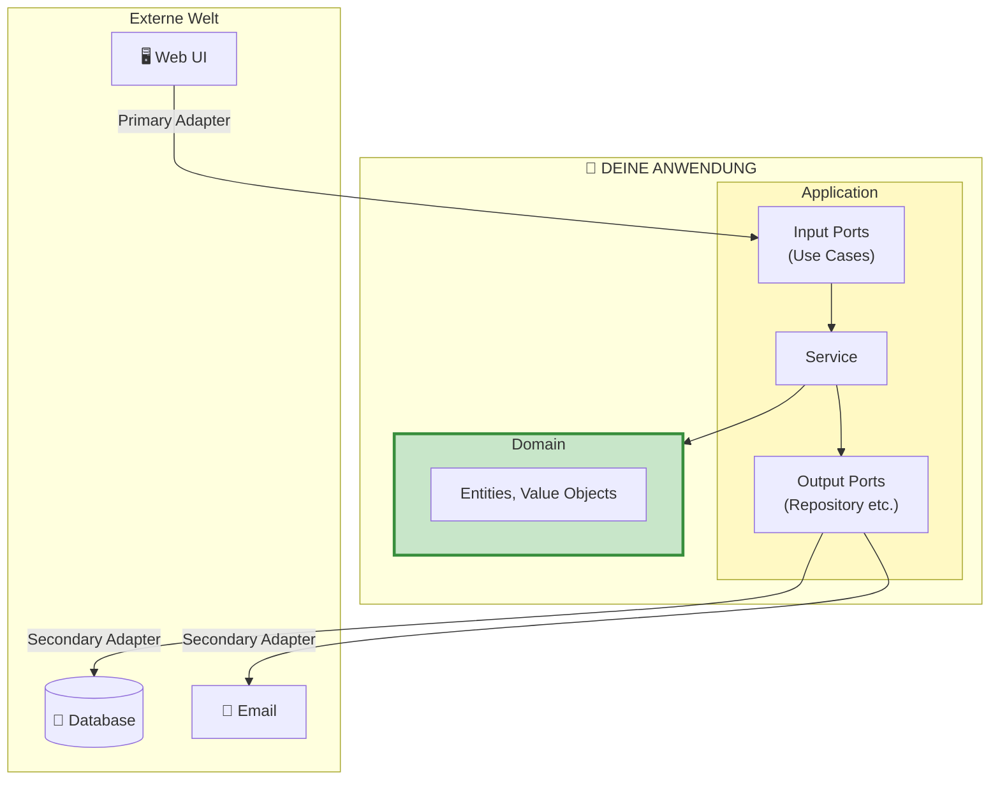

### Was sind Ports?

> **Port = Schnittstelle** - Eine definierte Schnittstelle, fcber die die Anwendung kommuniziert.
> In OO ist das meistens ein Interface.

Es gibt zwei Arten:

| Port-Typ | Richtung | Beispiel |
|----------|----------|----------|
| **Input Port** | Rein (wer ruft uns auf?) | `ConfirmOrderUseCase` |
| **Output Port** | Raus (wen rufen wir auf?) | `LoadOrderPort`, `SendNotificationPort` |

### Was sind Adapter?

> **Adapter = Implementierung** - Die konkrete Anbindung an die externe Technologie.

| Adapter-Typ | Funktion | Beispiel |
|-------------|----------|----------|
| **Primary Adapter** | Ruft Input Ports auf | `OrderController` |
| **Secondary Adapter** | Implementiert Output Ports | `OrderPersistenceAdapter` |

### Primary vs Secondary

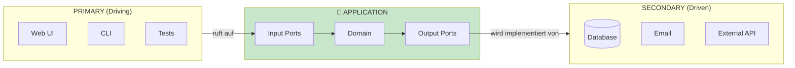

**Merkregel:**
```
PRIMARY = Eingang  → "Wer ruft uns auf?"  → Input Ports
SECONDARY = Ausgang → "Wen rufen wir auf?" → Output Ports
```

### Gegenüberstellung: Layered vs Hexagonal

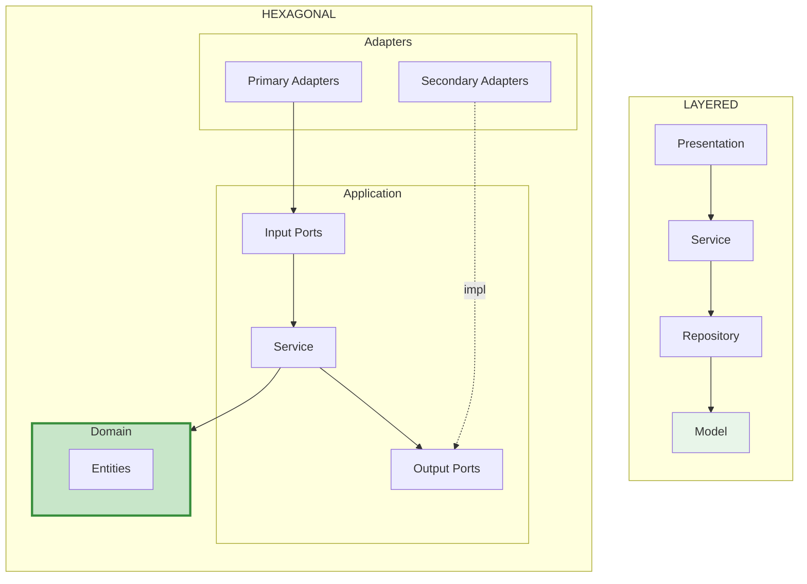

**Wo landet was?**

| Komponente | Layered | Hexagonal |
|------------|---------|-----------|
| Controller | Presentation | **Primary Adapter** |
| OrderService | Service | **Application Service** (implementiert Input Ports) |
| Repository Interface | - | **Output Port** |
| Repository Impl | Repository (konkret) | **Secondary Adapter** |
| Order, Money | Model | **Domain** |

---

## 4. Schicht für Schicht: Der Umbau

Lass uns Layered zu Hexagonal umbauen - Schritt für Schritt.

### Schritt 1: Domain definieren (der Kern)

Der Domain-Kern enthält deine **Geschäftsobjekte** - ohne jegliche Abhängigkeiten!

**Layered Model** → **Hexagonal Domain**

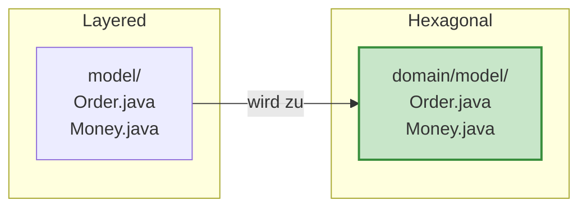

**Code-Referenz:** [hexagonal/.../domain/model/Order.java](hexagonal/src/main/java/order/domain/model/Order.java)

```java
package order.domain.model;  // ← Beachte: "domain" Package!

// KEINE Imports von außerhalb des Domain!
// Keine Ports, keine Adapter, keine Frameworks

public class Order {
    private final OrderId id;
    private final CustomerId customerId;
    private List<OrderItem> items;
    private OrderStatus status;

    // Reine Geschäftslogik
    public void confirm() {
        if (items.isEmpty()) {
            throw new EmptyOrderException(id);
        }
        this.status = OrderStatus.CONFIRMED;
    }
}
```

---

### Schritt 2: Output Ports definieren (was brauchen wir?)

Output Ports definieren, was die Anwendung **braucht** - ohne zu sagen **wie**:

**Code-Referenz:** [hexagonal/.../port/output/](hexagonal/src/main/java/order/application/port/output/)

```java
// LoadOrderPort.java - Lesen
package order.application.port.output;

public interface LoadOrderPort {
    Optional<Order> loadById(OrderId orderId);
}
```

```java
// SaveOrderPort.java - Schreiben
public interface SaveOrderPort {
    Order save(Order order);
}
```

```java
// SendNotificationPort.java - Benachrichtigung
public interface SendNotificationPort {
    void sendOrderConfirmation(CustomerId customerId, OrderConfirmation confirmation);
}
```

**Warum separate Load/Save Ports?**

| Single Repository | Separate Ports |
|-------------------|----------------|
| `findById()` + `save()` zusammen | `LoadOrderPort` + `SaveOrderPort` getrennt |
| Einfacher | Flexibler (z.B. Read Replica) |
| Üblich in Layered | Häufig in Ports & Adapters als CQRS-lite genutzt |

---

### Schritt 3: Input Ports definieren (Use Cases!)

Input Ports definieren die **Use Cases** deiner Anwendung.
Das ist nicht exclusiv „Hexagonal vs Onion“, sondern ein typischer Fokus von Ports-&-Adapters und Clean: Use Cases als explizite Verträge statt „ein Service macht alles“.

**Code-Referenz:** [hexagonal/.../port/input/](hexagonal/src/main/java/order/application/port/input/)

```java
// GetOrderUseCase.java
public interface GetOrderUseCase {
    OrderResponse getOrder(OrderId orderId);
}

// UpdateOrderUseCase.java
public interface UpdateOrderUseCase {
    OrderResponse updateOrder(OrderId orderId, UpdateOrderCommand command);
}

// ConfirmOrderUseCase.java
public interface ConfirmOrderUseCase {
    OrderConfirmationResponse confirmOrder(OrderId orderId);
}
```

**Merke:** Du kannst Use Cases auch in einem Interface bündeln.
Viele kleine Ports sind gut, wenn du klare Verträge und testbare Abhängigkeiten willst.
Wenn dein Projekt dadurch unübersichtlich wird, ist Bündeln oft die bessere Wahl.

---

### Schritt 4: Application Service (implementiert Input Ports)

**Code-Referenz:** [hexagonal/.../service/OrderService.java](hexagonal/src/main/java/order/application/service/OrderService.java)

```java
package order.application.service;

// Importiert NUR Ports und Domain!
import order.application.port.input.*;   // Input Ports
import order.application.port.output.*;  // Output Ports
import order.domain.model.*;

public class OrderService implements GetOrderUseCase,
                                      UpdateOrderUseCase,
                                      ConfirmOrderUseCase {

    // Hängt nur von OUTPUT PORTS ab!
    private final LoadOrderPort loadOrderPort;
    private final SaveOrderPort saveOrderPort;
    private final SendNotificationPort sendNotificationPort;

    public OrderService(
            LoadOrderPort loadOrderPort,           // ← Port!
            SaveOrderPort saveOrderPort,           // ← Port!
            SendNotificationPort sendNotificationPort) {
        this.loadOrderPort = loadOrderPort;
        this.saveOrderPort = saveOrderPort;
        this.sendNotificationPort = sendNotificationPort;
    }

    @Override
    public OrderConfirmationResponse confirmOrder(OrderId orderId) {
        Order order = loadOrderPort.loadById(orderId)
            .orElseThrow(() -> new OrderNotFoundException(orderId));

        order.confirm();

        saveOrderPort.save(order);
        sendNotificationPort.sendOrderConfirmation(...);

        return mapper.toResponse(...);
    }
}
```

---

### Schritt 5: Secondary Adapters (implementieren Output Ports)

**Code-Referenz:** [hexagonal/.../adapter/output/persistence/OrderPersistenceAdapter.java](hexagonal/src/main/java/order/adapter/output/persistence/OrderPersistenceAdapter.java)

```java
package order.adapter.output.persistence;

import order.application.port.output.LoadOrderPort;  // ← Importiert Port
import order.application.port.output.SaveOrderPort;
import order.domain.model.*;

// Implementiert Output Ports
public class OrderPersistenceAdapter implements LoadOrderPort, SaveOrderPort {

    private final Map<Long, OrderEntity> database = new HashMap<>();

    @Override
    public Optional<Order> loadById(OrderId orderId) {
        OrderEntity entity = database.get(orderId.value());
        return Optional.ofNullable(entity).map(this::mapToDomain);
    }

    @Override
    public Order save(Order order) {
        OrderEntity entity = mapToEntity(order);
        database.put(entity.id, entity);
        return mapToDomain(entity);
    }
}
```

**Email Adapter:**

```java
package order.adapter.output.notification;

import order.application.port.output.SendNotificationPort;

public class EmailNotificationAdapter implements SendNotificationPort {

    @Override
    public void sendOrderConfirmation(CustomerId customerId, OrderConfirmation confirmation) {
        String email = customerId.value() + "@example.com";
        System.out.printf("[EMAIL] Sende an %s%n", email);
    }
}
```

---

### Schritt 6: Primary Adapter (Controller)

**Code-Referenz:** [hexagonal/.../adapter/input/rest/OrderController.java](hexagonal/src/main/java/order/adapter/input/rest/OrderController.java)

```java
package order.adapter.input.rest;

import order.application.port.input.*;  // ← Nur Input Ports!

public class OrderController {

    // Kennt nur die INPUT PORTS - nicht den konkreten Service!
    private final GetOrderUseCase getOrderUseCase;
    private final ConfirmOrderUseCase confirmOrderUseCase;

    public OrderController(
            GetOrderUseCase getOrderUseCase,           // ← Interface!
            ConfirmOrderUseCase confirmOrderUseCase) { // ← Interface!
        this.getOrderUseCase = getOrderUseCase;
        this.confirmOrderUseCase = confirmOrderUseCase;
    }

    // GET /orders/{id}
    public OrderResponse getOrder(Long id) {
        return getOrderUseCase.getOrder(OrderId.of(id));
    }

    // POST /orders/{id}/confirm
    public OrderConfirmationResponse confirmOrder(Long id) {
        return confirmOrderUseCase.confirmOrder(OrderId.of(id));
    }
}
```

**Warum separate Use Case Interfaces?**

| Ein Service | Separate Use Cases |
|-------------|-------------------|
| Controller kennt alles | Controller kennt nur was er braucht |
| `OrderService` = God Class | Interfaces = klare Verträge |
| Schwer zu mocken | Einfach zu mocken |

---

## 5. Code-Vergleich: Vorher/Nachher

### Der Service

**LAYERED:**

```java
public class OrderService {
    private final OrderRepository orderRepository;        // Konkrete Klasse!
    private final EmailService emailService;              // Konkrete Klasse!
    private final ProductRepository productRepository;    // Fremdes Modul!
```

**HEXAGONAL:**

```java
public class OrderService implements GetOrderUseCase,
                                      UpdateOrderUseCase,
                                      ConfirmOrderUseCase {

    private final LoadOrderPort loadOrderPort;              // Port!
    private final SaveOrderPort saveOrderPort;              // Port!
    private final SendNotificationPort sendNotificationPort; // Port!
```

### Der Unterschied im Bild

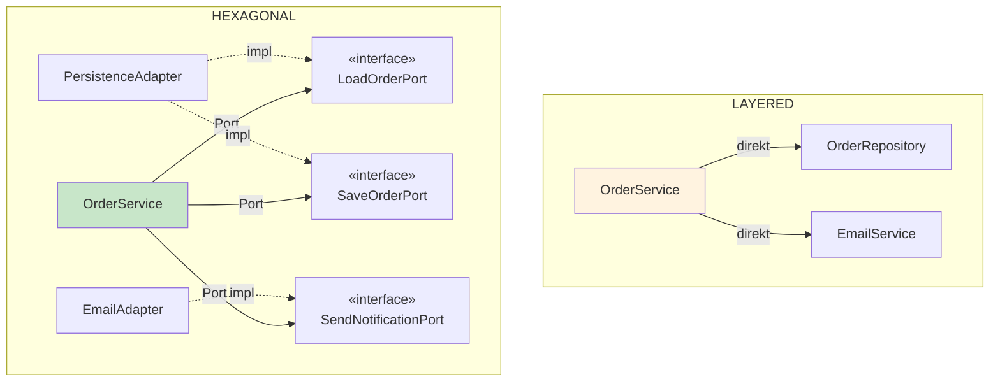

### Controller

**LAYERED:**

```java
public class OrderController {
    private final OrderService orderService;  // ← Konkrete Klasse!

    public OrderResponse getOrder(Long id) {
        return orderService.getOrder(id);
    }
}
```

**HEXAGONAL:**

```java
public class OrderController {
    private final GetOrderUseCase getOrderUseCase;  // ← Interface (Port)!

    public OrderResponse getOrder(Long id) {
        return getOrderUseCase.getOrder(OrderId.of(id));
    }
}
```

---

## 6. Die Dependency Rule

### Die goldene Regel von Hexagonal:

> **Adapter hängen von Ports ab - niemals umgekehrt!**
> **Die Anwendung kennt nur Ports - niemals Adapter!**

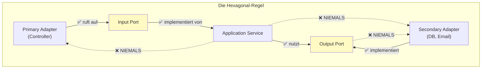

### Was bedeutet das konkret?

| Komponente | Darf importieren | Darf NICHT importieren |
|------------|------------------|------------------------|
| **Domain** | Nichts (außer Java stdlib) | Ports, Adapter |
| **Application (Service)** | Domain, Output Ports | Adapter |
| **Primary Adapter** | Input Ports | Service direkt, andere Adapter |
| **Secondary Adapter** | Output Ports, Domain | Service, andere Adapter |

### Beispiel: Import-Analyse

**Domain:**
```java
package order.domain.model;

// ✅ Nur Java Standard Library
import java.util.List;

// ❌ NIEMALS Ports oder Adapter
// import order.application.port.output.LoadOrderPort;  // VERBOTEN!
```

**Application Service:**
```java
package order.application.service;

// ✅ Input Ports (implementieren)
import order.application.port.input.*;

// ✅ Output Ports (nutzen)
import order.application.port.output.*;

// ✅ Domain
import order.domain.model.*;

// ❌ NIEMALS Adapter!
// import order.adapter.output.persistence.OrderPersistenceAdapter;  // VERBOTEN!
```

**Secondary Adapter:**
```java
package order.adapter.output.persistence;

// ✅ Output Ports (implementieren)
import order.application.port.output.LoadOrderPort;
import order.application.port.output.SaveOrderPort;

// ✅ Domain (für Mapping)
import order.domain.model.*;
```

---

## 7. Praktisches Beispiel: Order bestätigen

### Der Flow in Hexagonal

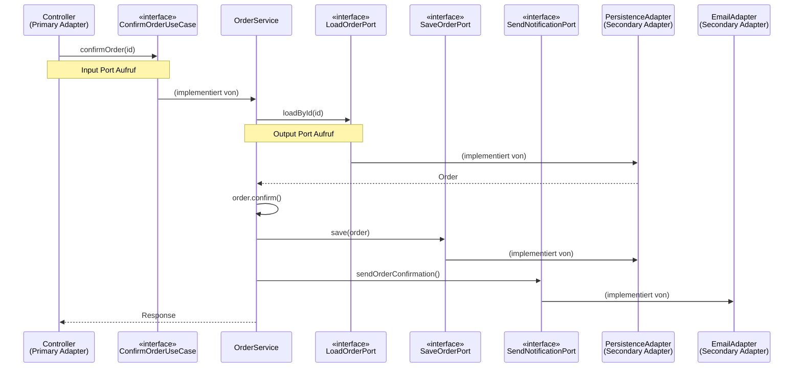

### Der Code

**Code-Referenz:** [hexagonal/.../OrderService.java](hexagonal/src/main/java/order/application/service/OrderService.java) (Zeile 70-98)

```java
@Override
public OrderConfirmationResponse confirmOrder(OrderId orderId) {
    // 1. Laden über Output Port
    Order order = loadOrder(orderId);

    // 2. Externes System prüfen über Output Port
    if (checkOrderExistsPort.existsInExternalSystem(orderId)) {
        throw new OrderAlreadyExistsException(orderId);
    }

    // 3. Stock reservieren (Cross-Domain über Use Case)
    reserveStockForOrder(order);

    // 4. Domain-Logik
    order.confirm();

    // 5. Berechnung (Domain Service)
    OrderConfirmation confirmation = calculator.calculate(order);

    // 6. Persistieren über Output Ports
    saveOrderPort.save(order);
    OrderConfirmation savedConfirmation = saveConfirmationPort.save(confirmation);

    // 7. Benachrichtigung über Output Port
    sendNotificationPort.sendOrderConfirmation(order.getCustomerId(), savedConfirmation);

    return mapper.toResponse(savedConfirmation);
}

private Order loadOrder(OrderId orderId) {
    return loadOrderPort.loadById(orderId)
        .orElseThrow(() -> new OrderNotFoundException(orderId));
}
```

### Alle Ports im Überblick

```java
public class OrderService implements GetOrderUseCase, UpdateOrderUseCase, ConfirmOrderUseCase {

    // INPUT PORTS (implementiert)
    // → GetOrderUseCase, UpdateOrderUseCase, ConfirmOrderUseCase

    // OUTPUT PORTS (nutzt)
    private final LoadOrderPort loadOrderPort;
    private final SaveOrderPort saveOrderPort;
    private final SaveConfirmationPort saveConfirmationPort;
    private final CheckOrderExistsPort checkOrderExistsPort;
    private final SendNotificationPort sendNotificationPort;
    private final LoadProductInfoPort loadProductInfoPort;
```

---

## 8. Zusammenfassung

### Die Transformation: Layered → Hexagonal

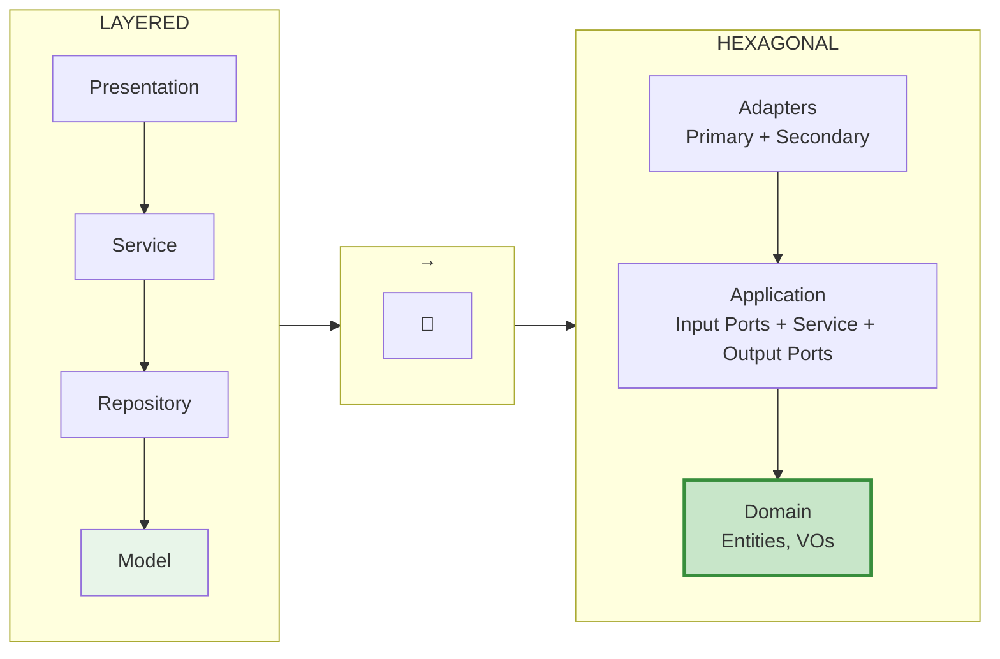

### Merksätze

1. **"Ports sind Interfaces"**
   - Input Ports = was die Anwendung anbietet (Use Cases)
   - Output Ports = was die Anwendung braucht (Repository, Email)

2. **"Adapter sind Implementierungen"**
   - Primary Adapters rufen Input Ports auf (Controller)
   - Secondary Adapters implementieren Output Ports (DB, Email)

3. **"Primary = rein, Secondary = raus"**
   - Primary: Wer treibt die Anwendung?
   - Secondary: Was wird von der Anwendung getrieben?

4. **"Die Anwendung kennt nur Ports"**
   - Kein Import von Adaptern
   - Nur Interfaces

### Schnellreferenz: Dateistruktur

```
hexagonal/src/main/java/order/
│
├── domain/                              ← 💚 DOMAIN (Kern)
│   ├── model/
│   │   ├── Order.java                   ← Aggregate Root
│   │   ├── OrderItem.java
│   │   ├── Money.java                   ← Value Object
│   │   └── OrderId.java                 ← Value Object
│   ├── exception/
│   │   └── OrderNotFoundException.java
│   └── service/
│       └── OrderConfirmationCalculator.java
│
├── application/                         ← 🟡 APPLICATION
│   ├── port/
│   │   ├── input/                       ← Input Ports (Use Cases)
│   │   │   ├── GetOrderUseCase.java
│   │   │   ├── UpdateOrderUseCase.java
│   │   │   └── ConfirmOrderUseCase.java
│   │   └── output/                      ← Output Ports
│   │       ├── LoadOrderPort.java
│   │       ├── SaveOrderPort.java
│   │       └── SendNotificationPort.java
│   ├── service/
│   │   └── OrderService.java            ← Implementiert Input Ports
│   ├── dto/
│   └── mapper/
│
└── adapter/                             ← 🔵 ADAPTERS
    ├── input/rest/                      ← Primary Adapters
    │   └── OrderController.java
    ├── output/                          ← Secondary Adapters
    │   ├── persistence/
    │   │   └── OrderPersistenceAdapter.java
    │   ├── notification/
    │   │   └── EmailNotificationAdapter.java
    │   └── external/
    │       └── ExternalOrderApiAdapter.java
    └── config/
        └── OrderConfiguration.java
```

### Wann Hexagonal verwenden?

| Situation | Empfehlung |
|-----------|------------|
| Kleine Projekte / MVPs | Layered reicht |
| Komplexe Geschäftslogik | ✅ Hexagonal |
| Viele externe Integrationen | ✅ Hexagonal |
| Hohe Testanforderungen | ✅ Hexagonal |
| Microservices | ✅ Hexagonal |
| Team mit wenig Erfahrung | Layered (erstmal) |

### Der echte Kern-Unterschied (Hexagonal vs Onion)

| Frage | Onion | Hexagonal |
|-------|-------|-----------|
| **Use Cases als Interfaces?** | Möglich (optional) | Häufig so umgesetzt (Input Ports) |
| **Primary/Secondary?** | Nicht zwingend (anderer Fokus) | Übliche Begriffe in Ports & Adapters |
| **Fokus** | Schichten zum Kern | Ports & Adapters |
| **Terminologie** | Core, Application, Infrastructure | Domain, Application, Adapter |

### Fairerweise

> **Hexagonal ist nicht immer besser.** Der Overhead durch Ports und Adapter
> lohnt sich nur, wenn du die Flexibilität brauchst.
>
> **Für kleine Projekte** ist Layered oft die bessere Wahl.
> **Für Microservices** oder **viele Integrationen** glänzt Hexagonal.

---

## 9. Wie Hexagonal die Probleme löst

Hier nochmal alle Probleme aus Kapitel 2 - und wie Hexagonal sie löst:

---

<a id="lösung-1-abhängigkeiten-zeigen-nach-innen"></a>
### Lösung 1: Abhängigkeiten zeigen nach INNEN
[← Zurück zum Problem](#problem-1-layered)

**Layered:** Abhängigkeiten zeigen nach unten (Service → Repository → DB)

**Hexagonal:** Adapter implementieren Ports - Abhängigkeiten zeigen **nach innen**:

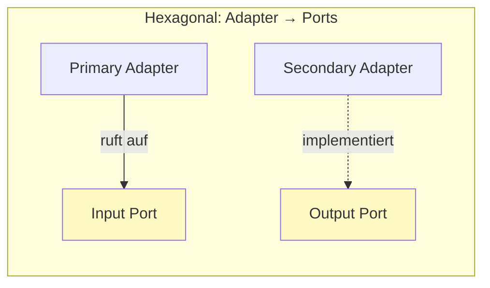

**Code-Referenz:** [hexagonal/.../OrderPersistenceAdapter.java](hexagonal/src/main/java/order/adapter/output/persistence/OrderPersistenceAdapter.java)

---

<a id="lösung-2-business-logic-ist-der-kern"></a>
### Lösung 2: Business Logic ist der KERN
[← Zurück zum Problem](#problem-2-layered)

**Layered:** Business Logic ist "gefangen" zwischen Presentation und Repository.

**Hexagonal:** Domain ist das **Zentrum** - Adapter sind austauschbar:

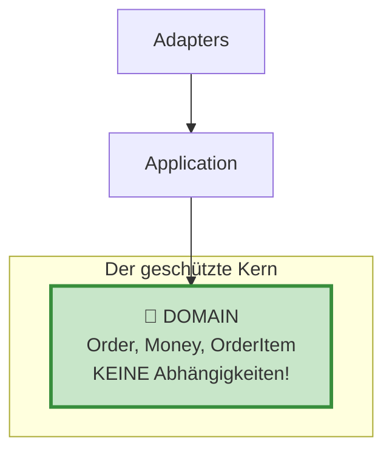

---

<a id="lösung-3-ports-definieren-klare-verträge"></a>
### Lösung 3: Ports definieren klare Verträge
[← Zurück zum Problem](#problem-3-layered)

**Layered:** Keine Interfaces → Implizite Verträge.

**Hexagonal:** Jeder Port ist ein **expliziter Vertrag**:

```java
// Output Port - klarer Vertrag
public interface LoadOrderPort {
    Optional<Order> loadById(OrderId orderId);
}

// Input Port - klarer Use Case
public interface ConfirmOrderUseCase {
    OrderConfirmationResponse confirmOrder(OrderId orderId);
}
```

---

<a id="lösung-4-adapter-sind-austauschbar"></a>
### Lösung 4: Adapter sind AUSTAUSCHBAR
[← Zurück zum Problem](#problem-4-layered)

**Layered:** Komponenten austauschen erfordert massive Änderungen.

**Hexagonal:** Neuer Adapter, fertig:

```java
// Heute: In-Memory
public class InMemoryOrderAdapter implements LoadOrderPort, SaveOrderPort { ... }

// Morgen: PostgreSQL
public class PostgresOrderAdapter implements LoadOrderPort, SaveOrderPort { ... }

// Übermorgen: MongoDB
public class MongoOrderAdapter implements LoadOrderPort, SaveOrderPort { ... }
```

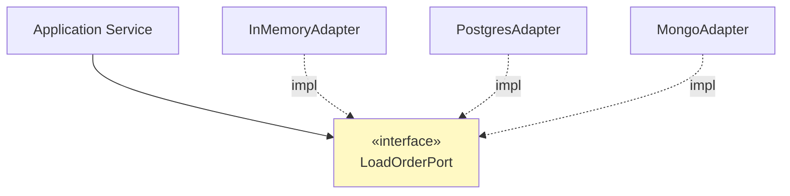

---

<a id="lösung-5-input-ports-machen-use-cases-explizit"></a>
### Lösung 5: Input Ports machen Use Cases EXPLIZIT
[← Zurück zum Problem](#problem-5-layered)

**Layered:** Ein großer Service mit vielen Methoden.

**Hexagonal:** Jeder Use Case hat sein eigenes Interface:

```java
// Statt einem großen Service...
public interface GetOrderUseCase {
    OrderResponse getOrder(OrderId orderId);
}

public interface UpdateOrderUseCase {
    OrderResponse updateOrder(OrderId orderId, UpdateOrderCommand command);
}

public interface ConfirmOrderUseCase {
    OrderConfirmationResponse confirmOrder(OrderId orderId);
}
```

**Vorteil:** Controller kennt nur die Use Cases, die er braucht:

```java
public class OrderController {
    // Nur die benötigten Use Cases!
    private final GetOrderUseCase getOrderUseCase;
    private final ConfirmOrderUseCase confirmOrderUseCase;
    // NICHT: private final OrderService orderService; (kennt alles)
}
```

---

## Weiterführende Dateien in diesem Projekt

- **Hexagonal Beispiel komplett:** [hexagonal/](hexagonal/)
- **Layered zum Vergleich:** [layered/](layered/)
- **Onion (verwandte Architektur):** [onion/](onion/)
- **Clean Architecture:** [clean/](clean/)

---

### Pragmatismus-Hinweis

> **Wichtig:** Hexagonal ist ein Werkzeug, kein Dogma.
>
> - Ein funktionierendes Layered-Projekt ist besser als ein nie fertiges Hexagonal-Projekt
> - Du kannst Hexagonal schrittweise einführen: Erst Output Ports, dann Input Ports
> - Nicht jeder Service braucht alle Ports - starte mit den wichtigsten
> - Primary/Secondary Unterscheidung ist konzeptuell - die Ordnerstruktur kann variieren
>
> **Starte einfach, refactore wenn es wehtut.**

---

## Verwandte Tutorials

- [tutorialOnion.md](tutorialOnion.md) - Von Layered zu Onion Architecture
- [tutorialRichVsAnemic.md](tutorialRichVsAnemic.md) - Rich vs Anemic Domain Model
- [tutorialPackaging.md](tutorialPackaging.md) - DDD vs Package-Struktur
