```mermaid
graph LR
    subgraph Primary ["PRIMARY (Driving)"]
        UI["Web UI"]
        CLI["CLI"]
        Test["Tests"]
    end

    subgraph App ["🔷 APPLICATION"]
        IP["Input Ports"]
        Core["Domain"]
        OP["Output Ports"]
    end

    subgraph Secondary ["SECONDARY (Driven)"]
        DB[(Database)]
        Email["Email"]
        API["External API"]
    end

    Primary -->|"ruft auf"| IP
    IP --> Core
    Core --> OP
    OP -->|"wird implementiert von"| Secondary

    style App fill:#c8e6c9
```

# Von Layered zu Hexagonal Architecture - Ein Tutorial

Dieses Tutorial erklärt **Hexagonal Architecture (Ports & Adapters)** ausgehend von der bekannten **Layered Architecture**. Du lernst, was Ports und Adapter sind und warum diese Architektur besonders flexibel ist.

---

## Wichtig vorab: Hexagonal vs Onion vs Clean

### Die Familie


| Architektur | Fokus | Terminologie |
|-------------|-------|--------------|
| **Hexagonal** | Ports nach außen, Adapter implementieren | Ports, Adapters, Primary/Secondary |
| **Onion** | Konzentrische Schichten | Core, Domain Services, Application, Infrastructure |
| **Clean** | Use Cases explizit | Entity, Use Case, Interface Adapter, Framework |

**Alle drei** setzen auf: Domain im Zentrum, Abhängigkeiten nach innen.

> **Tipp:** Wenn du [tutorialOnion.md](tutorialOnion.md) gelesen hast, wird vieles bekannt vorkommen.
> Der Hauptunterschied ist die **Terminologie** und der **Fokus auf Ports**.

---

## Inhaltsverzeichnis

0. [Das Demo-Szenario](#0-das-demo-szenario)
1. [Die Kernidee: Ports & Adapters](#1-die-kernidee-ports--adapters)
2. [Primary vs Secondary](#2-primary-vs-secondary)
3. [Von Layered zu Hexagonal](#3-von-layered-zu-hexagonal)
4. [Die Ports im Detail](#4-die-ports-im-detail)
5. [Die Adapter im Detail](#5-die-adapter-im-detail)
6. [Code-Vergleich: Layered vs Hexagonal](#6-code-vergleich-layered-vs-hexagonal)
7. [Praktisches Beispiel: Order bestätigen](#7-praktisches-beispiel-order-bestätigen)
8. [Wann Hexagonal verwenden?](#8-wann-hexagonal-verwenden)
9. [Zusammenfassung](#9-zusammenfassung)

---

## 0. Das Demo-Szenario

Wir nutzen dasselbe Szenario wie in [tutorialOnion.md](tutorialOnion.md):

### Die Domäne: Ein Bestellsystem

```mermaid
graph LR
    subgraph Order ["ORDER"]
        O[Order]
        OI[OrderItem]
        OC[OrderConfirmation]
    end

    subgraph Product ["PRODUCT"]
        P[Product]
        Stock[Lagerbestand]
    end

    O -->|"enthält"| OI
    OI -->|"referenziert"| P
    O -->|"erzeugt"| OC
```



### Der zentrale Use Case: Order bestätigen

```mermaid
flowchart LR
    A[Order laden] --> B[Externes System prüfen]
    B --> C[Lagerbestand reservieren]
    C --> D[Order bestätigen]
    D --> E[Bestätigung berechnen]
    E --> F[Alles speichern]
    F --> G[Email senden]

    style D fill:#c8e6c9
```



---

## 1. Die Kernidee: Ports & Adapters

### Das Hexagon

Stell dir deine Anwendung als **Sechseck (Hexagon)** vor - mit Öffnungen (Ports) nach außen:

```mermaid
graph TB
    subgraph Hexagon ["🔷 DEINE ANWENDUNG"]
        Core["Domain<br/>+ Application"]
    end

    subgraph External ["Externe Welt"]
        UI["🖥️ Web UI"]
        CLI["⌨️ CLI"]
        DB[(💾 Database)]
        Email["📧 Email"]
        API["🌐 External API"]
    end

    UI -->|"Port"| Core
    CLI -->|"Port"| Core
    Core -->|"Port"| DB
    Core -->|"Port"| Email
    Core -->|"Port"| API

    style Core fill:#c8e6c9,stroke:#388e3c,stroke-width:3px
```



### Was sind Ports?

> **Port = Interface** - Eine definierte Schnittstelle, über die die Anwendung kommuniziert.

```java
// Das ist ein PORT - ein Interface
public interface LoadOrderPort {
    Optional<Order> loadById(OrderId orderId);
}
```

### Was sind Adapter?

> **Adapter = Implementierung** - Die konkrete Anbindung an die externe Technologie.

```java
// Das ist ein ADAPTER - eine Implementierung
public class OrderPersistenceAdapter implements LoadOrderPort {
    @Override
    public Optional<Order> loadById(OrderId orderId) {
        // Echte DB-Logik hier
    }
}
```

### Das Bild


---

## 2. Primary vs Secondary

### Zwei Arten von Ports

Hexagonal unterscheidet zwischen **zwei Richtungen**:



### Primary (Driving) - "Wer treibt die Anwendung?"

| Begriff | Bedeutung | Beispiele |
|---------|-----------|-----------|
| **Primary Port** | Interface, das die Anwendung **anbietet** | `GetOrderUseCase`, `ConfirmOrderUseCase` |
| **Primary Adapter** | Ruft die Anwendung **auf** | REST Controller, CLI, Tests |

```java
// PRIMARY PORT - was die Anwendung ANBIETET
public interface ConfirmOrderUseCase {
    OrderConfirmationResponse confirmOrder(OrderId orderId);
}

// PRIMARY ADAPTER - wer die Anwendung AUFRUFT
public class OrderController {
    private final ConfirmOrderUseCase confirmOrderUseCase;  // ← Port!

    public OrderConfirmationResponse confirmOrder(Long id) {
        return confirmOrderUseCase.confirmOrder(OrderId.of(id));
    }
}
```

### Secondary (Driven) - "Was wird von der Anwendung getrieben?"

| Begriff | Bedeutung | Beispiele |
|---------|-----------|-----------|
| **Secondary Port** | Interface, das die Anwendung **benötigt** | `LoadOrderPort`, `SendNotificationPort` |
| **Secondary Adapter** | **Implementiert** den Port | DB Repository, Email Service |

```java
// SECONDARY PORT - was die Anwendung BENÖTIGT
public interface LoadOrderPort {
    Optional<Order> loadById(OrderId orderId);
}

// SECONDARY ADAPTER - wer den Port IMPLEMENTIERT
public class OrderPersistenceAdapter implements LoadOrderPort {
    @Override
    public Optional<Order> loadById(OrderId orderId) {
        // DB-Zugriff hier
    }
}
```

### Merkregel

```
PRIMARY = Eingang  → "Wer ruft uns auf?"  → Input Ports
SECONDARY = Ausgang → "Wen rufen wir auf?" → Output Ports
```

---

## 3. Von Layered zu Hexagonal

### Layered (zur Erinnerung)


### Hexagonal


### Was landet wo?

| Layered | Hexagonal | Erklärung |
|---------|-----------|-----------|
| Controller | **Primary Adapter** | Ruft Input Ports auf |
| OrderService | **Application Service** | Implementiert Input Ports |
| - | **Input Port** | Interface für Use Cases |
| - | **Output Port** | Interface für externe Systeme |
| OrderRepository (konkret) | **Secondary Adapter** | Implementiert Output Ports |
| Model | **Domain** | Entities, Value Objects |

---

## 4. Die Ports im Detail

### Input Ports (Primary Ports)

Input Ports definieren die **Use Cases** deiner Anwendung:

**Code-Referenz:** [hexagonal/.../port/input/](hexagonal/src/main/java/order/application/port/input/)

```java
// GetOrderUseCase.java
public interface GetOrderUseCase {
    OrderResponse getOrder(OrderId orderId);
}

// UpdateOrderUseCase.java
public interface UpdateOrderUseCase {
    OrderResponse updateOrder(OrderId orderId, UpdateOrderCommand command);
}

// ConfirmOrderUseCase.java
public interface ConfirmOrderUseCase {
    OrderConfirmationResponse confirmOrder(OrderId orderId);
}
```

**Der Service implementiert ALLE Input Ports:**

```java
public class OrderService implements GetOrderUseCase,
                                      UpdateOrderUseCase,
                                      ConfirmOrderUseCase {
    // Implementiert alle Use Cases
}
```

### Output Ports (Secondary Ports)

Output Ports definieren, was die Anwendung **braucht** - ohne zu sagen **wie**:

**Code-Referenz:** [hexagonal/.../port/output/](hexagonal/src/main/java/order/application/port/output/)

```java
// LoadOrderPort.java - Lesen
public interface LoadOrderPort {
    Optional<Order> loadById(OrderId orderId);
}

// SaveOrderPort.java - Schreiben
public interface SaveOrderPort {
    Order save(Order order);
}

// SendNotificationPort.java - Benachrichtigung
public interface SendNotificationPort {
    void sendOrderConfirmation(CustomerId customerId, OrderConfirmation confirmation);
}

// CheckOrderExistsPort.java - Externes System
public interface CheckOrderExistsPort {
    boolean existsInExternalSystem(OrderId orderId);
}
```

### Warum separate Load/Save Ports?

In Hexagonal trennt man oft **Lesen und Schreiben**:


| Single Repository | Separate Ports |
|-------------------|----------------|
| `findById()` + `save()` zusammen | `LoadOrderPort` + `SaveOrderPort` getrennt |
| Einfacher | Flexibler (z.B. Read Replica) |
| Üblich in Layered | Typisch für Hexagonal |

---

## 5. Die Adapter im Detail

### Primary Adapters (Input Adapters)

Primary Adapters **rufen** die Anwendung auf:

**Code-Referenz:** [hexagonal/.../adapter/input/rest/OrderController.java](hexagonal/src/main/java/order/adapter/input/rest/OrderController.java)

```java
package order.adapter.input.rest;

public class OrderController {

    // Kennt nur die INPUT PORTS - nicht den konkreten Service!
    private final GetOrderUseCase getOrderUseCase;
    private final UpdateOrderUseCase updateOrderUseCase;
    private final ConfirmOrderUseCase confirmOrderUseCase;

    public OrderController(
            GetOrderUseCase getOrderUseCase,           // ← Interface!
            UpdateOrderUseCase updateOrderUseCase,     // ← Interface!
            ConfirmOrderUseCase confirmOrderUseCase) { // ← Interface!
        this.getOrderUseCase = getOrderUseCase;
        this.updateOrderUseCase = updateOrderUseCase;
        this.confirmOrderUseCase = confirmOrderUseCase;
    }

    // GET /orders/{id}
    public OrderResponse getOrder(Long id) {
        return getOrderUseCase.getOrder(OrderId.of(id));
    }

    // POST /orders/{id}/confirm
    public OrderConfirmationResponse confirmOrder(Long id) {
        return confirmOrderUseCase.confirmOrder(OrderId.of(id));
    }
}
```

**Warum drei separate Interfaces statt einem Service?**

| Ein Service | Separate Use Cases |
|-------------|-------------------|
| Controller kennt alles | Controller kennt nur was er braucht |
| `OrderService` = God Class | Interfaces = klare Verträge |
| Schwer zu mocken | Einfach zu mocken |

### Secondary Adapters (Output Adapters)

Secondary Adapters **implementieren** die Output Ports:

**Code-Referenz:** [hexagonal/.../adapter/output/persistence/OrderPersistenceAdapter.java](hexagonal/src/main/java/order/adapter/output/persistence/OrderPersistenceAdapter.java)

```java
package order.adapter.output.persistence;

// Implementiert BEIDE Ports (Load + Save)
public class OrderPersistenceAdapter implements LoadOrderPort, SaveOrderPort {

    private final Map<Long, OrderEntity> database = new HashMap<>();

    @Override
    public Optional<Order> loadById(OrderId orderId) {
        OrderEntity entity = database.get(orderId.value());
        if (entity == null) {
            return Optional.empty();
        }
        return Optional.of(mapToDomain(entity));  // ← Entity → Domain
    }

    @Override
    public Order save(Order order) {
        OrderEntity entity = mapToEntity(order);  // ← Domain → Entity
        database.put(entity.id, entity);
        return mapToDomain(entity);
    }

    // Mapping zwischen Domain und Persistence
    private Order mapToDomain(OrderEntity entity) { ... }
    private OrderEntity mapToEntity(Order order) { ... }
}
```

**Code-Referenz:** [hexagonal/.../adapter/output/notification/EmailNotificationAdapter.java](hexagonal/src/main/java/order/adapter/output/notification/EmailNotificationAdapter.java)

```java
package order.adapter.output.notification;

public class EmailNotificationAdapter implements SendNotificationPort {

    @Override
    public void sendOrderConfirmation(CustomerId customerId, OrderConfirmation confirmation) {
        // Hier kommt die echte Email-Logik
        String email = customerId.value() + "@example.com";
        System.out.printf("[EMAIL] Sende an %s%n", email);
    }
}
```

---

## 6. Code-Vergleich: Layered vs Hexagonal

### Der Service

**LAYERED:**

```java
// layered/src/main/java/order/service/OrderService.java

public class OrderService {
    private final OrderRepository orderRepository;        // ← Konkrete Klasse!
    private final EmailService emailService;              // ← Konkrete Klasse!
    private final ProductRepository productRepository;    // ← Fremdes Modul!

    public OrderConfirmationResponse confirmOrder(OrderId orderId) {
        Order order = orderRepository.findById(orderId)   // ← Direkt auf Impl
            .orElseThrow(() -> new OrderNotFoundException(orderId));

        order.confirm();

        orderRepository.save(order);
        emailService.sendOrderConfirmation(...);          // ← Direkt auf Impl

        return mapper.toResponse(...);
    }
}
```

**HEXAGONAL:**

```java
// hexagonal/src/main/java/order/application/service/OrderService.java

public class OrderService implements GetOrderUseCase,
                                      UpdateOrderUseCase,
                                      ConfirmOrderUseCase {

    private final LoadOrderPort loadOrderPort;              // ← Port (Interface)!
    private final SaveOrderPort saveOrderPort;              // ← Port (Interface)!
    private final SendNotificationPort sendNotificationPort; // ← Port (Interface)!

    @Override
    public OrderConfirmationResponse confirmOrder(OrderId orderId) {
        Order order = loadOrderPort.loadById(orderId)       // ← Über Port
            .orElseThrow(() -> new OrderNotFoundException(orderId));

        order.confirm();

        saveOrderPort.save(order);                          // ← Über Port
        sendNotificationPort.sendOrderConfirmation(...);    // ← Über Port

        return mapper.toResponse(...);
    }
}
```

### Der Unterschied im Bild


### Controller

**LAYERED:**

```java
public class OrderController {
    private final OrderService orderService;  // ← Konkrete Klasse

    public OrderResponse getOrder(Long id) {
        return orderService.getOrder(id);
    }
}
```

**HEXAGONAL:**

```java
public class OrderController {
    private final GetOrderUseCase getOrderUseCase;  // ← Interface (Port)!

    public OrderResponse getOrder(Long id) {
        return getOrderUseCase.getOrder(OrderId.of(id));
    }
}
```

---

## 7. Praktisches Beispiel: Order bestätigen

### Der Flow in Hexagonal


### Der Code

**Code-Referenz:** [hexagonal/.../OrderService.java](hexagonal/src/main/java/order/application/service/OrderService.java) (Zeile 70-98)

```java
@Override
public OrderConfirmationResponse confirmOrder(OrderId orderId) {
    // 1. Laden über Output Port
    Order order = loadOrder(orderId);

    // 2. Externes System prüfen über Output Port
    if (checkOrderExistsPort.existsInExternalSystem(orderId)) {
        throw new OrderAlreadyExistsException(orderId);
    }

    // 3. Stock reservieren (Cross-Domain über Use Case)
    reserveStockForOrder(order);

    // 4. Domain-Logik
    order.confirm();

    // 5. Berechnung (Domain Service)
    OrderConfirmation confirmation = calculator.calculate(order);

    // 6. Persistieren über Output Ports
    saveOrderPort.save(order);
    OrderConfirmation savedConfirmation = saveConfirmationPort.save(confirmation);

    // 7. Benachrichtigung über Output Port
    sendNotificationPort.sendOrderConfirmation(order.getCustomerId(), savedConfirmation);

    return mapper.toResponse(savedConfirmation);
}

private Order loadOrder(OrderId orderId) {
    return loadOrderPort.loadById(orderId)
        .orElseThrow(() -> new OrderNotFoundException(orderId));
}
```

### Alle Ports im Überblick

```java
public class OrderService implements GetOrderUseCase, UpdateOrderUseCase, ConfirmOrderUseCase {

    // INPUT PORTS (implementiert)
    // → GetOrderUseCase, UpdateOrderUseCase, ConfirmOrderUseCase

    // OUTPUT PORTS (nutzt)
    private final LoadOrderPort loadOrderPort;
    private final SaveOrderPort saveOrderPort;
    private final SaveConfirmationPort saveConfirmationPort;
    private final CheckOrderExistsPort checkOrderExistsPort;
    private final SendNotificationPort sendNotificationPort;
    private final LoadProductInfoPort loadProductInfoPort;
```

---

## 8. Wann Hexagonal verwenden?

### Hexagonal passt gut wenn:

| Situation | Warum Hexagonal? |
|-----------|-----------------|
| **Viele externe Integrationen** | Jede Integration = ein Port |
| **Microservices** | Klare Grenzen durch Ports |
| **Technologie-Wechsel absehbar** | Nur Adapter tauschen |
| **Hohe Testanforderungen** | Ports mocken ist einfach |
| **Team-Arbeit** | Teams arbeiten an verschiedenen Adaptern |

### Hexagonal ist Overkill wenn:

| Situation | Warum nicht Hexagonal? |
|-----------|------------------------|
| **Kleine Projekte** | Zu viel Boilerplate |
| **Wenig externe Systeme** | Ports ohne echten Nutzen |
| **Prototypen** | Zu viel Abstraktion |
| **Keine wechselnden Anforderungen** | Flexibilität nicht gebraucht |

### Vergleich mit anderen Architekturen

| Aspekt | Layered | Hexagonal | Onion |
|--------|---------|-----------|-------|
| **Terminologie** | Schichten | Ports & Adapters | Konzentrische Schichten |
| **Fokus** | Einfachheit | Austauschbarkeit | Domain im Zentrum |
| **Ports explizit** | Nein | **Ja** | Interfaces, aber nicht "Ports" genannt |
| **Primary/Secondary** | Nein | **Ja** | Nein |
| **Use Case Interfaces** | Nein | **Ja** | Optional |
| **Komplexität** | Niedrig | Hoch | Mittel-Hoch |

---

## 9. Zusammenfassung

### Die Hexagonal-Terminologie


### Merksätze

1. **"Ports sind Interfaces"**
   - Input Ports = was die Anwendung anbietet (Use Cases)
   - Output Ports = was die Anwendung braucht

2. **"Adapter sind Implementierungen"**
   - Primary Adapters rufen Ports auf (Controller)
   - Secondary Adapters implementieren Ports (DB, Email)

3. **"Primary = rein, Secondary = raus"**
   - Primary: Wer treibt die Anwendung?
   - Secondary: Was wird von der Anwendung getrieben?

4. **"Die Anwendung kennt nur Ports"**
   - Kein Import von Adaptern
   - Nur Interfaces

### Dateistruktur

```
hexagonal/src/main/java/order/
│
├── domain/                              ← 💚 DOMAIN
│   ├── model/
│   │   ├── Order.java                   ← Aggregate Root
│   │   ├── OrderItem.java
│   │   └── Money.java                   ← Value Object
│   ├── exception/
│   │   └── OrderNotFoundException.java
│   └── service/
│       └── OrderConfirmationCalculator.java
│
├── application/                         ← 🟡 APPLICATION
│   ├── port/
│   │   ├── input/                       ← Input Ports (Use Cases)
│   │   │   ├── GetOrderUseCase.java
│   │   │   ├── UpdateOrderUseCase.java
│   │   │   └── ConfirmOrderUseCase.java
│   │   └── output/                      ← Output Ports
│   │       ├── LoadOrderPort.java
│   │       ├── SaveOrderPort.java
│   │       └── SendNotificationPort.java
│   ├── service/
│   │   └── OrderService.java            ← Implementiert Input Ports
│   ├── dto/
│   └── mapper/
│
└── adapter/                             ← 🔵 ADAPTERS
    ├── input/rest/                      ← Primary Adapters
    │   └── OrderController.java
    ├── output/                          ← Secondary Adapters
    │   ├── persistence/
    │   │   └── OrderPersistenceAdapter.java
    │   ├── notification/
    │   │   └── EmailNotificationAdapter.java
    │   └── external/
    │       └── ExternalOrderApiAdapter.java
    └── config/
        └── OrderConfiguration.java
```

### Der Kern-Unterschied zu Layered

| Frage | Layered | Hexagonal |
|-------|---------|-----------|
| **Wie greift Controller auf Service zu?** | Direkt | Über Input Port (Interface) |
| **Wie greift Service auf Repository zu?** | Oft direkt | Über Output Port (Interface) |
| **Wer definiert Schnittstellen?** | Framework oder niemand | Du selbst (Ports) |
| **Austauschbarkeit** | Schwierig | Einfach (neuer Adapter) |

### Fairerweise

> **Hexagonal ist nicht immer besser.** Der Overhead durch Ports und Adapter
> lohnt sich nur, wenn du die Flexibilität brauchst.
>
> **Für kleine Projekte** ist Layered oft die bessere Wahl.
> **Für Microservices** oder **viele Integrationen** glänzt Hexagonal.

---

## Weiterführende Dateien

- **Hexagonal Beispiel komplett:** [hexagonal/](hexagonal/)
- **Layered zum Vergleich:** [layered/](layered/)
- **Onion (verwandte Architektur):** [onion/](onion/)
- **Clean Architecture:** [clean/](clean/)

---

## Verwandte Tutorials

- [tutorialOnion.md](tutorialOnion.md) - Von Layered zu Onion Architecture
- [tutorialRichVsAnemic.md](tutorialRichVsAnemic.md) - Rich vs Anemic Domain Model
- [tutorialPackaging.md](tutorialPackaging.md) - DDD vs Package-Struktur
