# Von Layered zu Onion Architecture - Ein Tutorial

Dieses Tutorial erklärt **Onion Architecture** Schritt für Schritt, ausgehend von der bekannten **Layered Architecture**. Am Ende wirst du verstehen, warum Onion existiert und wie du es anwendest.

---

## Wichtig vorab: Was dieses Tutorial zeigt (und was nicht)

### Was wir vergleichen

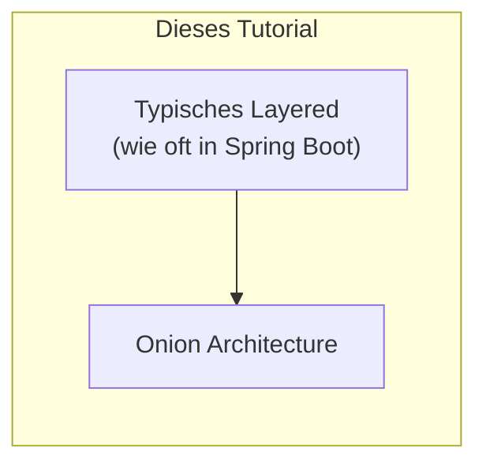

### Was du wissen solltest

| Aussage | Erklärung |
|---------|-----------|
| **Layered ≠ schlecht** | Layered Architecture ist valide und kann sauber umgesetzt werden |
| **Layered kann Interfaces haben** | Man KANN in Layered Interfaces nutzen - viele tun es nur nicht |
| **Onion/Clean/Hexagonal sind verwandt** | Alle basieren auf dem gleichen Prinzip: **Dependency Inversion** |
| **Der echte Unterschied** | Nicht "Interface vs. keine Interface", sondern **wohin zeigen die Abhängigkeiten?** |

### Die zwei Varianten von Layered

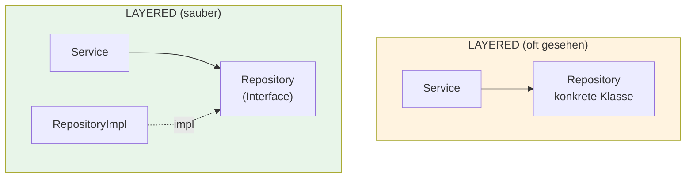

**Beide sind "Layered"!** Dieses Tutorial vergleicht das linke (typische) Layered mit Onion.

> **Merke:** Der Kern-Unterschied zwischen Layered und Onion ist nicht "Interfaces ja/nein",
> sondern **wer definiert die Interfaces** und **in welche Richtung zeigen Abhängigkeiten**.

---

## Inhaltsverzeichnis

0. [Das Demo-Szenario](#0-das-demo-szenario)
1. [Ausgangspunkt: Layered Architecture](#1-ausgangspunkt-layered-architecture)
2. [Häufige Probleme in typischem Layered](#2-häufige-probleme-in-typischem-layered)
3. [Die Kernidee von Onion](#3-die-kernidee-von-onion)
4. [Schicht für Schicht: Der Umbau](#4-schicht-für-schicht-der-umbau)
5. [Code-Vergleich: Vorher/Nachher](#5-code-vergleich-vorhernachher)
6. [Die Dependency Rule](#6-die-dependency-rule)
7. [Praktisches Beispiel: Order bestätigen](#7-praktisches-beispiel-order-bestätigen)
8. [Zusammenfassung](#8-zusammenfassung)
9. [Wie Onion die Probleme löst](#9-wie-onion-die-probleme-löst)

---

## 0. Das Demo-Szenario

Bevor wir in die Architektur einsteigen, hier das **Beispiel-Szenario**, das wir verwenden:

### Die Domäne: Ein Bestellsystem

Wir bauen ein einfaches **E-Commerce Backend** mit zwei Bereichen:

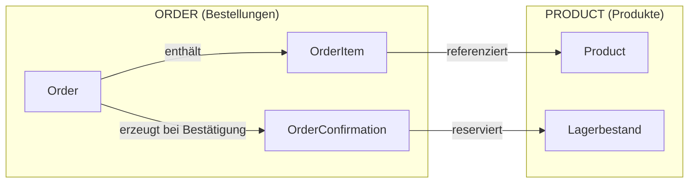

### Die Geschäftsobjekte

| Objekt | Beschreibung |
|--------|--------------|
| **Order** | Eine Bestellung mit Status (DRAFT → CONFIRMED) |
| **OrderItem** | Position in der Bestellung (Produkt + Menge + Preis) |
| **OrderConfirmation** | Bestätigungsdetails (Summe, Steuer, Versand) |
| **Product** | Artikel im Katalog mit Lagerbestand |
| **Money** | Geldbetrag (Value Object) |

### Der zentrale Use Case: Order bestätigen

Das Tutorial fokussiert auf den **komplexesten Use Case** - eine Bestellung bestätigen:

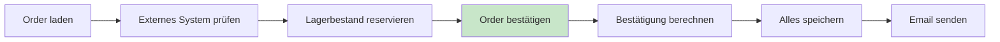

**Was passiert dabei?**

1. **Order laden** - Aus der Datenbank holen
2. **Externes System prüfen** - Gibt es die Order schon woanders?
3. **Lagerbestand reservieren** - Im Product-Modul Stock abziehen
4. **Order bestätigen** - Status auf CONFIRMED setzen
5. **Bestätigung berechnen** - Summe + Steuer + Versand
6. **Speichern** - Order und Confirmation in DB
7. **Email senden** - Kunde benachrichtigen

### Warum dieses Szenario?

Dieser Use Case ist perfekt um Architektur-Unterschiede zu zeigen:

| Aspekt | Was wir sehen |
|--------|---------------|
| **Repository-Zugriff** | Wie werden Daten geladen/gespeichert? |
| **Cross-Modul-Kommunikation** | Wie ruft Order das Product-Modul auf? |
| **Externe Services** | Wie wird Email/External API angebunden? |
| **Business Logic** | Wo liegt die Bestelllogik? |

> Im Folgenden siehst du, wie **derselbe Use Case** in Layered vs. Onion aussieht.

---

## 1. Ausgangspunkt: Layered Architecture

Die meisten Entwickler kennen Layered Architecture - sie ist der "Standard":


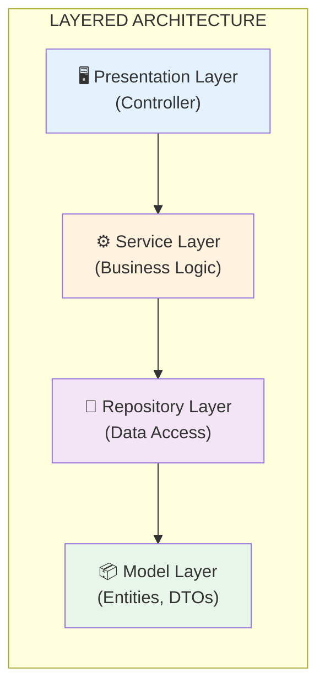

### So sieht das in unserem Projekt aus:

**Dateistruktur** ([layered/](layered/)):
```
layered/src/main/java/order/
├── presentation/          ← Presentation Layer
│   └── OrderController.java
├── service/               ← Service Layer
│   ├── OrderService.java
│   └── EmailService.java
├── repository/            ← Repository Layer
│   └── OrderRepository.java
└── model/                 ← Model Layer
    ├── Order.java
    └── Money.java
```

### Der typische Code-Fluss:

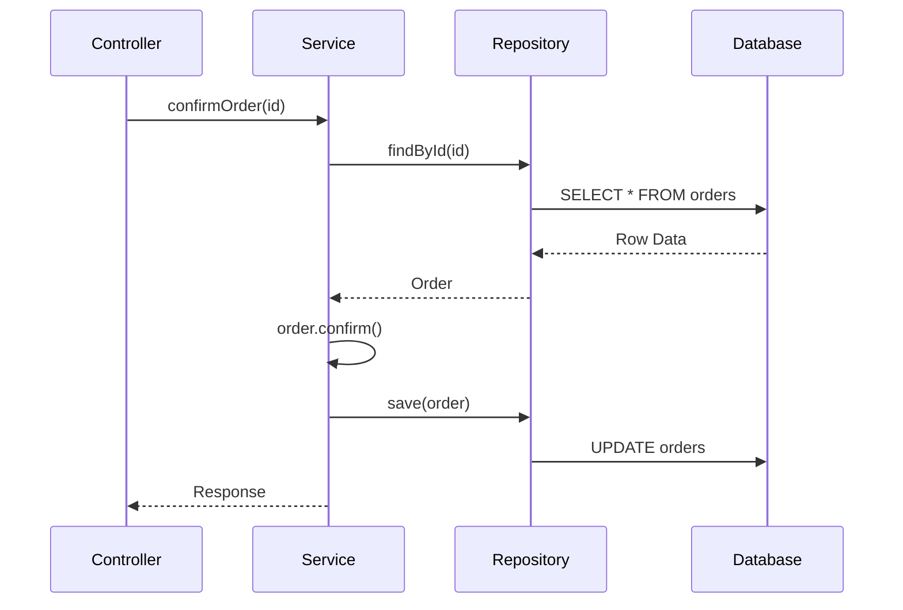

**Code-Referenz:** [layered/.../OrderService.java](layered/src/main/java/order/service/OrderService.java) (Zeile 58)

```java
public OrderConfirmationResponse confirmOrder(OrderId orderId) {
    Order order = findOrder(orderId);           // ← Holt aus Repository
    order.confirm();                            // ← Business Logic
    orderRepository.save(order);                // ← Speichert zurück
    return mapper.toResponse(savedConfirmation);
}
```

**Das funktioniert** - aber es gibt häufige Probleme...

---

## 2. Häufige Probleme in typischem Layered

> **Hinweis:** Diese Probleme sind nicht zwingend in Layered - aber sie passieren oft,
> weil Layered diese Fehler nicht aktiv verhindert. Sauberes Layered ist möglich!


<a id="problem-1-layered"></a>
### Problem 1: Abhängigkeiten zeigen nach UNTEN (zur Infrastruktur)
[→ Wie Onion das löst](#lösung-1-abhängigkeiten-zeigen-nach-innen)

In typischem Layered fließen Abhängigkeiten von oben nach unten - bis zur Datenbank:

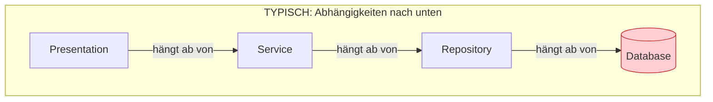

**Was bedeutet das?**

Schau dir den Service an ([layered/.../OrderService.java](layered/src/main/java/order/service/OrderService.java), Zeile 18):

```java
public class OrderService {
    private final OrderRepository orderRepository;        // Oft konkrete Klasse
    private final EmailService emailService;              // Oft konkrete Klasse
    private final product.repository.ProductRepository productRepository;  // Fremdes Modul!
```

> **Fairerweise:** Man KANN hier auch Interfaces nutzen. Das Problem ist:
> In welcher Schicht liegt das Interface? Wer definiert den Vertrag?

<a id="problem-2-layered"></a>
### Problem 2: Domain ist "unten" statt "zentral"
[→ Wie Onion das löst](#lösung-2-business-logic-ist-der-kern)

In Layered liegt die Domain (Model) ganz unten - als wäre sie unwichtig:

```
Presentation  ← "oben"
    ↓
Service
    ↓
Repository
    ↓
Model         ← "unten" (Domain ist Fundament, nicht Zentrum)
```

Deine **wichtigste Logik** (die Geschäftsregeln) sitzt im Service Layer, der von:
- Repository-Implementierungen abhängt
- Email-Service-Implementierungen abhängt
- Datenbank-Strukturen abhängt

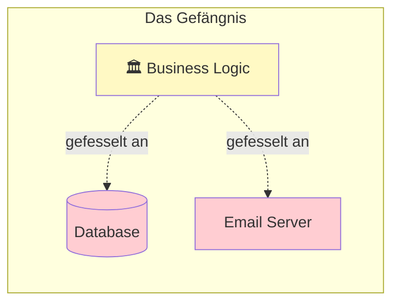

<a id="problem-3-layered"></a>
### Problem 3: Keine erzwungenen Verträge
[→ Wie Onion das löst](#lösung-3-interfaces-ermöglichen-einfaches-testen)

In typischem Layered gibt es keine Regel, die Interfaces erzwingt:

```java
public class OrderService {
    private final OrderRepository orderRepository;  // Ist das ein Interface? Eine Klasse?
    private final EmailService emailService;        // Wer weiß...
}
```

**Das Problem ist nicht das Testen** (Mockito funktioniert auch ohne Interfaces).

**Das Problem ist:** Es gibt keinen expliziten Vertrag, der dokumentiert:
- Was muss `findById` zurückgeben?
- Welche Exceptions können fliegen?
- Was ist der Kontrakt zwischen Service und Repository?

| Mit konkreten Klassen | Mit expliziten Interfaces |
|-----------------------|---------------------------|
| Vertrag ist implizit | Vertrag ist dokumentiert |
| Implementierungsdetails sichtbar | Nur der Kontrakt sichtbar |
| Austausch erfordert Subclassing | Austausch durch neue Implementierung |

> **Der Unterschied zu Onion:** In Onion definierst du Interfaces im Application Layer.
> Das erzwingt, dass du über Verträge nachdenkst.

<a id="problem-4-layered"></a>
### Problem 4: Austauschen kann teuer sein
[→ Wie Onion das löst](#lösung-4-austauschen-ist-einfach)

Was wenn du...
- die Datenbank wechseln willst (SQL → NoSQL)?
- den Email-Provider ändern willst (SMTP → SendGrid)?
- Tests ohne echte Infrastruktur laufen lassen willst?

**Ohne Interfaces:** Änderungen an vielen Stellen nötig.

**Mit Interfaces (auch in Layered möglich!):** Nur neue Implementierung schreiben.

> **Der Unterschied zu Onion:** In Onion ist die Regel "Domain kennt keine Infrastruktur"
> architektonisch erzwungen. In Layered ist es eine Disziplin-Frage.

<a id="problem-5-layered"></a>
### Problem 5: Ordner explodieren bei Wachstum (bei Package by Layer)
[→ Wie Onion das löst](#lösung-5-fachliche-struktur-statt-technische)

> **Hinweis:** Dieses Problem entsteht durch **Package by Layer**, nicht durch Layered Architecture selbst.
> Man kann auch in Layered nach Feature oder Domain strukturieren - siehe [tutorialPackaging.md](tutorialPackaging.md).

Typisches Layered nutzt oft **technische Ordner**. Bei einem kleinen Projekt sieht das okay aus:

```
service/
├── OrderService.java
├── ProductService.java
└── EmailService.java
```

Aber was passiert bei 20 Modulen?

```
service/
├── OrderService.java
├── OrderConfirmationService.java
├── OrderCancellationService.java
├── OrderHistoryService.java
├── ProductService.java
├── ProductCatalogService.java
├── ProductImportService.java
├── InventoryService.java
├── CustomerService.java
├── CustomerLoyaltyService.java
├── PaymentService.java
├── RefundService.java
├── ShippingService.java
├── NotificationService.java
├── EmailService.java
├── ReportingService.java
├── AuditService.java
└── ... (50 weitere Dateien)
```

**Das Problem:** Alles ist flach in einem Ordner. Du siehst nicht:
- Was gehört zusammen?
- Welche Services gehören zu "Order"?
- Wo sind die Grenzen zwischen Modulen?

> **Layered skaliert schlecht.** Bei großen Projekten verlierst du den Überblick.

---

## 3. Die Kernidee von Onion


### Die Revolution: Abhängigkeiten umdrehen!

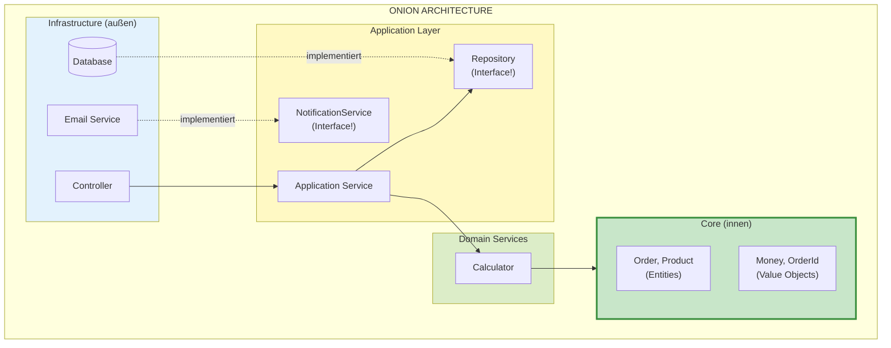

### Gegenüberstellung: Layered vs Onion

#### Die Schichten im Vergleich

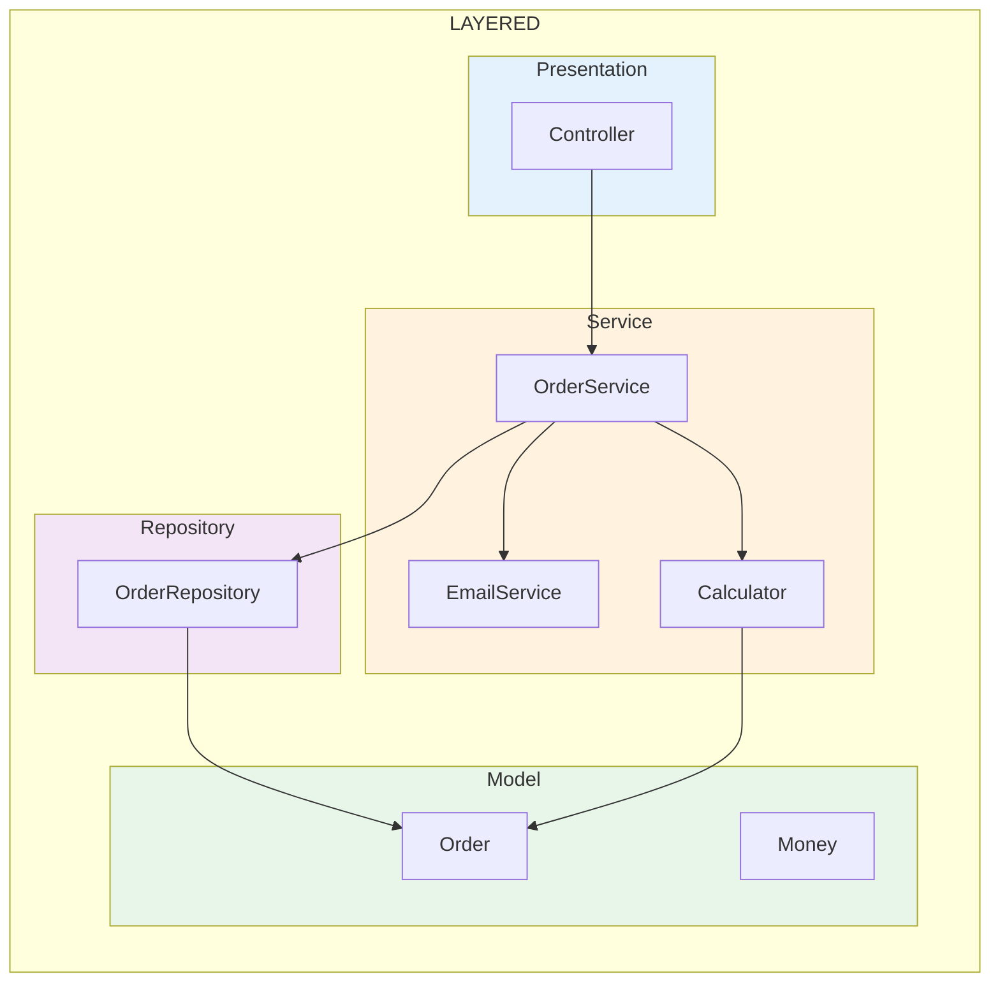

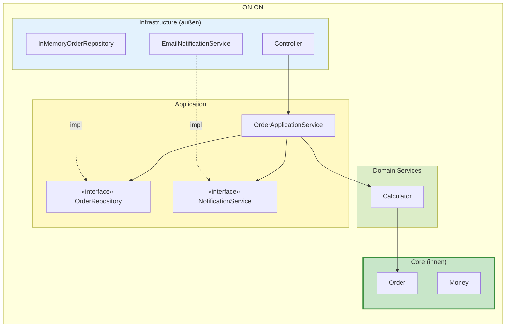

**Wo landet was?**

| Komponente | Layered | Onion |
|------------|---------|-------|
| Controller | Presentation | Infrastructure |
| OrderService | Service | Application |
| Calculator | Service | Domain Services |
| EmailService | Service (konkret) | Infrastructure (als Impl) |
| OrderRepository | Repository (konkret oder JpaRepository) | Infrastructure (als Impl) |
| Repository Interface | Framework-Interface (extends JpaRepository) | Eigenes Interface in Application (framework-frei) |
| Order, Money | Model | Core (geschützt) |

---

### Praktische Vergleiche: Wo passiert was?

Lass uns drei konkrete Aufgaben vergleichen und schauen, wie sie in Layered vs Onion gelöst werden.

#### 1. Berechnungslogik (Calculator)

**Die Aufgabe:** Berechne Summe, Steuer und Versandkosten für eine Bestellung.

**LAYERED:**
```java
// Calculator liegt im Service-Layer - kann auf alles zugreifen
package order.service;

public class OrderConfirmationCalculator {

    private final ProductRepository productRepository;  // ← Kann Repository nutzen!
    private final TaxService taxService;                // ← Kann andere Services nutzen!

    public OrderConfirmation calculate(Order order) {
        Money total = Money.ZERO;

        // Lädt Produktpreise aus DB (Infrastructure-Zugriff!)
        for (OrderItem item : order.getItems()) {
            Product product = productRepository.findById(item.getProductId());
            total = total.add(product.getPrice().multiply(item.getQuantity()));
        }

        // Ruft anderen Service auf
        Money tax = taxService.calculateTax(total);
        // ...
    }
}
```

**ONION:**
```java
// Calculator liegt in Domain Services - NUR Core-Zugriff erlaubt
package order.domainservices;

public class OrderConfirmationCalculator {

    // KEINE Repository-Abhängigkeit!
    // KEINE Service-Abhängigkeit!

    public OrderConfirmation calculate(Order order) {
        // Order enthält bereits alle Preise und berechnet sich selbst
        Money total = order.calculateTotal();
        Money tax = total.multiply(TAX_RATE);
        // ...
    }
}
```

```java
// Order (Core) - berechnet sich selbst (Rich Domain Model)
package order.core.model;

public class Order {
    private final List<OrderItem> items;

    public Money calculateTotal() {
        return items.stream()
            .map(item -> item.getPrice().multiply(item.getQuantity()))
            .reduce(Money.ZERO, Money::add);
    }
}
```

**Aber wer lädt die Produktinfos?** Der Application Service - VOR dem Calculator-Aufruf:

```java
// Application Service lädt Daten, Calculator rechnet nur
package order.application;

public class OrderApplicationService {

    private final ProductInfoPort productInfoPort;  // ← Interface!
    private final OrderConfirmationCalculator calculator;

    public OrderConfirmationResponse confirmOrder(OrderId orderId) {
        Order order = loadOrder(orderId);

        // Application Service lädt Produktinfos (über Interface)
        enrichOrderWithPrices(order);

        // Calculator bekommt fertige Order - lädt selbst NICHTS
        OrderConfirmation confirmation = calculator.calculate(order);
        // ...
    }

    private void enrichOrderWithPrices(Order order) {
        for (OrderItem item : order.getItems()) {
            Money price = productInfoPort.getPrice(item.getProductId());
            item.setPrice(price);
        }
    }
}
```

**Der Unterschied im Bild:**

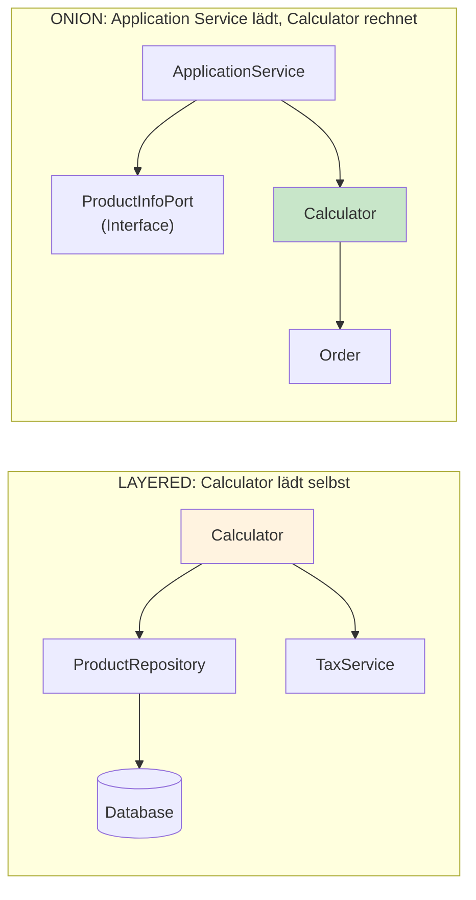

**Warum der Unterschied?**

| Aspekt | Layered | Onion |
|--------|---------|-------|
| **Wer lädt Daten?** | Calculator selbst | Application Service |
| **Calculator kennt** | Repository, Services, DB | Nur Order, Money (Core) |
| **Verantwortung** | Calculator = Laden + Rechnen | Calculator = nur Rechnen |
| **Testbarkeit Calculator** | Braucht DB-Mock | Braucht nur Order-Objekt |

> **Der Punkt:** In Onion ist der Calculator "rein" - er bekommt alles übergeben und rechnet nur. Das Laden ist Aufgabe des Application Service.

> **Hinweis:** Der Calculator ist jetzt testbar mit einem einfachen `new Order()` - keine Mocks, keine DB nötig.

---

#### 2. Email versenden

**Die Aufgabe:** Nach Bestellbestätigung eine Email an den Kunden senden.

**LAYERED:**
```java
// OrderService ruft EmailService direkt auf
package order.service;

public class OrderService {
    private final EmailService emailService;  // ← Konkrete Klasse!

    public void confirmOrder(OrderId id) {
        // ... Bestellung bestätigen ...

        emailService.sendOrderConfirmation(customer, confirmation);
        //    ↑ Direkt die konkrete Implementierung
    }
}
```

**ONION:**
```java
// OrderApplicationService ruft Interface auf
package order.application;

public class OrderApplicationService {
    private final NotificationService notificationService;  // ← Interface!

    public void confirmOrder(OrderId id) {
        // ... Bestellung bestätigen ...

        notificationService.sendOrderConfirmation(customer, confirmation);
        //    ↑ Nur das Interface - WIE ist egal
    }
}
```

```java
// Die Implementierung ist in Infrastructure - austauschbar!
package order.infrastructure.notification;

public class EmailNotificationService implements NotificationService {
    @Override
    public void sendOrderConfirmation(...) {
        // Hier die echte Email-Logik
    }
}
```

**Der Unterschied im Bild:**

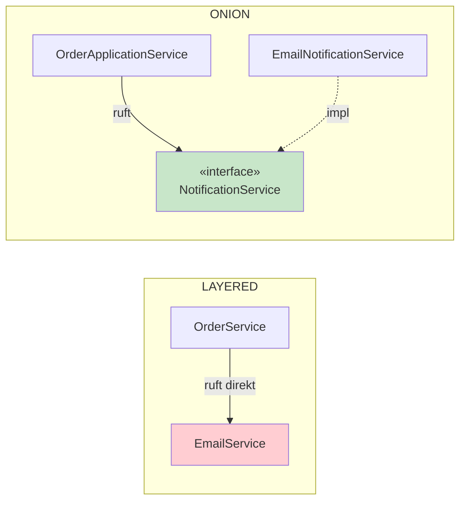

**Warum der Unterschied?**

| Aspekt | Layered | Onion |
|--------|---------|-------|
| **Service kennt** | `EmailService` (konkret) | `NotificationService` (Interface) |
| **Austauschbar?** | Schwierig | Einfach (neue Impl schreiben) |
| **Testbar?** | Mock der konkreten Klasse | Eigene Test-Implementierung |

> **Der Punkt:** In Onion kannst du Email durch SMS, Push, oder Nichts ersetzen - ohne OrderService zu ändern.


---

#### 3. Daten laden (Repository)

**Die Aufgabe:** Eine Bestellung aus der Datenbank laden.

**LAYERED (typisch mit Spring Boot + JPA):**
```java
package order.service;

public class OrderService {
    private final OrderRepository orderRepository;  // ← JpaRepository!

    public Order getOrder(Long id) {
        return orderRepository.findById(id)
            .orElseThrow(() -> new OrderNotFoundException(id));
    }
}
```

```java
// Repository ist ein FRAMEWORK-Interface
package order.repository;

public interface OrderRepository extends JpaRepository<Order, Long> {
    // Spring generiert die Implementierung!
    // ABER: Interface ist an JPA gebunden
}
```

**Das Problem:** Das Interface gehört zum Framework, nicht zu deiner Domain.

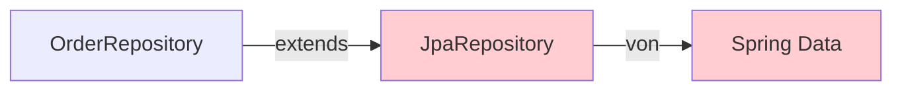

**ONION:**
```java
package order.application;

public class OrderApplicationService {
    private final OrderRepository orderRepository;  // ← Interface!

    public Order getOrder(OrderId id) {
        return orderRepository.findById(id)  // Aufruf über Interface
            .orElseThrow(() -> new OrderNotFoundException(id));
    }
}
```

```java
// Interface im Application Layer
package order.application.repository;

public interface OrderRepository {  // ← NUR Interface!
    Optional<Order> findById(OrderId id);
    Order save(Order order);
}
```

```java
// Implementierung im Infrastructure Layer
package order.infrastructure.persistence;

public class InMemoryOrderRepository implements OrderRepository {
    private final Map<OrderId, Order> orders = new HashMap<>();

    @Override
    public Optional<Order> findById(OrderId id) {
        return Optional.ofNullable(orders.get(id));
    }
}
```

**Der Unterschied im Bild:**

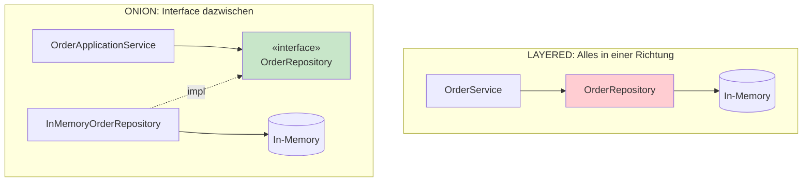

**Warum der Unterschied?**

| Aspekt | Layered (JpaRepository) | Onion |
|--------|-------------------------|-------|
| **Repository Interface** | Erbt von Framework (JpaRepository) | Eigenes Interface, framework-frei |
| **Wer definiert den Vertrag?** | Spring Data | Du selbst |
| **Wechsel zu MongoDB** | Neues Interface (MongoRepository) | Nur neue Impl, Interface bleibt |
| **Für Tests** | @DataJpaTest oder Mock | Eigene TestRepository Klasse |

> **Der Punkt:** In Layered gehört das Interface dem Framework. In Onion gehört es dir.

---

### Zusammenfassung der Vergleiche

| Aufgabe | Layered | Onion |
|---------|---------|-------|
| **Berechnung** | Im Service-Layer (gemischt) | Eigene Schicht (Domain Services) |
| **Email senden** | Konkrete Klasse `EmailService` | Interface `NotificationService` |
| **Daten laden** | Framework-Interface (JpaRepository) | Eigenes Interface + Impl getrennt |
| **Grundprinzip** | Framework-abhängig, gekoppelt | Framework-frei, entkoppelt |

---

### Der entscheidende Unterschied (Zusammenfassung)

| Aspekt | Layered | Onion |
|--------|---------|-------|
| **Repository** | Konkrete Klasse | Interface + Implementierung getrennt |
| **Service kennt** | Repository-Implementierung | Nur das Interface |
| **Domain** | Ganz unten | Im Zentrum (geschützt) |

### Code-Beispiel: So sieht der Unterschied aus

**LAYERED - Service importiert konkrete Repository-Klasse:**

```java
package order.service;

import order.repository.OrderRepository;  // ← KONKRETE KLASSE!

public class OrderService {
    private final OrderRepository repo;  // ← Konkrete Klasse

    public OrderService(OrderRepository repo) {
        this.repo = repo;  // Geht nur MIT dieser Implementierung
    }
}
```

**ONION - Service importiert Interface:**

```java
package order.application;

import order.application.repository.OrderRepository;  // ← INTERFACE!

public class OrderApplicationService {
    private final OrderRepository repo;  // ← Interface

    public OrderApplicationService(OrderRepository repo) {
        this.repo = repo;  // Geht mit JEDER Implementierung!
    }
}
```

**ONION - Infrastructure implementiert das Interface:**

```java
package order.infrastructure.persistence;

import order.application.repository.OrderRepository;  // ← Importiert Interface

public class InMemoryOrderRepository implements OrderRepository {
    // Infrastructure hängt von Application ab (nicht umgekehrt!)
}
```

> **Das ist der ganze Trick:** In Layered importiert Service die konkrete Klasse.
> In Onion importiert Service ein Interface - und Infrastructure implementiert es.

### Das Zwiebel-Modell

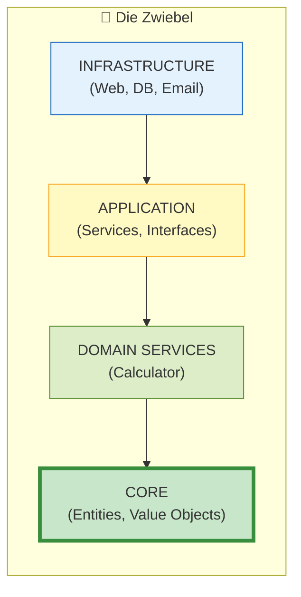

**Regel:** Abhängigkeiten zeigen immer **nach INNEN** zum Kern!

---

## 4. Schicht für Schicht: Der Umbau

Lass uns Layered zu Onion umbauen - Schritt für Schritt.

### Schritt 1: Core definieren (das Innerste)

Der Core enthält deine **Geschäftsobjekte** - ohne jegliche Abhängigkeiten!

**Layered Model** → **Onion Core**

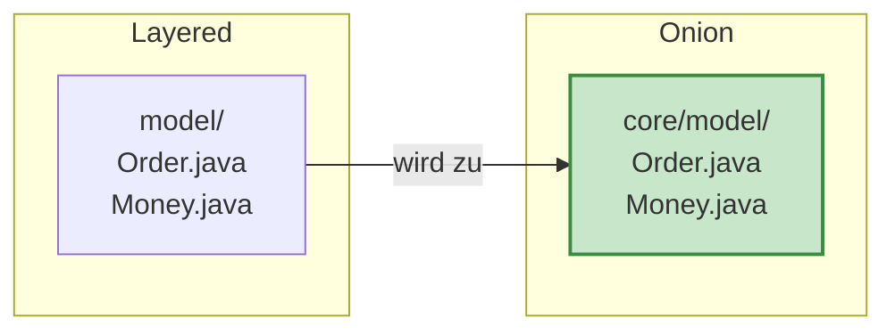

**Code-Referenz:** [onion/.../core/model/Order.java](onion/src/main/java/order/core/model/Order.java)

```java
package order.core.model;  // ← Beachte: "core" Package!

// KEINE Imports von außerhalb des Core!
// Keine Repository, keine Services, keine Frameworks

public class Order {
    private final OrderId id;
    private final CustomerId customerId;
    private List<OrderItem> items;
    private OrderStatus status;

    // Reine Geschäftslogik
    public void confirm() {
        if (items.isEmpty()) {
            throw new EmptyOrderException(id);
        }
        this.status = OrderStatus.CONFIRMED;
    }
}
```

**Vergleiche mit Layered:** [layered/src/main/java/order/model/Order.java](layered/src/main/java/order/model/Order.java)

→ Der Code ist fast identisch! Der Unterschied liegt in der **Platzierung** und den **Abhängigkeiten**.

---

### Schritt 2: Domain Services (um den Core)

Logik, die nicht in eine einzelne Entity passt:

**Code-Referenz:** [onion/.../domainservices/OrderConfirmationCalculator.java](onion/src/main/java/order/domainservices/OrderConfirmationCalculator.java)

```java
package order.domainservices;  // ← Eigene Schicht!

import order.core.model.*;    // ← Importiert nur Core!

public class OrderConfirmationCalculator {

    public OrderConfirmation calculate(Order order) {
        Money totalAmount = order.calculateTotal();
        Money taxAmount = totalAmount.multiply(TAX_RATE);
        Money shippingCost = calculateShipping(order.getItemCount());

        return OrderConfirmation.create(...);
    }
}
```

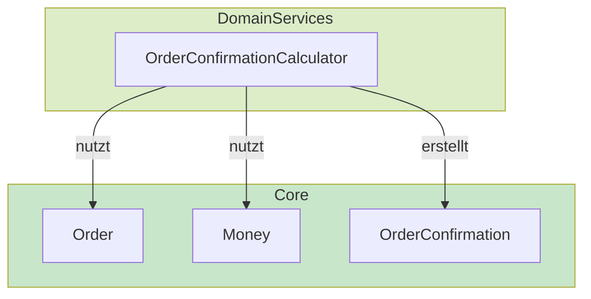

---

### Schritt 3: Application Layer - DER SCHLÜSSEL!

Hier passiert die **Magie** - wir definieren **Interfaces** für externe Abhängigkeiten!

#### 3a. Repository Interface definieren

**Layered** (konkrete Klasse):
```java
// layered/repository/OrderRepository.java
public class OrderRepository {  // ← Konkrete Implementierung!
    private final Map<OrderId, Order> orders = new HashMap<>();

    public Optional<Order> findById(OrderId id) { ... }
    public Order save(Order order) { ... }
}
```

**Onion** (Interface in Application):

**Code-Referenz:** [onion/.../application/repository/OrderRepository.java](onion/src/main/java/order/application/repository/OrderRepository.java)

```java
package order.application.repository;  // ← Application Layer!

import order.core.model.*;

// NUR ein Interface! Keine Implementierung!
public interface OrderRepository {
    Optional<Order> findById(OrderId orderId);
    Order save(Order order);
}
```

#### 3b. Notification Interface definieren

**Code-Referenz:** [onion/.../application/service/NotificationService.java](onion/src/main/java/order/application/service/NotificationService.java)

```java
package order.application.service;

// Interface - WIE die Notification gesendet wird, ist hier egal!
public interface NotificationService {
    void sendOrderConfirmation(CustomerId customerId, OrderConfirmation confirmation);
}
```

#### 3c. Application Service

**Code-Referenz:** [onion/.../application/OrderApplicationService.java](onion/src/main/java/order/application/OrderApplicationService.java)

```java
package order.application;

// Importiert NUR Interfaces und Core!
import order.application.repository.OrderRepository;      // Interface!
import order.application.service.NotificationService;    // Interface!
import order.core.model.*;

public class OrderApplicationService {

    // Hängt nur von INTERFACES ab!
    private final OrderRepository orderRepository;
    private final NotificationService notificationService;

    public OrderApplicationService(
            OrderRepository orderRepository,           // ← Interface!
            NotificationService notificationService) { // ← Interface!
        this.orderRepository = orderRepository;
        this.notificationService = notificationService;
    }

    public OrderConfirmationResponse confirmOrder(OrderId orderId) {
        Order order = findOrder(orderId);
        order.confirm();
        // ... rest der Logik
    }
}
```

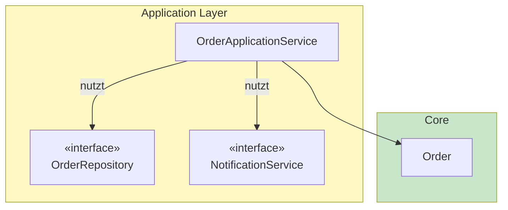

---

### Schritt 4: Infrastructure (das Äußerste)

Jetzt implementieren wir die Interfaces - **außerhalb** der Application!

#### 4a. Repository Implementierung

**Code-Referenz:** [onion/.../infrastructure/persistence/InMemoryOrderRepository.java](onion/src/main/java/order/infrastructure/persistence/InMemoryOrderRepository.java)

```java
package order.infrastructure.persistence;  // ← Infrastructure!

import order.application.repository.OrderRepository;  // ← Importiert Interface
import order.core.model.*;

// Implementiert das Interface aus Application Layer
public class InMemoryOrderRepository implements OrderRepository {

    private final Map<OrderId, Order> orders = new HashMap<>();

    @Override
    public Optional<Order> findById(OrderId orderId) {
        return Optional.ofNullable(orders.get(orderId));
    }

    @Override
    public Order save(Order order) {
        orders.put(order.getId(), order);
        return order;
    }
}
```

#### 4b. Email Implementierung

**Code-Referenz:** [onion/.../infrastructure/notification/EmailNotificationService.java](onion/src/main/java/order/infrastructure/notification/EmailNotificationService.java)

```java
package order.infrastructure.notification;

import order.application.service.NotificationService;  // ← Importiert Interface

public class EmailNotificationService implements NotificationService {

    @Override
    public void sendOrderConfirmation(CustomerId customerId, OrderConfirmation confirmation) {
        // Hier kommt die echte Email-Logik hin
        String email = customerId.value() + "@example.com";
        System.out.printf("[EMAIL] Sende Bestätigung an %s%n", email);
    }
}
```

#### 4c. Controller

**Code-Referenz:** [onion/.../infrastructure/web/OrderController.java](onion/src/main/java/order/infrastructure/web/OrderController.java)

```java
package order.infrastructure.web;  // ← Infrastructure!

import order.application.OrderApplicationService;

public class OrderController {

    private final OrderApplicationService orderService;

    public OrderController(OrderApplicationService orderService) {
        this.orderService = orderService;
    }

    public OrderResponse getOrder(Long orderId) {
        return orderService.getOrder(OrderId.of(orderId));
    }
}
```

---

## 5. Code-Vergleich: Vorher/Nachher

### Die Abhängigkeiten im Vergleich

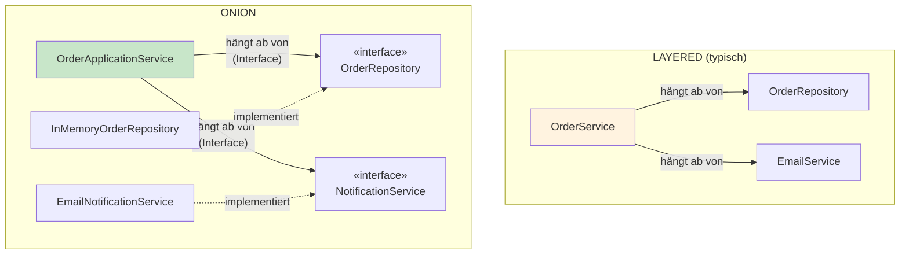

### Vergleich der OrderService Klassen

| Aspekt | Layered | Onion |
|--------|---------|-------|
| **Datei** | [layered/.../OrderService.java](layered/src/main/java/order/service/OrderService.java) | [onion/.../OrderApplicationService.java](onion/src/main/java/order/application/OrderApplicationService.java) |
| **Repository** | `OrderRepository` (konkret) | `OrderRepository` (Interface) |
| **Email** | `EmailService` (konkret) | `NotificationService` (Interface) |
| **Testbarkeit** | Braucht echte Implementierungen | Mock reicht |

### Layered Service (Zeile 18-40):

```java
// layered/src/main/java/order/service/OrderService.java

public class OrderService {
    private final OrderRepository orderRepository;              // Konkrete Klasse!
    private final OrderConfirmationRepository confirmationRepository;
    private final EmailService emailService;                    // Konkrete Klasse!
    private final ExternalOrderApiService externalApiService;
    private final product.repository.ProductRepository productRepository;  // Anderes Modul!
```

### Onion Service (Zeile 24-48):

```java
// onion/src/main/java/order/application/OrderApplicationService.java

public class OrderApplicationService {
    private final OrderRepository orderRepository;              // Interface!
    private final OrderConfirmationRepository confirmationRepository;
    private final NotificationService notificationService;      // Interface!
    private final ExternalOrderService externalOrderService;    // Interface!
```

---

## 6. Die Dependency Rule

### Die goldene Regel von Onion:

> **Abhängigkeiten dürfen nur nach INNEN zeigen - niemals nach außen!**

```mermaid
graph TB
    subgraph "Die Zwiebel-Schichten"
        I["🔵 Infrastructure"]
        A["🟡 Application"]
        DS["🟢 Domain Services"]
        C["💚 Core"]
    end

    I -->|"✅ darf"| A
    A -->|"✅ darf"| DS
    DS -->|"✅ darf"| C

    C -.->|"❌ NIEMALS"| DS
    DS -.->|"❌ NIEMALS"| A
    A -.->|"❌ NIEMALS"| I

    style C fill:#c8e6c9,stroke:#388e3c,stroke-width:3px
    style I fill:#e3f2fd
```

### Was bedeutet das konkret?

| Schicht | Darf importieren | Darf NICHT importieren |
|---------|------------------|------------------------|
| **Core** | Nichts (außer Java stdlib) | Application, Infrastructure |
| **Domain Services** | Core | Application, Infrastructure |
| **Application** | Core, Domain Services | Infrastructure |
| **Infrastructure** | Alles | - |

### Beispiel: Import-Analyse

**Core** ([onion/.../core/model/Order.java](onion/src/main/java/order/core/model/Order.java)):
```java
package order.core.model;

// ✅ Nur Java Standard Library
import java.util.ArrayList;
import java.util.Collections;
import java.util.List;

// ✅ Nur andere Core-Klassen
import order.core.exception.OrderNotFoundException;
```

**Application** ([onion/.../application/OrderApplicationService.java](onion/src/main/java/order/application/OrderApplicationService.java)):
```java
package order.application;

// ✅ Core importieren
import order.core.model.*;
import order.core.exception.*;

// ✅ Domain Services importieren
import order.domainservices.OrderConfirmationCalculator;

// ✅ Application-interne Interfaces
import order.application.repository.OrderRepository;

// ❌ NIEMALS Infrastructure importieren!
// import order.infrastructure.persistence.InMemoryOrderRepository; // VERBOTEN!
```

**Infrastructure** ([onion/.../infrastructure/persistence/InMemoryOrderRepository.java](onion/src/main/java/order/infrastructure/persistence/InMemoryOrderRepository.java)):
```java
package order.infrastructure.persistence;

// ✅ Darf Application importieren (um Interface zu implementieren)
import order.application.repository.OrderRepository;

// ✅ Darf Core importieren
import order.core.model.*;
```

---

## 7. Praktisches Beispiel: Order bestätigen

Lass uns den kompletten Flow der `confirmOrder` Operation vergleichen.

### Layered Flow

```mermaid
sequenceDiagram
    participant C as Controller
    participant S as OrderService
    participant R as OrderRepository<br/>(konkret)
    participant E as EmailService<br/>(konkret)

    C->>S: confirmOrder(id)
    S->>R: findById(id)
    Note over S,R: Direkte Abhängigkeit!
    R-->>S: Order
    S->>S: order.confirm()
    S->>R: save(order)
    S->>E: sendOrderConfirmation()
    Note over S,E: Direkte Abhängigkeit!
    S-->>C: Response
```

**Code:** [layered/.../OrderService.java](layered/src/main/java/order/service/OrderService.java) (Zeile 58-88)

```java
public OrderConfirmationResponse confirmOrder(OrderId orderId) {
    Order order = findOrder(orderId);

    // Direkt auf konkrete Klassen
    if (externalApiService.existsInExternalSystem(orderId)) { ... }

    order.confirm();

    OrderConfirmation confirmation = calculator.calculate(order);

    orderRepository.save(order);                    // Konkrete Klasse
    OrderConfirmation savedConfirmation = confirmationRepository.save(confirmation);

    emailService.sendOrderConfirmation(...);        // Konkrete Klasse

    return mapper.toResponse(savedConfirmation);
}
```

### Onion Flow

```mermaid
sequenceDiagram
    participant C as Controller<br/>(Infrastructure)
    participant S as OrderApplicationService<br/>(Application)
    participant RI as «interface»<br/>OrderRepository
    participant NI as «interface»<br/>NotificationService
    participant Impl as InMemoryOrderRepository<br/>(Infrastructure)
    participant Email as EmailNotificationService<br/>(Infrastructure)

    C->>S: confirmOrder(id)
    S->>RI: findById(id)
    Note over RI,Impl: Interface-Aufruf!
    RI->>Impl: (delegiert)
    Impl-->>S: Order
    S->>S: order.confirm()
    S->>RI: save(order)
    S->>NI: sendOrderConfirmation()
    Note over NI,Email: Interface-Aufruf!
    NI->>Email: (delegiert)
    S-->>C: Response
```

**Code:** [onion/.../OrderApplicationService.java](onion/src/main/java/order/application/OrderApplicationService.java) (Zeile 67-95)

```java
public OrderConfirmationResponse confirmOrder(OrderId orderId) {
    Order order = findOrder(orderId);

    // Über Interface - konkrete Implementierung ist egal!
    if (externalOrderService.existsInExternalSystem(orderId)) { ... }

    order.confirm();

    OrderConfirmation confirmation = calculator.calculate(order);

    orderRepository.save(order);                     // ← Interface!
    OrderConfirmation savedConfirmation = confirmationRepository.save(confirmation);

    notificationService.sendOrderConfirmation(...);  // ← Interface!

    return mapper.toResponse(savedConfirmation);
}
```

### Der Unterschied beim Testen

**Layered testen:**
```java
@Test
void testConfirmOrder_Layered() {
    // Mockito funktioniert auch mit konkreten Klassen
    OrderRepository repo = mock(OrderRepository.class);
    EmailService email = mock(EmailService.class);

    when(repo.findById(any())).thenReturn(Optional.of(testOrder));

    OrderService service = new OrderService(repo, email, ...);
    service.confirmOrder(orderId);
}
```

**Onion testen (mehr Optionen):**
```java
@Test
void testConfirmOrder_Onion() {
    // Option 1: Mock (wie Layered)
    OrderRepository repo = mock(OrderRepository.class);

    // Option 2: Eigene Test-Implementierung (kein Mocking-Framework nötig!)
    OrderRepository repo = new TestOrderRepository();

    NotificationService notif = mock(NotificationService.class);
    OrderApplicationService service = new OrderApplicationService(repo, notif, ...);
}

// Eigene Test-Implementierung möglich dank Interface
class TestOrderRepository implements OrderRepository {
    private Map<OrderId, Order> orders = new HashMap<>();

    @Override
    public Optional<Order> findById(OrderId id) {
        return Optional.ofNullable(orders.get(id));
    }

    @Override
    public Order save(Order order) {
        orders.put(order.getId(), order);
        return order;
    }
}
```

> **Fairerweise:** Mocking funktioniert in beiden. Onion gibt dir zusätzlich die Option,
> echte Test-Implementierungen zu schreiben - ohne Mocking-Framework.

---

## 8. Zusammenfassung

### Die Transformation: Layered → Onion

```mermaid
graph LR
    subgraph Layered ["LAYERED"]
        direction TB
        LP[Presentation]
        LS[Service]
        LR[Repository]
        LM[Model]
        LP --> LS --> LR --> LM
    end

    subgraph Transform ["→"]
        T["🔄"]
    end

    subgraph Onion ["ONION"]
        direction TB
        OI[Infrastructure<br/>Controller, DB, Email]
        OA[Application<br/>Services + Interfaces]
        ODS[Domain Services]
        OC[Core<br/>Entities, VOs]

        OI --> OA --> ODS --> OC
    end

    Layered --> Transform --> Onion

    style LM fill:#e8f5e9
    style OC fill:#c8e6c9,stroke:#388e3c,stroke-width:3px
```

### Merksätze

1. **"Der Core ist König"**
   - Deine Geschäftslogik ist das Wichtigste
   - Sie hat KEINE externen Abhängigkeiten

2. **"Interfaces im Application Layer"**
   - Definiere WAS du brauchst, nicht WIE
   - Repository, NotificationService, etc. sind Interfaces

3. **"Infrastructure implementiert"**
   - Die äußerste Schicht enthält die konkreten Implementierungen
   - Sie kann jederzeit ausgetauscht werden

4. **"Abhängigkeiten zeigen nach innen"**
   - Infrastructure → Application → Domain Services → Core
   - Niemals umgekehrt!

### Schnellreferenz: Dateistruktur

```
onion/src/main/java/order/
│
├── core/                           ← 💚 INNERSTER KERN
│   ├── model/
│   │   ├── Order.java              ← Aggregate Root
│   │   ├── OrderItem.java
│   │   ├── Money.java              ← Value Object
│   │   └── OrderId.java            ← Value Object
│   └── exception/
│       └── OrderNotFoundException.java
│
├── domainservices/                 ← 🟢 DOMAIN SERVICES
│   └── OrderConfirmationCalculator.java
│
├── application/                    ← 🟡 APPLICATION LAYER
│   ├── OrderApplicationService.java
│   ├── repository/
│   │   └── OrderRepository.java    ← Interface!
│   ├── service/
│   │   └── NotificationService.java ← Interface!
│   └── dto/
│       └── OrderResponse.java
│
└── infrastructure/                 ← 🔵 INFRASTRUCTURE
    ├── persistence/
    │   └── InMemoryOrderRepository.java  ← Implementiert Interface
    ├── notification/
    │   └── EmailNotificationService.java ← Implementiert Interface
    ├── web/
    │   └── OrderController.java
    └── config/
        └── OrderModuleConfiguration.java
```

### Wann Onion verwenden?

| Situation | Empfehlung |
|-----------|------------|
| Kleine Projekte / MVPs | Layered reicht |
| Komplexe Geschäftslogik | ✅ Onion |
| Viele externe Abhängigkeiten | ✅ Onion |
| Hohe Testanforderungen | ✅ Onion |
| Langlebige Systeme | ✅ Onion |
| Team mit wenig Erfahrung | Layered (erstmal) |


### Der echte Kern-Unterschied

Nach all den Details - hier ist der wahre Unterschied:

| Frage | Layered | Onion |
|-------|---------|-------|
| **Wer definiert Interfaces?** | Oft das Framework (JpaRepository) oder niemand | Du selbst, in der Application-Schicht |
| **Wohin zeigen Abhängigkeiten?** | Nach unten (zur DB) | Nach innen (zum Domain Core) |
| **Domain kennt Infrastructure?** | Nicht verboten | Architektonisch verboten |
| **Gute Praktiken** | Möglich, aber Disziplin-Frage | Durch Struktur erzwungen |

### Fairerweise

> **Layered ist nicht schlecht.** Man KANN sauberes Layered bauen - mit Interfaces,
> klaren Grenzen und Dependency Inversion. Das erfordert Disziplin.
>
> **Onion erzwingt es.** Die Schichten-Struktur macht es schwerer,
> Fehler zu machen. Das ist der eigentliche Vorteil.

### Verwandte Architekturen

Onion ist nicht allein. Diese Architekturen basieren auf den gleichen Prinzipien:

| Architektur | Kern-Idee | Unterschied zu Onion |
|-------------|-----------|----------------------|
| **Clean Architecture** | Dependency Rule, Use Cases | Explizitere Use Case / Interactor Schicht |
| **Hexagonal (Ports & Adapters)** | Ports nach außen, Adapter implementieren | Fokus auf Ports statt Schichten |
| **Onion** | Konzentrische Schichten | Fokus auf Schichten zum Kern |

**Alle drei** setzen auf: Domain im Zentrum, Infrastructure außen, Abhängigkeiten nach innen.

---

## 9. Wie Onion die Probleme löst

Hier nochmal alle Probleme aus Kapitel 2 - und wie Onion sie löst:

---

<a id="lösung-1-abhängigkeiten-zeigen-nach-innen"></a>
### Lösung 1: Abhängigkeiten zeigen nach INNEN
[← Zurück zum Problem](#problem-1-layered)

**Layered:** Abhängigkeiten zeigen nach unten (Service → Repository → DB)

**Onion:** Abhängigkeiten zeigen nach **innen** zum Core:

```mermaid
graph LR
    subgraph "Onion: Innen nach Außen"
        I[Infrastructure] -->|"hängt ab von"| A[Application]
        A -->|"hängt ab von"| C[Core]
    end

    style C fill:#c8e6c9,stroke:#388e3c,stroke-width:3px
```

```java
// Infrastructure IMPLEMENTIERT Application-Interface
public class InMemoryOrderRepository implements OrderRepository {
    // Repository hängt vom Interface ab, nicht umgekehrt!
}
```

**Code-Referenz:** [onion/.../InMemoryOrderRepository.java](onion/src/main/java/order/infrastructure/persistence/InMemoryOrderRepository.java)

---

<a id="lösung-2-business-logic-ist-der-kern"></a>
### Lösung 2: Business Logic ist der KERN
[← Zurück zum Problem](#problem-2-layered)

**Layered:** Business Logic ist "gefangen" zwischen Presentation und Repository.

**Onion:** Business Logic ist das **Zentrum** - alles andere hängt von ihr ab:

```mermaid
graph TB
    subgraph "Der geschützte Kern"
        Core["💚 CORE<br/>Order, Money, OrderItem<br/>KEINE Abhängigkeiten!"]
    end

    Infra[Infrastructure] --> App[Application] --> Core

    style Core fill:#c8e6c9,stroke:#388e3c,stroke-width:3px
```

```java
// Core hat KEINE Imports von außerhalb
package order.core.model;

import java.util.List;  // Nur Java stdlib!

public class Order {
    public void confirm() { ... }  // Reine Geschäftslogik
}
```

**Code-Referenz:** [onion/.../core/model/Order.java](onion/src/main/java/order/core/model/Order.java)

---

<a id="lösung-3-interfaces-ermöglichen-einfaches-testen"></a>
### Lösung 3: Interfaces ermöglichen einfaches Testen
[← Zurück zum Problem](#problem-3-layered)

**Layered:** Keine Interfaces → Mocking-Frameworks als Workaround nötig.

**Onion:** Interfaces im Application Layer → Einfache Test-Implementierungen möglich:

```java
// Das Interface (Application Layer)
public interface OrderRepository {
    Optional<Order> findById(OrderId id);
    Order save(Order order);
}

// Test-Implementierung - KEIN Mockito nötig!
class TestOrderRepository implements OrderRepository {
    private Map<OrderId, Order> orders = new HashMap<>();

    @Override
    public Optional<Order> findById(OrderId id) {
        return Optional.ofNullable(orders.get(id));
    }

    @Override
    public Order save(Order order) {
        orders.put(order.getId(), order);
        return order;
    }
}

// Test ist simpel und lesbar
@Test
void testConfirmOrder() {
    OrderRepository repo = new TestOrderRepository();
    // Kein when().thenReturn() - echtes Verhalten!
}
```

**Code-Referenz:** [onion/.../application/repository/OrderRepository.java](onion/src/main/java/order/application/repository/OrderRepository.java)

---

<a id="lösung-4-austauschen-ist-einfach"></a>
### Lösung 4: Austauschen ist EINFACH
[← Zurück zum Problem](#problem-4-layered)

**Layered:** Komponenten austauschen erfordert massive Änderungen.

**Onion:** Neue Implementierung schreiben, fertig:

```java
// Heute: In-Memory
public class InMemoryOrderRepository implements OrderRepository { ... }

// Morgen: PostgreSQL - gleches Interface!
public class PostgresOrderRepository implements OrderRepository { ... }

// Übermorgen: MongoDB - immer noch gleiches Interface!
public class MongoOrderRepository implements OrderRepository { ... }
```

```mermaid
graph TB
    App[Application Service]
    IF["«interface»<br/>OrderRepository"]

    Impl1[InMemoryOrderRepository]
    Impl2[PostgresOrderRepository]
    Impl3[MongoOrderRepository]

    App --> IF
    Impl1 -.->|implements| IF
    Impl2 -.->|implements| IF
    Impl3 -.->|implements| IF

    style IF fill:#fff9c4
```

**Der Application Service ändert sich NIE** - nur die Konfiguration, welche Implementierung injiziert wird.

---

<a id="lösung-5-fachliche-struktur-statt-technische"></a>
### Lösung 5: Fachliche Struktur statt technische
[← Zurück zum Problem](#problem-5-layered)

**Layered:** Technische Ordner → 50 Dateien in `service/`

**Onion:** Fachliche Ordner → Alles zu "Order" ist zusammen:

```
onion/src/main/java/
│
├── order/                          ← Alles zu ORDER
│   ├── core/
│   │   └── model/Order.java
│   ├── application/
│   │   └── OrderApplicationService.java
│   └── infrastructure/
│       └── persistence/InMemoryOrderRepository.java
│
├── product/                        ← Alles zu PRODUCT
│   ├── core/
│   ├── application/
│   └── infrastructure/
│
└── customer/                       ← Alles zu CUSTOMER
    ├── core/
    ├── application/
    └── infrastructure/
```

```mermaid
graph TB
    subgraph Layered ["❌ LAYERED: 50 Dateien pro Ordner"]
        S["service/"]
        R["repository/"]
    end

    subgraph Onion ["✅ ONION: Fachlich gruppiert"]
        O["order/<br/>~10 Dateien"]
        P["product/<br/>~10 Dateien"]
        C["customer/<br/>~10 Dateien"]
    end

    style S fill:#ffcdd2
    style R fill:#ffcdd2
    style O fill:#c8e6c9
    style P fill:#c8e6c9
    style C fill:#c8e6c9
```

**Vorteil:** Du siehst sofort, was zu welchem Fachbereich gehört.

---

## Weiterführende Dateien in diesem Projekt

- **Onion Beispiel komplett:** [onion/](onion/)
- **Layered zum Vergleich:** [layered/](layered/)
- **Hexagonal (ähnliches Konzept):** [hexagonal/](hexagonal/)
- **Clean Architecture:** [clean/](clean/)

---

> 💡 **Tipp:** Lies die README-Dateien in den einzelnen Ordnern für architekturspezifische Details:
> - [onion/README.md](onion/README.md)
> - [layered/README.md](layered/README.md)

---

### Pragmatismus-Hinweis

> **Wichtig:** Onion ist ein Werkzeug, kein Dogma.
>
> - Ein funktionierendes Layered-Projekt ist besser als ein nie fertiges Onion-Projekt
> - Der Übergang von Layered zu Onion kann inkrementell erfolgen (erst Interfaces, dann Packages)
> - Nicht jedes Projekt braucht Onion - CRUD-Apps mit wenig Logik sind mit Layered gut bedient
> - Die "Domain Services" Schicht ist optional - viele Teams nutzen nur 3 Schichten
>
> **Starte einfach, refactore wenn es wehtut.**

---

## Verwandte Tutorials

- [tutorialHexagonal.md](tutorialHexagonal.md) - Von Layered zu Hexagonal Architecture
- [tutorialRichVsAnemic.md](tutorialRichVsAnemic.md) - Rich vs Anemic Domain Model
- [tutorialPackaging.md](tutorialPackaging.md) - DDD vs Package-Struktur
