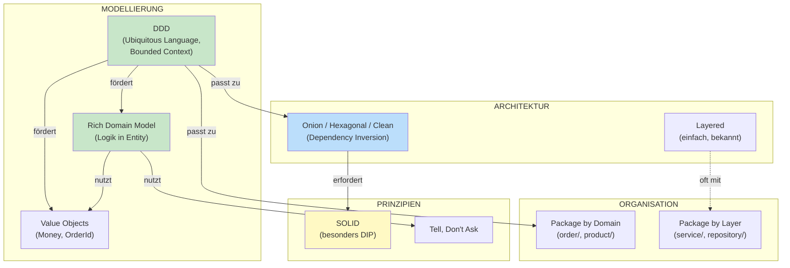

# Software-Architektur Overview: Was gehört zusammen?

Dieses Tutorial ordnet die wichtigsten Konzepte ein und zeigt **wie sie zusammenhängen**, **wo Übergänge sind**, und **was wann gilt**.

---

## Inhaltsverzeichnis

1. [Die Landkarte: Drei Ebenen](#1-die-landkarte-drei-ebenen)
2. [Was gehört zu was?](#2-was-gehört-zu-was)
3. [Die Konzepte im Projekt](#3-die-konzepte-im-projekt)
4. [SOLID Principles](#4-solid-principles)
5. [Weitere wichtige Prinzipien](#5-weitere-wichtige-prinzipien)
6. [Fließende Übergänge](#6-fließende-übergänge)
7. [Entscheidungshilfen](#7-entscheidungshilfen)
8. [Anti-Patterns](#8-anti-patterns)

---

## 1. Die Landkarte: Drei Ebenen

Diese Konzepte beantworten **unterschiedliche Fragen**:

```
┌─────────────────────────────────────────────────────────────────────┐
│                         WIE DENKE ICH?                              │
│                        (Modellierung)                               │
│  ┌─────────────────┐  ┌─────────────────┐  ┌─────────────────────┐  │
│  │      DDD        │  │ Rich vs Anemic  │  │   Value Objects     │  │
│  │ Bounded Context │  │ Logik in Entity │  │   Aggregates        │  │
│  └─────────────────┘  └─────────────────┘  └─────────────────────┘  │
├─────────────────────────────────────────────────────────────────────┤
│                      WIE STRUKTURIERE ICH?                          │
│                        (Architektur)                                │
│  ┌─────────────────┐  ┌─────────────────┐  ┌─────────────────────┐  │
│  │    Layered      │  │ Onion/Hexagonal │  │ Package-Strategien  │  │
│  │  Oben → Unten   │  │  Außen → Innen  │  │ by Layer/Domain     │  │
│  └─────────────────┘  └─────────────────┘  └─────────────────────┘  │
├─────────────────────────────────────────────────────────────────────┤
│                       WIE SCHREIBE ICH?                             │
│                       (Code-Qualität)                               │
│  ┌─────────────────┐  ┌─────────────────┐  ┌─────────────────────┐  │
│  │     SOLID       │  │   DRY / KISS    │  │  Tell, Don't Ask    │  │
│  │  5 Prinzipien   │  │     YAGNI       │  │  Immutability       │  │
│  └─────────────────┘  └─────────────────┘  └─────────────────────┘  │
└─────────────────────────────────────────────────────────────────────┘
```

| Ebene | Frage | Konzepte | Detail-Tutorial |
|-------|-------|----------|-----------------|
| **Modellierung** | Wie bilde ich Fachlichkeit ab? | DDD, Rich/Anemic, Aggregates | [tutorialRichVsAnemic.md](tutorialRichVsAnemic.md) |
| **Architektur** | Wie organisiere ich Abhängigkeiten? | Layered, Onion, Hexagonal | [tutorialOnion.md](tutorialOnion.md) |
| **Organisation** | Wie sortiere ich Dateien? | Package by Layer/Domain | [tutorialPackaging.md](tutorialPackaging.md) |
| **Code-Qualität** | Wie schreibe ich wartbaren Code? | SOLID, DRY, KISS, YAGNI | (dieses Tutorial) |

> **Wichtig:** Diese Ebenen sind **unabhängig voneinander wählbar**, aber sie **verstärken sich gegenseitig**.

---

## 2. Was gehört zu was?

### Die häufigsten Verwechslungen

| Aussage | Wahrheit |
|---------|----------|
| "domain/ Ordner = DDD" | ❌ DDD ist ein Denkansatz, keine Ordnerstruktur |
| "Onion = Rich Domain Model" | ❌ Beides unabhängige Entscheidungen |
| "Hexagonal = Onion = Clean" | ⚠️ Gleiche Prinzipien, andere Terminologie |
| "Layered = keine Interfaces" | ❌ Layered KANN Interfaces haben |
| "Package by Domain = DDD" | ❌ Package-Strategie ≠ Modellierungsansatz |

### Was fördert was?



### Der Kern-Unterschied: Abhängigkeitsrichtung

```
LAYERED                              ONION / HEXAGONAL / CLEAN
────────────────────                 ────────────────────────────

┌──────────────────┐                 ┌────────────────────────────┐
│   Controller     │                 │      INFRASTRUCTURE        │
├──────────────────┤                 │  (Controller, DB, Email)   │
│    Service       │──────┐          │            │               │
├──────────────────┤      │          │            ▼               │
│   Repository     │◄─────┘          │  ┌──────────────────────┐  │
├──────────────────┤                 │  │    APPLICATION       │  │
│     Model        │                 │  │  (Services, Ports)   │  │
└──────────────────┘                 │  │         │            │  │
        │                            │  │         ▼            │  │
        ▼                            │  │  ┌──────────────┐    │  │
   [ Database ]                      │  │  │    DOMAIN    │    │  │
                                     │  │  │  (Entities)  │    │  │
Abhängigkeiten                       │  │  └──────────────┘    │  │
zeigen nach UNTEN                    │  └──────────────────────┘  │
                                     └────────────────────────────┘

                                     Abhängigkeiten zeigen nach INNEN
```

| Aspekt | Layered | Onion/Hexagonal |
|--------|---------|-----------------|
| **Wer definiert Interfaces?** | Framework (JpaRepository) oder niemand | Du selbst, im Application Layer |
| **Domain kennt Infrastructure?** | Nicht verboten | Architektonisch verboten |
| **Testbarkeit** | Oft nur mit Mocking-Framework | Einfache Test-Implementierungen |

---

## 3. Die Konzepte im Projekt

Dieses Projekt implementiert **dieselbe Funktionalität** in vier Architekturen.

### Value Objects (DDD-Konzept)

Value Objects haben keine Identität - sie sind durch ihre Werte definiert.

**Projekt-Beispiel:** [hexagonal/.../Money.java](hexagonal/src/main/java/order/domain/model/Money.java)
```java
public record Money(BigDecimal amount) {
    public static final Money ZERO = new Money(BigDecimal.ZERO);

    public Money {
        Objects.requireNonNull(amount, "amount must not be null");
    }

    public Money add(Money other) {
        return new Money(this.amount.add(other.amount));
    }
}
```

**Wo im Projekt:** `Money`, `OrderId`, `CustomerId`, `ProductId`, `Quantity` - in allen vier Architekturen identisch.

### Rich Domain Model (Logik in Entity)

**Projekt-Beispiel:** [hexagonal/.../Order.java](hexagonal/src/main/java/order/domain/model/Order.java)
```java
public class Order {
    private final OrderId id;
    private List<OrderItem> items;
    private OrderStatus status;

    public void confirm() {
        ensureModifiable();                    // Entity prüft selbst
        if (items.isEmpty()) {
            throw new EmptyOrderException(id); // Entity wirft Exception
        }
        this.status = OrderStatus.CONFIRMED;
    }

    public List<OrderItem> getItems() {
        return Collections.unmodifiableList(items);  // Schutz vor Manipulation
    }
}
```

**Tell, Don't Ask:**
```java
// SCHLECHT (Ask): Service fragt und entscheidet
if (order.getStatus() == OrderStatus.DRAFT && !order.getItems().isEmpty()) {
    order.setStatus(OrderStatus.CONFIRMED);
}

// GUT (Tell): Service sagt, Entity entscheidet
order.confirm();
```

### Ports & Adapters (Hexagonal)

**Input Port** - was die Anwendung kann:
```java
// hexagonal/.../ConfirmOrderUseCase.java
public interface ConfirmOrderUseCase {
    OrderConfirmationResponse confirmOrder(OrderId orderId);
}
```

**Output Port** - was die Anwendung braucht:
```java
// hexagonal/.../SendNotificationPort.java
public interface SendNotificationPort {
    void sendOrderConfirmation(CustomerId customerId, OrderConfirmation confirmation);
}
```

**Adapter** - implementiert den Port:
```java
// hexagonal/.../EmailNotificationAdapter.java
public class EmailNotificationAdapter implements SendNotificationPort {
    @Override
    public void sendOrderConfirmation(CustomerId customerId, OrderConfirmation confirmation) {
        // Konkrete Email-Implementierung
    }
}
```

### Vergleich: Dieselbe Funktionalität, vier Architekturen

| Konzept | Layered | Onion | Hexagonal | Clean |
|---------|---------|-------|-----------|-------|
| **Order Entity** | `order/model/` | `order/core/model/` | `order/domain/model/` | `order/entity/model/` |
| **Repository** | Konkrete Klasse | Interface in `application/` | Output Port | Gateway Interface |
| **Email** | EmailService (konkret) | NotificationService (Interface) | SendNotificationPort | NotificationGateway |

### Package-Struktur im Vergleich

```
LAYERED (by Layer)              ONION (by Domain + Layer)
──────────────────              ─────────────────────────
order/                          order/
├── model/                      ├── core/
│   └── Order.java              │   └── model/Order.java
├── service/                    ├── application/
│   └── OrderService.java       │   ├── OrderApplicationService.java
├── repository/                 │   └── repository/
│   └── OrderRepository.java    │       └── OrderRepository.java  ← Interface!
└── presentation/               └── infrastructure/
    └── OrderController.java        ├── persistence/
                                    │   └── InMemoryOrderRepository.java
                                    └── web/OrderController.java
```

---

## 4. SOLID Principles

### S - Single Responsibility

> **Eine Klasse sollte nur einen Grund haben, sich zu ändern.**

```java
// GUT: Jede Klasse hat eine Verantwortung
Order                          → Bestellungslogik, Invarianten
OrderConfirmationCalculator    → Berechnung von Summe, Steuer, Versand
EmailNotificationAdapter       → Email versenden
```

### O - Open/Closed

> **Offen für Erweiterung, geschlossen für Änderung.**

```java
// Neue Notification-Art? Neuer Adapter, Service bleibt unverändert!
public class SmsNotificationAdapter implements SendNotificationPort { ... }
public class PushNotificationAdapter implements SendNotificationPort { ... }
```

### L - Liskov Substitution

> **Subtypen müssen sich wie ihre Basistypen verhalten.**

```java
// Alle Implementierungen sind austauschbar:
InMemoryOrderRepository implements OrderRepository
PostgresOrderRepository implements OrderRepository
MongoOrderRepository implements OrderRepository
```

### I - Interface Segregation

> **Kleine, spezifische Interfaces statt großer, allgemeiner.**

```java
// Hexagonal macht das explizit:
public interface LoadOrderPort { ... }   // Nur Lesen
public interface SaveOrderPort { ... }   // Nur Schreiben
```

### D - Dependency Inversion

> **Abhängig von Abstraktionen, nicht von Implementierungen.**

Das wichtigste Prinzip für Onion/Hexagonal.

```java
// Application Layer definiert das Interface
public interface OrderRepository {
    Optional<Order> findById(OrderId id);
}

// Infrastructure implementiert es
public class InMemoryOrderRepository implements OrderRepository { ... }

// Service hängt nur vom Interface ab
public class OrderApplicationService {
    private final OrderRepository repository;  // Dein Interface!
}
```

```
  OrderApplicationService
           │
           ▼
    «interface»
   OrderRepository        ← Du definierst den Vertrag
           ▲
           │
  InMemoryOrderRepository ← Infrastructure implementiert
```

---

## 5. Weitere wichtige Prinzipien

### DRY - Don't Repeat Yourself

```java
// SCHLECHT: Dieselbe Berechnung an zwei Stellen
// GUT: Eine Stelle
public class Order {
    public Money calculateTotal() {
        return items.stream()
            .map(OrderItem::calculateSubtotal)
            .reduce(Money.ZERO, Money::add);
    }
}
```

**Aber:** Zwei ähnliche Code-Stellen sind nicht automatisch Duplikation. Frag dich: "Ändern sie sich aus demselben Grund?"

### KISS - Keep It Simple

```java
// OVER-ENGINEERING: State Machine für 4 Status
// KISS: Einfache Prüfung
public void confirm() {
    if (status != OrderStatus.DRAFT) {
        throw new IllegalStateException("Only DRAFT can be confirmed");
    }
    this.status = OrderStatus.CONFIRMED;
}
```

### YAGNI - You Ain't Gonna Need It

```java
// YAGNI-Verstoß: "Vielleicht brauchen wir das später"
public interface OrderExporter {
    void exportToCsv();
    void exportToXml();
    void exportToJson();
    void exportToPdf();
}

// YAGNI: Nur was angefordert wurde
public interface OrderExporter {
    void exportToCsv();
}
```

### Tell, Don't Ask

> **Sag Objekten was sie tun sollen, statt sie nach Zustand zu fragen.**

```java
// ASK (Anemic)
if (order.getStatus() == OrderStatus.DRAFT) {
    if (!order.getItems().isEmpty()) {
        order.setStatus(OrderStatus.CONFIRMED);
    }
}

// TELL (Rich)
order.confirm();  // Entity prüft alles selbst
```

### Composition over Inheritance

```java
// VERERBUNG: Starr
class ConfirmedOrder extends Order { ... }
class ShippedOrder extends ConfirmedOrder { ... }

// KOMPOSITION: Flexibel
class Order {
    private OrderStatus status;  // Status als Feld
    public void confirm() { ... }
    public void ship() { ... }
}
```

---

## 6. Fließende Übergänge

### Layered → Onion: Schrittweise

```
SCHRITT 1                    SCHRITT 2                    SCHRITT 3
─────────                    ─────────                    ─────────
Eigene Interfaces            Package-Struktur             Logik in Entities
einführen                    anpassen                     verschieben
```

**Schritt 1: Eigene Interfaces**
```java
// Vorher: Framework-Interface
@Repository
public interface OrderRepository extends JpaRepository<Order, Long> { }

// Nachher: Dein Interface + Adapter
public interface OrderRepository {
    Optional<Order> findById(OrderId id);
}

public class JpaOrderRepositoryAdapter implements OrderRepository { ... }
```

**Schritt 2: Package-Struktur**
```
// Vorher: by Layer       // Nachher: by Domain + Schichten
order/                    order/
├── service/              ├── application/
├── repository/           ├── core/
└── model/                └── infrastructure/
```

**Schritt 3: Logik in Entities**
```java
// Vorher: Service hat Logik
if (order.getItems().isEmpty()) throw new EmptyOrderException();
order.setStatus(CONFIRMED);

// Nachher: Entity hat Logik
order.confirm();
```

### Onion vs Hexagonal vs Clean: Terminologie

| Konzept | Onion | Hexagonal | Clean |
|---------|-------|-----------|-------|
| **Innerster Kern** | Core | Domain | Entities |
| **Anwendungslogik** | Application | Application | Use Cases |
| **Externe Schnittstellen** | Infrastructure | Adapters | Interface Adapters |
| **Repository-Abstraktion** | Repository Interface | Output Port | Gateway |

---

## 7. Entscheidungshilfen

### Wann welche Architektur?

| Situation | Empfehlung | Grund |
|-----------|------------|-------|
| CRUD-Anwendung | Layered | Wenig Logik, Overhead nicht gerechtfertigt |
| Komplexe Geschäftsregeln | Onion/Hexagonal | Domain wird geschützt |
| Hohe Testanforderungen | Onion/Hexagonal | Einfach testbar ohne Mocks |
| Viele externe Integrationen | Hexagonal | Ports & Adapters ideal |
| Microservices | Hexagonal | Pro Service eigene Adapter |

### Wann Rich vs Anemic?

| Indikator | → Anemic OK | → Rich empfohlen |
|-----------|-------------|------------------|
| Geschäftsregeln | Wenige | Viele |
| Service-Code | Wenige `if`-Prüfungen | Viele `if`-Prüfungen |
| Invarianten | Keine | Müssen geschützt werden |

**Faustregel:** Wenn dein Service mehr als 3 `if (entity.getX() == Y)` Prüfungen hat, gehört diese Logik in die Entity.

### Wann welche Package-Strategie?

| Projekt-Größe | Empfehlung |
|---------------|------------|
| < 20 Entities | by Layer funktioniert |
| 20-50 Entities | by Domain empfohlen |
| > 50 Entities | by Domain notwendig |

---

## 8. Anti-Patterns

### Onion + Anemic = Verschwendung

```java
// ANTI-PATTERN: Onion-Struktur, aber Entities ohne Logik
order/core/model/Order.java      ← Nur Getter/Setter
order/application/OrderService.java ← Alle Logik hier

// Der Architektur-Aufwand bringt nichts ohne Rich Domain Model!
```

### "DDD" als Ordnername

```java
// ANTI-PATTERN
src/domain/Order.java  ← Keine Ubiquitous Language, keine Bounded Contexts

// Echtes DDD erfordert:
// 1. Gespräche mit Fachbereich
// 2. Gemeinsame Sprache
// 3. Klare Grenzen (Bounded Contexts)
```

### Framework-Bleeding

```java
// ANTI-PATTERN: JPA-Annotationen im Domain-Kern (bei Onion/Hexagonal)
@Entity
@Table(name = "orders")
public class Order { ... }

// BESSER: Saubere Domain + separates Mapping in Infrastructure
```

---

## Projekt-Struktur

| Ordner | Architektur |
|--------|-------------|
| [layered/](layered/) | Layered Architecture |
| [onion/](onion/) | Onion Architecture |
| [hexagonal/](hexagonal/) | Hexagonal (Ports & Adapters) |
| [clean/](clean/) | Clean Architecture |

---

## Weiterführende Tutorials

| Tutorial | Wann lesen? |
|----------|-------------|
| [tutorialOnion.md](tutorialOnion.md) | Migration von Layered zu Onion |
| [tutorialHexagonal.md](tutorialHexagonal.md) | Ports & Adapters verstehen |
| [tutorialRichVsAnemic.md](tutorialRichVsAnemic.md) | Wo gehört Logik hin? |
| [tutorialPackaging.md](tutorialPackaging.md) | Ordnerstruktur überdenken |
