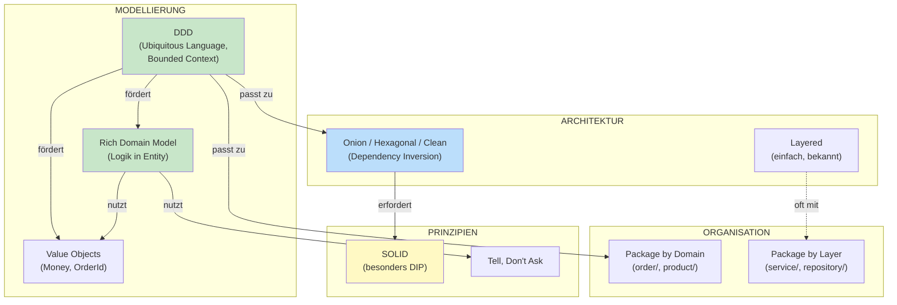

# Software-Architektur Overview: Was gehört zusammen?

Dieses Tutorial ordnet die wichtigsten Konzepte ein und zeigt **wie sie zusammenhängen**, **wo Übergänge sind**, und **was wann gilt**.

---

## Inhaltsverzeichnis

1. [Die Landkarte: Drei Ebenen](#1-die-landkarte-drei-ebenen)
2. [Was gehört zu was?](#2-was-gehört-zu-was)
3. [Die Konzepte im Projekt](#3-die-konzepte-im-projekt)
4. [SOLID Principles](#4-solid-principles)
5. [Weitere wichtige Prinzipien](#5-weitere-wichtige-prinzipien)
6. [Realitäts-Check: Prinzipien in der Praxis](#6-realitäts-check-prinzipien-in-der-praxis)
7. [Fließende Übergänge](#7-fließende-übergänge)
8. [Entscheidungshilfen](#8-entscheidungshilfen)
9. [Anti-Patterns](#9-anti-patterns)

---

## 1. Die Landkarte: Drei Ebenen

Diese Konzepte beantworten **unterschiedliche Fragen**:

```
┌─────────────────────────────────────────────────────────────────────┐
│                         WIE DENKE ICH?                              │
│                        (Modellierung)                               │
│  ┌─────────────────┐  ┌─────────────────┐  ┌─────────────────────┐  │
│  │      DDD        │  │ Rich vs Anemic  │  │   Value Objects     │  │
│  │ Bounded Context │  │ Logik in Entity │  │   Aggregates        │  │
│  └─────────────────┘  └─────────────────┘  └─────────────────────┘  │
├─────────────────────────────────────────────────────────────────────┤
│                      WIE STRUKTURIERE ICH?                          │
│                        (Architektur)                                │
│  ┌─────────────────┐  ┌─────────────────┐  ┌─────────────────────┐  │
│  │    Layered      │  │ Onion/Hexagonal │  │ Package-Strategien  │  │
│  │  Oben → Unten   │  │  Außen → Innen  │  │ by Layer/Domain     │  │
│  └─────────────────┘  └─────────────────┘  └─────────────────────┘  │
├─────────────────────────────────────────────────────────────────────┤
│                       WIE SCHREIBE ICH?                             │
│                       (Code-Qualität)                               │
│  ┌─────────────────┐  ┌─────────────────┐  ┌─────────────────────┐  │
│  │     SOLID       │  │   DRY / KISS    │  │  Tell, Don't Ask    │  │
│  │  5 Prinzipien   │  │     YAGNI       │  │  Immutability       │  │
│  └─────────────────┘  └─────────────────┘  └─────────────────────┘  │
└─────────────────────────────────────────────────────────────────────┘
```

| Ebene | Frage | Konzepte | Detail-Tutorial |
|-------|-------|----------|-----------------|
| **Modellierung** | Wie bilde ich Fachlichkeit ab? | DDD, Rich/Anemic, Aggregates | [tutorialRichVsAnemic.md](tutorialRichVsAnemic.md) |
| **Architektur** | Wie organisiere ich Abhängigkeiten? | Layered, Onion, Hexagonal | [tutorialOnion.md](tutorialOnion.md) |
| **Organisation** | Wie sortiere ich Dateien? | Package by Layer/Domain | [tutorialPackaging.md](tutorialPackaging.md) |
| **Code-Qualität** | Wie schreibe ich wartbaren Code? | SOLID, DRY, KISS, YAGNI | (dieses Tutorial) |

> **Wichtig:** Diese Ebenen sind **unabhängig voneinander wählbar**, aber sie **verstärken sich gegenseitig**.

---

## 2. Was gehört zu was?

### Die häufigsten Verwechslungen

| Aussage | Wahrheit |
|---------|----------|
| "domain/ Ordner = DDD" | ❌ DDD ist ein Denkansatz, keine Ordnerstruktur |
| "Onion = Rich Domain Model" | ❌ Beides unabhängige Entscheidungen |
| "Hexagonal = Onion = Clean" | ⚠️ Gleiche Prinzipien, andere Terminologie |
| "Layered = keine Interfaces" | ❌ Layered KANN Interfaces haben |
| "Package by Domain = DDD" | ❌ Package-Strategie ≠ Modellierungsansatz |

### Was fördert was?



### Der Kern-Unterschied: Abhängigkeitsrichtung

```
LAYERED                              ONION / HEXAGONAL / CLEAN
────────────────────                 ────────────────────────────

┌──────────────────┐                 ┌────────────────────────────┐
│   Controller     │                 │      INFRASTRUCTURE        │
├──────────────────┤                 │  (Controller, DB, Email)   │
│    Service       │──────┐          │            │               │
├──────────────────┤      │          │            ▼               │
│   Repository     │◄─────┘          │  ┌──────────────────────┐  │
├──────────────────┤                 │  │    APPLICATION       │  │
│     Model        │                 │  │  (Services, Ports)   │  │
└──────────────────┘                 │  │         │            │  │
        │                            │  │         ▼            │  │
        ▼                            │  │  ┌──────────────┐    │  │
   [ Database ]                      │  │  │    DOMAIN    │    │  │
                                     │  │  │  (Entities)  │    │  │
Abhängigkeiten                       │  │  └──────────────┘    │  │
zeigen nach UNTEN                    │  └──────────────────────┘  │
                                     └────────────────────────────┘

                                     Abhängigkeiten zeigen nach INNEN
```

| Aspekt | Layered | Onion/Hexagonal |
|--------|---------|-----------------|
| **Wer definiert Interfaces?** | Framework (JpaRepository) oder du selbst | Du selbst, typischerweise im Application Layer |
| **Domain kennt Infrastructure?** | Kann vermieden werden, wird aber nicht immer aktiv verhindert | Ziel: Domain ist unabhängig; Abhängigkeiten zeigen nach innen |
| **Testbarkeit** | Oft nur mit Mocking-Framework | Einfache Test-Implementierungen |

---

## 3. Die Konzepte im Projekt

Dieses Projekt implementiert **dieselbe Funktionalität** in vier Architekturen.

### Value Objects (DDD-Konzept)

Value Objects haben keine Identität - sie sind durch ihre Werte definiert.

**Projekt-Beispiel:** [hexagonal/.../Money.java](hexagonal/src/main/java/order/domain/model/Money.java)
```java
public record Money(BigDecimal amount) {
    public static final Money ZERO = new Money(BigDecimal.ZERO);

    public Money {
        Objects.requireNonNull(amount, "amount must not be null");
    }

    public Money add(Money other) {
        return new Money(this.amount.add(other.amount));
    }
}
```

**Wo im Projekt:** `Money`, `OrderId`, `CustomerId`, `ProductId`, `Quantity` - in allen vier Architekturen identisch.

### Rich Domain Model (Logik in Entity)

**Projekt-Beispiel:** [hexagonal/.../Order.java](hexagonal/src/main/java/order/domain/model/Order.java)
```java
public class Order {
    private final OrderId id;
    private List<OrderItem> items;
    private OrderStatus status;

    public void confirm() {
        ensureModifiable();                    // Entity prüft selbst
        if (items.isEmpty()) {
            throw new EmptyOrderException(id); // Entity wirft Exception
        }
        this.status = OrderStatus.CONFIRMED;
    }

    public List<OrderItem> getItems() {
        return Collections.unmodifiableList(items);  // Schutz vor Manipulation
    }
}
```

**Tell, Don't Ask:**
```java
// SCHLECHT (Ask): Service fragt und entscheidet
if (order.getStatus() == OrderStatus.DRAFT && !order.getItems().isEmpty()) {
    order.setStatus(OrderStatus.CONFIRMED);
}

// GUT (Tell): Service sagt, Entity entscheidet
order.confirm();
```

### Ports & Adapters (Hexagonal)

**Input Port** - was die Anwendung kann:
```java
// hexagonal/.../ConfirmOrderUseCase.java
public interface ConfirmOrderUseCase {
    OrderConfirmationResponse confirmOrder(OrderId orderId);
}
```

**Output Port** - was die Anwendung braucht:
```java
// hexagonal/.../SendNotificationPort.java
public interface SendNotificationPort {
    void sendOrderConfirmation(CustomerId customerId, OrderConfirmation confirmation);
}
```

**Adapter** - implementiert den Port:
```java
// hexagonal/.../EmailNotificationAdapter.java
public class EmailNotificationAdapter implements SendNotificationPort {
    @Override
    public void sendOrderConfirmation(CustomerId customerId, OrderConfirmation confirmation) {
        // Konkrete Email-Implementierung
    }
}
```

### Vergleich: Dieselbe Funktionalität, vier Architekturen

| Konzept | Layered | Onion | Hexagonal | Clean |
|---------|---------|-------|-----------|-------|
| **Order Entity** | `order/model/` | `order/core/model/` | `order/domain/model/` | `order/entity/model/` |
| **Repository** | Konkrete Klasse | Interface in `application/` | Output Port | Gateway Interface |
| **Email** | EmailService (konkret) | NotificationService (Interface) | SendNotificationPort | NotificationGateway |

### Package-Struktur im Vergleich

```
LAYERED (by Layer)              ONION (by Domain + Layer)
──────────────────              ─────────────────────────
order/                          order/
├── model/                      ├── core/
│   └── Order.java              │   └── model/Order.java
├── service/                    ├── application/
│   └── OrderService.java       │   ├── OrderApplicationService.java
├── repository/                 │   └── repository/
│   └── OrderRepository.java    │       └── OrderRepository.java  ← Interface!
└── presentation/               └── infrastructure/
    └── OrderController.java        ├── persistence/
                                    │   └── InMemoryOrderRepository.java
                                    └── web/OrderController.java
```

---

## 4. SOLID Principles

> **Ehrliche Einordnung vorweg:** SOLID wird in mittelgroßen Spring-Boot-Projekten selten "rein" gelebt – und das ist oft okay.

### S - Single Responsibility

> **Eine Klasse sollte nur einen Grund haben, sich zu ändern.**

```java
// THEORIE: Jede Klasse hat eine Verantwortung
Order                          → Bestellungslogik
OrderConfirmationCalculator    → Berechnung
EmailNotificationAdapter       → Email versenden

// REALITÄT: UserService macht alles
@Service
public class UserService {
    // Validierung, Businesslogik, Mapping,
    // bisschen Security, bisschen Transaktionen...
    // 400 Zeilen später...
}
```

**Praxis-Einordnung:**

| Theorie | Realität |
|---------|----------|
| Strikte Trennung | Controller okay, Services werden "God Services" |
| Eine Verantwortung | Oft 3-4 Verantwortungen, die "irgendwie zusammengehören" |

```
WIRD GELEBT?
─────────────────────────────────────────────────────────
[██████████░░░░░░░░░░] 50-70%

✅ Am ehesten umgesetzt
❌ Perfekte Trennung fast nie
```

### O - Open/Closed

> **Offen für Erweiterung, geschlossen für Änderung.**

```java
// THEORIE: Neue Notification-Art = Neuer Adapter
public class SmsNotificationAdapter implements SendNotificationPort { ... }

// REALITÄT: if-else Kette im Service
public void notify(Order order) {
    if (type == EMAIL) { ... }
    else if (type == SMS) { ... }
    else if (type == PUSH) { ... }
    // Kommt noch einer? Einfach else if dazu...
}
```

**Praxis-Einordnung:**

| Theorie | Realität |
|---------|----------|
| Strategy Pattern, Events | Switch-Statements, if-else |
| Erweitern ohne Änderung | Features werden einfach reingebaut |

```
WIRD GELEBT?
─────────────────────────────────────────────────────────
[████░░░░░░░░░░░░░░░░] 20%

✅ Nur bei echtem Bedarf (Plugin-System, viele Varianten)
❌ Kein Default-Ansatz
```

### L - Liskov Substitution

> **Subtypen müssen sich wie ihre Basistypen verhalten.**

```java
// Alle Implementierungen sind austauschbar:
InMemoryOrderRepository implements OrderRepository
PostgresOrderRepository implements OrderRepository
```

**Praxis-Einordnung:**

| Theorie | Realität |
|---------|----------|
| Subtypen verhalten sich gleich | Kaum Vererbung in Spring Boot |
| Wichtig für Polymorphie | Komposition + Interfaces statt Vererbung |

```
WIRD GELEBT?
─────────────────────────────────────────────────────────
[██░░░░░░░░░░░░░░░░░░] ~10%

⚠️ Nahezu irrelevant in der Praxis
   Spring Boot = Komposition, nicht Vererbung
   Wenn LSP verletzt → merkt man's erst in Prod 😬
```

### I - Interface Segregation

> **Kleine, spezifische Interfaces statt großer, allgemeiner.**

```java
// THEORIE (Hexagonal):
public interface LoadOrderPort { ... }   // Nur Lesen
public interface SaveOrderPort { ... }   // Nur Schreiben

// REALITÄT:
public interface UserService {
    User createUser();
    User findUser();
    void deleteUser();
    void resetPassword();
    void updateProfile();
    void sendWelcomeEmail();  // Gehört das hier hin? Egal, rein damit.
}
```

**Praxis-Einordnung:**

| Theorie | Realität |
|---------|----------|
| Ein Interface pro Use Case | "Lieber ein fettes Interface als 20 Mini-Interfaces" |
| Clients nutzen nur was sie brauchen | JpaRepository hat 20+ Methoden, stört niemanden |

```
WIRD GELEBT?
─────────────────────────────────────────────────────────
[███░░░░░░░░░░░░░░░░░] 15%

⚠️ Wird oft BEWUSST ignoriert
   → Overengineering-Gefahr bei strikter Umsetzung
   → Spring + JPA = fette Interfaces sind normal
```

### D - Dependency Inversion

> **Abhängig von Abstraktionen, nicht von Implementierungen.**

```java
// TECHNISCH JA:
@Service
public class OrderService {
    private final OrderRepository repo;  // Interface!
}

// INHALTLICH NEIN:
// → Niemand tauscht JPA je gegen was anderes
// → Interface existiert nur für Mockito
// → "Echte" Austauschbarkeit braucht keiner
```

**Praxis-Einordnung:**

| Theorie | Realität |
|---------|----------|
| Austauschbare Implementierungen | Nur für Tests relevant |
| High-Level unabhängig von Low-Level | JPA-Repository wird NIE ausgetauscht |

```
WIRD GELEBT?
─────────────────────────────────────────────────────────
[████████████░░░░░░░░] 60% (aber aus anderen Gründen)

✅ Formal ja (Constructor Injection)
⚠️ Inhaltlich nur für Testbarkeit
❌ Echte Austauschbarkeit? Fast nie genutzt
```

### SOLID Gesamtbild

```
┌─────────────────────────────────────────────────────────────────┐
│                    SOLID IN DER PRAXIS                          │
├─────────────────────────────────────────────────────────────────┤
│                                                                  │
│   S  [██████████░░░░░░░░░░]  50-70%   ← Am ehesten             │
│   O  [████░░░░░░░░░░░░░░░░]  20%      ← Nur bei Bedarf         │
│   L  [██░░░░░░░░░░░░░░░░░░]  10%      ← Kaum relevant          │
│   I  [███░░░░░░░░░░░░░░░░░]  15%      ← Bewusst ignoriert      │
│   D  [████████████░░░░░░░░]  60%      ← Für Tests, nicht mehr  │
│                                                                  │
├─────────────────────────────────────────────────────────────────┤
│                                                                  │
│   Erfolgreiche Teams machen PRAGMATISCHES SOLID:                │
│                                                                  │
│   • SRP: halbwegs sauber                                        │
│   • DIP: für Tests ausreichend                                  │
│   • OCP/ISP: nur bei echten Hotspots                           │
│   • LSP: kaum relevant                                          │
│                                                                  │
│   → Lesbarkeit & Änderbarkeit > Dogmen                         │
│                                                                  │
└─────────────────────────────────────────────────────────────────┘
```

### Wann SOLID sich lohnt

| Situation | SOLID-Level |
|-----------|-------------|
| MVP / Prototyp | Minimal (SRP grob, DIP für Tests) |
| Standard-CRUD | Niedrig (funktioniert auch ohne) |
| Komplexe Domain | Mittel (SRP wichtig, OCP bei Varianten) |
| Langlebiges Produkt | Höher (zahlt sich über Zeit aus) |
| Framework/Library | Hoch (andere bauen darauf auf) |

---

## 5. Weitere wichtige Prinzipien

### DRY - Don't Repeat Yourself

```java
// SCHLECHT: Dieselbe Berechnung an zwei Stellen
// GUT: Eine Stelle
public class Order {
    public Money calculateTotal() {
        return items.stream()
            .map(OrderItem::calculateSubtotal)
            .reduce(Money.ZERO, Money::add);
    }
}
```

**Aber:** Zwei ähnliche Code-Stellen sind nicht automatisch Duplikation. Frag dich: "Ändern sie sich aus demselben Grund?"

### KISS - Keep It Simple

```java
// OVER-ENGINEERING: State Machine für 4 Status
// KISS: Einfache Prüfung
public void confirm() {
    if (status != OrderStatus.DRAFT) {
        throw new IllegalStateException("Only DRAFT can be confirmed");
    }
    this.status = OrderStatus.CONFIRMED;
}
```

### YAGNI - You Ain't Gonna Need It

```java
// YAGNI-Verstoß: "Vielleicht brauchen wir das später"
public interface OrderExporter {
    void exportToCsv();
    void exportToXml();
    void exportToJson();
    void exportToPdf();
}

// YAGNI: Nur was angefordert wurde
public interface OrderExporter {
    void exportToCsv();
}
```

### Tell, Don't Ask

> **Sag Objekten was sie tun sollen, statt sie nach Zustand zu fragen.**

```java
// ASK (Anemic)
if (order.getStatus() == OrderStatus.DRAFT) {
    if (!order.getItems().isEmpty()) {
        order.setStatus(OrderStatus.CONFIRMED);
    }
}

// TELL (Rich)
order.confirm();  // Entity prüft alles selbst
```

### Composition over Inheritance

```java
// VERERBUNG: Starr
class ConfirmedOrder extends Order { ... }
class ShippedOrder extends ConfirmedOrder { ... }

// KOMPOSITION: Flexibel
class Order {
    private OrderStatus status;  // Status als Feld
    public void confirm() { ... }
    public void ship() { ... }
}
```

### Fail Fast

> **Früh fehlschlagen, nicht später mit kryptischen Fehlern.**

```java
// SCHLECHT: Fehler tritt 200 Zeilen später auf
public void processOrder(Order order) {
    // ... viel Code ...
    var total = order.calculateTotal();  // NullPointer wenn items null
}

// GUT: Sofort prüfen
public void processOrder(Order order) {
    Objects.requireNonNull(order, "order must not be null");
    if (order.getItems().isEmpty()) {
        throw new IllegalArgumentException("order must have items");
    }
    // Jetzt sicher weiterarbeiten
}
```

**Praxis-Einordnung:**

```
WANN FAIL FAST                      WANN TOLERANT SEIN
──────────────────                  ──────────────────
API-Eingaben (Controller)           Batch-Jobs (loggen, weitermachen)
Konstruktoren                       Optional-Felder
Geschäftslogik-Vorbedingungen       UI-Eingaben (Validierung anzeigen)
```

| Situation | Empfehlung |
|-----------|------------|
| REST-Controller | ✅ Fail Fast mit klaren Fehlermeldungen |
| Domain-Entity | ✅ Fail Fast - Invarianten schützen |
| Import-Job (1000 Datensätze) | ⚠️ Fehler sammeln, am Ende reporten |
| Event-Consumer | ⚠️ Dead Letter Queue statt Crash |

### Law of Demeter (Don't talk to strangers)

> **Nur mit direkten Nachbarn reden, nicht durch Objekte durchgreifen.**

```java
// SCHLECHT: Durchgreifen durch 3 Objekte
String city = order.getCustomer().getAddress().getCity();

// PROBLEM: Was wenn customer null? address null?
// PROBLEM: Order kennt interne Struktur von Customer

// BESSER: Order bietet das an
String city = order.getShippingCity();

// ODER: Null-safe mit Optional
String city = Optional.ofNullable(order.getCustomer())
    .map(Customer::getAddress)
    .map(Address::getCity)
    .orElse("Unknown");
```

**Praxis-Einordnung:**

```
         STRIKT                           PRAGMATISCH
           │                                   │
           ▼                                   ▼
    Getter-Ketten                    In Mappern/DTOs okay
    in Business-Logik                ─────────────────────
    │               │                │ Hier darf man     │
    │  Hier wirklich│                │ order.getCustomer │
    │  vermeiden    │                │ ().getName()      │
    │               │                │                   │
    └───────────────┘                └───────────────────┘
```

| Kontext | Wie strikt? |
|---------|-------------|
| Domain-Logik | Strikt - keine Ketten |
| Mapper/Converter | Pragmatisch - Ketten okay |
| Templates/Views | Pragmatisch - Ketten okay |
| Tests | Egal - Hauptsache lesbar |

### Separation of Concerns

> **Jede Komponente macht genau eine Sache.**

```java
// SCHLECHT: Controller macht alles
@PostMapping("/orders")
public ResponseEntity<?> createOrder(@RequestBody Map<String, Object> body) {
    // Validierung
    if (body.get("items") == null) return ResponseEntity.badRequest().build();

    // Mapping
    var order = new Order();
    order.setCustomerId((Long) body.get("customerId"));

    // Business Logik
    if (stockService.checkAvailability(...)) {
        order.setStatus(CONFIRMED);
    }

    // Persistenz
    entityManager.persist(order);

    // Notification
    emailService.send(...);

    // Response bauen
    return ResponseEntity.ok(Map.of("id", order.getId()));
}

// GUT: Jede Schicht macht eins
@PostMapping("/orders")
public ResponseEntity<OrderResponse> createOrder(@Valid @RequestBody CreateOrderRequest request) {
    var order = orderService.create(request);    // Service macht Business-Logik
    return ResponseEntity.ok(OrderMapper.toResponse(order));  // Controller nur HTTP
}
```

**Praxis-Einordnung:**

```
┌─────────────────────────────────────────────────────────────────┐
│                    SEPARATION OF CONCERNS                        │
├─────────────────────────────────────────────────────────────────┤
│                                                                  │
│  IMMER TRENNEN:                                                 │
│  ─────────────                                                  │
│  • HTTP-Handling (Controller) vs Business-Logik (Service)       │
│  • Validierung vs Verarbeitung                                  │
│  • Logging/Monitoring vs Fachlogik                              │
│                                                                  │
│  OFT TRENNEN:                                                   │
│  ────────────                                                   │
│  • Lesen vs Schreiben (CQRS-lite)                              │
│  • Orchestrierung vs Berechnung                                 │
│                                                                  │
│  NICHT ÜBERTREIBEN:                                             │
│  ──────────────────                                             │
│  • Nicht jede Methode in eigene Klasse                         │
│  • Nicht jedes Feld in eigene Komponente                       │
│                                                                  │
└─────────────────────────────────────────────────────────────────┘
```

### Immutability

> **Objekte nach Erstellung nicht mehr ändern.**

```java
// MUTABLE: Kann überall geändert werden
public class Money {
    private BigDecimal amount;  // Kann geändert werden

    public void setAmount(BigDecimal amount) {
        this.amount = amount;  // Wer hat das geändert? Wann?
    }
}

// IMMUTABLE: Sicher, threadsafe, einfach zu verstehen
public record Money(BigDecimal amount) {
    public Money {
        Objects.requireNonNull(amount);
    }

    public Money add(Money other) {
        return new Money(this.amount.add(other.amount));  // Neues Objekt!
    }
}
```

**Praxis-Einordnung:**

```
              IMMUTABILITY NUTZEN

    Immer │   Value Objects (Money, OrderId)
          │   DTOs / Request / Response
          │   Events
          │   Config-Objekte
          │
          │   ─────────────────────────────
          │
   Meistens│   Domain Entities (Felder final)
          │   Aber: Status darf sich ändern
          │
          │   ─────────────────────────────
          │
    Selten│   JPA Entities (Hibernate braucht Setter)
          │   Builder (während Konstruktion mutable)
          │
          ▼
```

| Objekt-Typ | Immutable? | Warum |
|------------|------------|-------|
| **Value Objects** | ✅ Immer | Keine Identität, nur Wert |
| **DTOs** | ✅ Immer | Nur Transport, keine Logik |
| **Domain Events** | ✅ Immer | Geschichte ändert sich nicht |
| **Entities** | ⚠️ Teilweise | ID immutable, Status mutable |
| **JPA Entities** | ❌ Leider nein | Hibernate braucht Zugriff |

**Java Records - der einfache Weg:**
```java
// Vorher: 30 Zeilen Boilerplate
public class OrderId {
    private final Long value;
    public OrderId(Long value) { this.value = value; }
    public Long getValue() { return value; }
    // equals, hashCode, toString...
}

// Nachher: 1 Zeile
public record OrderId(Long value) { }
```

---

## 6. Realitäts-Check: Prinzipien in der Praxis

### Das Spektrum: Wo stehst du?

```
CHAOS                                                      OVER-ENGINEERING
  │                                                              │
  │    "Geht doch"        SWEET SPOT         "Clean Code"       │
  │         │                 │                    │             │
  ▼         ▼                 ▼                    ▼             ▼
┌─────┬───────────┬─────────────────────┬───────────────┬───────────┐
│     │           │                     │               │           │
│ 1000-Zeilen    │   Pragmatisch:      │  Alles hat    │ Abstract  │
│ God-Class     │   - Lesbar           │  Interface    │ Factory   │
│ mit allem     │   - Testbar wo nötig │  - Auch DTOs  │ Provider  │
│               │   - Einfach genug    │  - Auch Utils │ Singleton │
└─────┴───────────┴─────────────────────┴───────────────┴───────────┘
        │                   │                   │
        │                   │                   │
   Technische         Wartbar UND          Niemand
   Schulden          verständlich         versteht's
```

### Typische Spring Boot Projekte - Was funktioniert

**Beispiel: Typischer OrderService**

```java
// SO SIEHT ES MEISTENS AUS - UND DAS IST OKAY
@Service
@RequiredArgsConstructor
public class OrderService {

    private final OrderRepository orderRepository;
    private final ProductClient productClient;
    private final NotificationService notificationService;

    @Transactional
    public OrderResponse createOrder(CreateOrderRequest request) {
        // Validierung
        if (request.getItems().isEmpty()) {
            throw new BadRequestException("Order must have items");
        }

        // Produkte prüfen
        for (var item : request.getItems()) {
            var product = productClient.getProduct(item.getProductId());
            if (product.getStock() < item.getQuantity()) {
                throw new BadRequestException("Not enough stock");
            }
        }

        // Order erstellen
        var order = new Order();
        order.setCustomerId(request.getCustomerId());
        order.setStatus(OrderStatus.CREATED);
        // ... 50 weitere Zeilen

        orderRepository.save(order);
        notificationService.sendOrderCreated(order);

        return OrderMapper.toResponse(order);
    }

    // ... 10 weitere Methoden, insgesamt 400 Zeilen
}
```

**Ist das schlecht?** Kommt drauf an:

| Situation | Bewertung |
|-----------|-----------|
| MVP, 2 Entwickler, 6 Monate Projekt | ✅ Völlig okay |
| 5 Jahre alt, 20 Entwickler, Kernprodukt | ⚠️ Refactoring überlegen |
| Geschäftslogik ändert sich wöchentlich | ❌ Wird zum Problem |

### Wann kippt es? Die Übergänge

```
         OKAY                          PROBLEMATISCH
           │                                 │
           │    ┌─────────────────────┐     │
           │    │   KIPPPUNKTE        │     │
           │    └─────────────────────┘     │
           │                                 │
           ▼                                 ▼

Service < 300 Zeilen          ──────►  Service > 500 Zeilen
3-4 Dependencies              ──────►  8+ Dependencies
Wenige if-Verschachtelungen   ──────►  if-if-if-if-else
Tests sind einfach            ──────►  Test-Setup > 50 Zeilen
Neue Devs verstehen es        ──────►  "Frag mal Peter"
```

### Praxisbeispiel: Der Übergang von Okay zu Problematisch

**Phase 1: Anfang (okay)**
```java
public class OrderService {
    public Order createOrder(Request req) { ... }      // 40 Zeilen
    public Order updateOrder(Long id, Request req) { ... } // 30 Zeilen
    public void cancelOrder(Long id) { ... }           // 20 Zeilen
}
// Total: 90 Zeilen - PRIMA
```

**Phase 2: Wachstum (noch okay)**
```java
public class OrderService {
    public Order createOrder(...) { ... }              // 60 Zeilen
    public Order updateOrder(...) { ... }              // 50 Zeilen
    public void cancelOrder(...) { ... }               // 40 Zeilen
    public OrderConfirmation confirmOrder(...) { ... } // 80 Zeilen
    public void sendReminder(...) { ... }              // 30 Zeilen
}
// Total: 260 Zeilen - NOCH OKAY, aber beobachten
```

**Phase 3: Problem**
```java
public class OrderService {
    // 12 Dependencies im Constructor
    // 15 public Methoden
    // Private Hilfsmethoden die nur von einer Methode genutzt werden
    // Methoden die andere Methoden aufrufen die andere aufrufen
    // "Das versteht nur Thomas"
}
// Total: 800 Zeilen - REFACTORING NÖTIG
```

### Was dann tun? Pragmatisches Refactoring

```
NICHT SO                              SONDERN SO
──────────────────                    ──────────────────

Alles auf einmal                      Ein Bereich nach dem anderen
umbauen                               ────────────────────────────
      │                                     │
      ▼                                     ▼
┌─────────────────┐                  ┌─────────────────┐
│ 3 Wochen        │                  │ OrderService    │
│ Refactoring     │                  │      │          │
│ "Big Bang"      │                  │      ▼          │
│                 │                  │ confirmOrder()  │──► eigene Klasse
│ Risiko: HOCH    │                  │ auslagern       │
│                 │                  │                 │
│ Keiner traut    │                  │ Rest bleibt     │
│ sich mehr       │                  │ erstmal         │
└─────────────────┘                  └─────────────────┘
```

**Konkreter Refactoring-Schritt:**
```java
// VORHER: Alles in OrderService
@Transactional
public OrderConfirmation confirmOrder(Long orderId) {
    var order = orderRepository.findById(orderId).orElseThrow();

    // 20 Zeilen: Externe API prüfen
    // 15 Zeilen: Stock reservieren
    // 10 Zeilen: Preis berechnen
    // 10 Zeilen: Bestätigung erstellen
    // 10 Zeilen: Speichern
    // 10 Zeilen: Email senden

    return confirmation;
}

// NACHHER: Komplexe Logik extrahiert
@Transactional
public OrderConfirmation confirmOrder(Long orderId) {
    var order = orderRepository.findById(orderId).orElseThrow();

    externalOrderValidator.validate(order);           // Eigene Klasse
    stockService.reserve(order);                      // Existiert schon
    var confirmation = confirmationCalculator.calculate(order); // Eigene Klasse

    order.setStatus(CONFIRMED);
    orderRepository.save(order);
    confirmationRepository.save(confirmation);

    notificationService.sendConfirmation(order, confirmation);

    return confirmation;
}
```

### SOLID in echt - Was davon nutzen?

```
                    NUTZEN IN DER PRAXIS

         Hoch │
              │     ┌─────┐
              │     │  D  │ ← Dependency Inversion
              │     │     │   (Spring macht's automatisch)
              │     └─────┘
              │          ┌─────┐
              │          │  S  │ ← Single Responsibility
              │          │     │   (wenn Service zu groß wird)
              │          └─────┘
              │               ┌─────┐
              │               │  L  │ ← Liskov
              │               │     │   (bei Vererbung)
              │               └─────┘
              │                         ┌─────┐
              │                         │  I  │ ← Interface Segregation
              │                         │     │   (selten relevant)
              │                         └─────┘
              │                              ┌─────┐
              │                              │  O  │ ← Open/Closed
         Niedrig                             │     │   (fast nie)
              └──────────────────────────────┴─────┴────────────►
                                                        Häufigkeit
```

### Konkret: Was in jedem Projekt machen

| Was | Warum | Aufwand |
|-----|-------|---------|
| **Constructor Injection** | Spring macht's, testbar | Keiner |
| **Kleine Methoden (< 20 Zeilen)** | Lesbar, testbar | Gering |
| **Sprechende Namen** | Kostet nichts, hilft allen | Keiner |
| **Value Objects für IDs** | `OrderId` statt `Long` - Typsicherheit | Gering |
| **Exceptions mit Kontext** | `OrderNotFoundException(orderId)` | Gering |

### Konkret: Was bei komplexer Logik machen

| Was | Warum | Wann |
|-----|-------|------|
| **Rich Domain Model** | Invarianten geschützt | Wenn > 3 Geschäftsregeln |
| **Eigene Interfaces** | Testbar ohne Mocks | Wenn externe Services |
| **Domain Services** | Logik zwischen Aggregates | Wenn Cross-Entity-Logik |

### Konkret: Was weglassen

| Was | Warum weglassen |
|-----|-----------------|
| **Interface für jeden Service** | `OrderService` + `OrderServiceImpl` = sinnloser Boilerplate |
| **DTO für alles** | Manchmal reicht die Entity |
| **Abstract Base Classes** | Composition > Inheritance |
| **Event Sourcing** | Außer du brauchst wirklich Audit-History |

### Der Realitäts-Test

Frag dich bei jedem "Clean Code" Refactoring:

```
┌────────────────────────────────────────────────────────────────┐
│                                                                │
│  1. Versteht ein neuer Entwickler das in 10 Minuten?          │
│                                                                │
│  2. Kann ich das in 2 Minuten erklären?                       │
│                                                                │
│  3. Wird der Test einfacher oder komplizierter?               │
│                                                                │
│  4. Löst das ein echtes Problem oder ein theoretisches?       │
│                                                                │
└────────────────────────────────────────────────────────────────┘

Wenn "Nein" → Lass es.
```

---

## 7. Fließende Übergänge

### Layered → Onion: Schrittweise

```
SCHRITT 1                    SCHRITT 2                    SCHRITT 3
─────────                    ─────────                    ─────────
Eigene Interfaces            Package-Struktur             Logik in Entities
einführen                    anpassen                     verschieben
```

**Schritt 1: Eigene Interfaces**
```java
// Vorher: Framework-Interface
@Repository
public interface OrderRepository extends JpaRepository<Order, Long> { }

// Nachher: Dein Interface + Adapter
public interface OrderRepository {
    Optional<Order> findById(OrderId id);
}

public class JpaOrderRepositoryAdapter implements OrderRepository { ... }
```

**Schritt 2: Package-Struktur**
```
// Vorher: by Layer       // Nachher: by Domain + Schichten
order/                    order/
├── service/              ├── application/
├── repository/           ├── core/
└── model/                └── infrastructure/
```

**Schritt 3: Logik in Entities**
```java
// Vorher: Service hat Logik
if (order.getItems().isEmpty()) throw new EmptyOrderException();
order.setStatus(CONFIRMED);

// Nachher: Entity hat Logik
order.confirm();
```

### Onion vs Hexagonal vs Clean: Terminologie

| Konzept | Onion | Hexagonal | Clean |
|---------|-------|-----------|-------|
| **Innerster Kern** | Core | Domain | Entities |
| **Anwendungslogik** | Application | Application | Use Cases |
| **Externe Schnittstellen** | Infrastructure | Adapters | Interface Adapters |
| **Repository-Abstraktion** | Repository Interface | Output Port | Gateway |

---

## 8. Entscheidungshilfen

### Wann welche Architektur?

| Situation | Empfehlung | Grund |
|-----------|------------|-------|
| CRUD-Anwendung | Layered | Wenig Logik, Overhead nicht gerechtfertigt |
| Komplexe Geschäftsregeln | Onion/Hexagonal | Domain wird geschützt |
| Hohe Testanforderungen | Onion/Hexagonal | Einfach testbar ohne Mocks |
| Viele externe Integrationen | Hexagonal | Ports & Adapters ideal |
| Microservices | Hexagonal | Pro Service eigene Adapter |

### Wann Rich vs Anemic?

| Indikator | → Anemic OK | → Rich empfohlen |
|-----------|-------------|------------------|
| Geschäftsregeln | Wenige | Viele |
| Service-Code | Wenige `if`-Prüfungen | Viele `if`-Prüfungen |
| Invarianten | Keine | Müssen geschützt werden |

**Faustregel:** Wenn dein Service mehr als 3 `if (entity.getX() == Y)` Prüfungen hat, gehört diese Logik in die Entity.

### Wann welche Package-Strategie?

| Projekt-Größe | Empfehlung |
|---------------|------------|
| < 20 Entities | by Layer funktioniert |
| 20-50 Entities | by Domain empfohlen |
| > 50 Entities | by Domain notwendig |

---

## 9. Anti-Patterns & Realität

### Onion + Anemic = Der Normalfall

```java
// REALITÄT in den meisten Projekten:
order/core/model/Order.java           ← Nur Getter/Setter (anemic)
order/application/OrderService.java   ← Alle Logik hier

// Onion strukturell genutzt, Anemic funktional gelebt.
```

**Warum ist das so häufig?**

| Onion-Struktur | Rich Domain Model |
|----------------|-------------------|
| Ordner umbenennen | Modellierung umdenken |
| Tutorial kopieren | Invarianten verstehen |
| Sofort sichtbar | Erfordert Erfahrung |
| ✅ Einfach | ❌ Schwer |

**Ehrliche Einordnung:**
- Funktioniert trotzdem (besser als Chaos)
- Dependency-Richtung stimmt immerhin
- Full Potential wird nicht genutzt
- Ist okay, solange das Team es weiß

### "DDD" als Ordnername

```java
// ANTI-PATTERN
src/domain/Order.java  ← Keine Ubiquitous Language, keine Bounded Contexts

// Echtes DDD erfordert:
// 1. Gespräche mit Fachbereich
// 2. Gemeinsame Sprache
// 3. Klare Grenzen (Bounded Contexts)
```

### Framework-Bleeding

```java
// ANTI-PATTERN: JPA-Annotationen im Domain-Kern (bei Onion/Hexagonal)
@Entity
@Table(name = "orders")
public class Order { ... }

// BESSER: Saubere Domain + separates Mapping in Infrastructure
```

---

## Projekt-Struktur

| Ordner | Architektur |
|--------|-------------|
| [layered/](layered/) | Layered Architecture |
| [onion/](onion/) | Onion Architecture |
| [hexagonal/](hexagonal/) | Hexagonal (Ports & Adapters) |
| [clean/](clean/) | Clean Architecture |

---

## Weiterführende Tutorials

| Tutorial | Wann lesen? |
|----------|-------------|
| [tutorialOnion.md](tutorialOnion.md) | Migration von Layered zu Onion |
| [tutorialHexagonal.md](tutorialHexagonal.md) | Ports & Adapters verstehen |
| [tutorialRichVsAnemic.md](tutorialRichVsAnemic.md) | Wo gehört Logik hin? |
| [tutorialPackaging.md](tutorialPackaging.md) | Ordnerstruktur überdenken |
