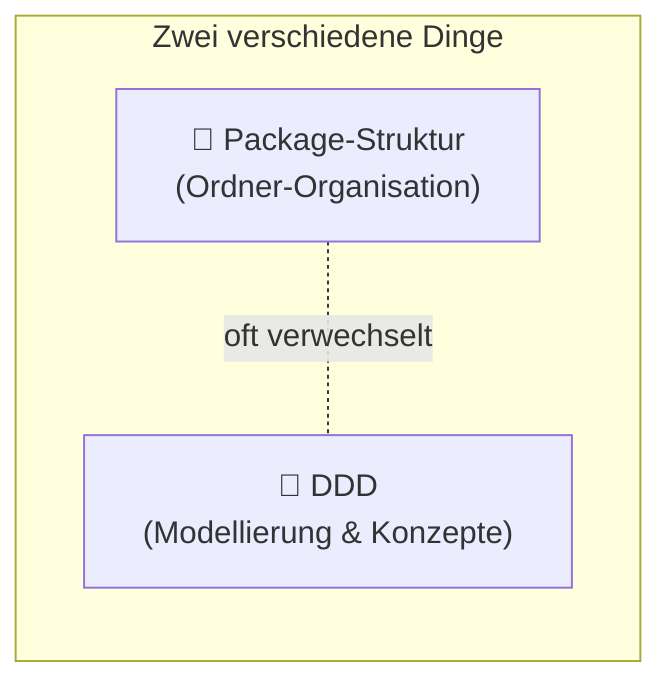
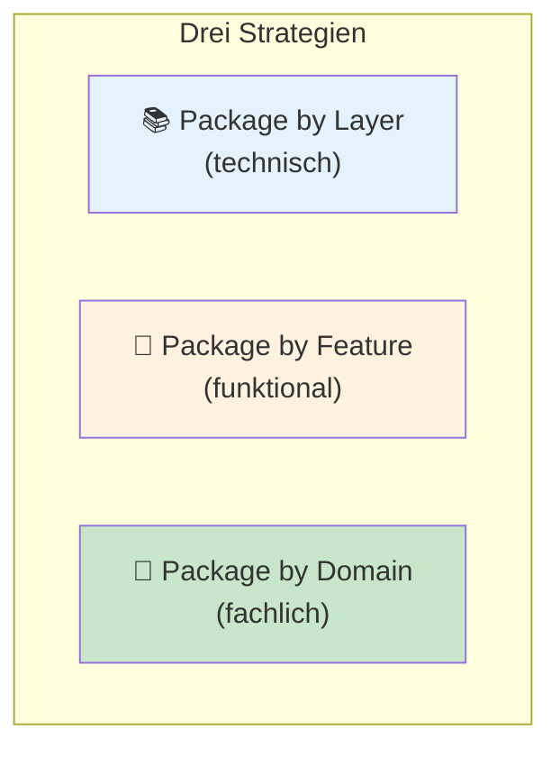
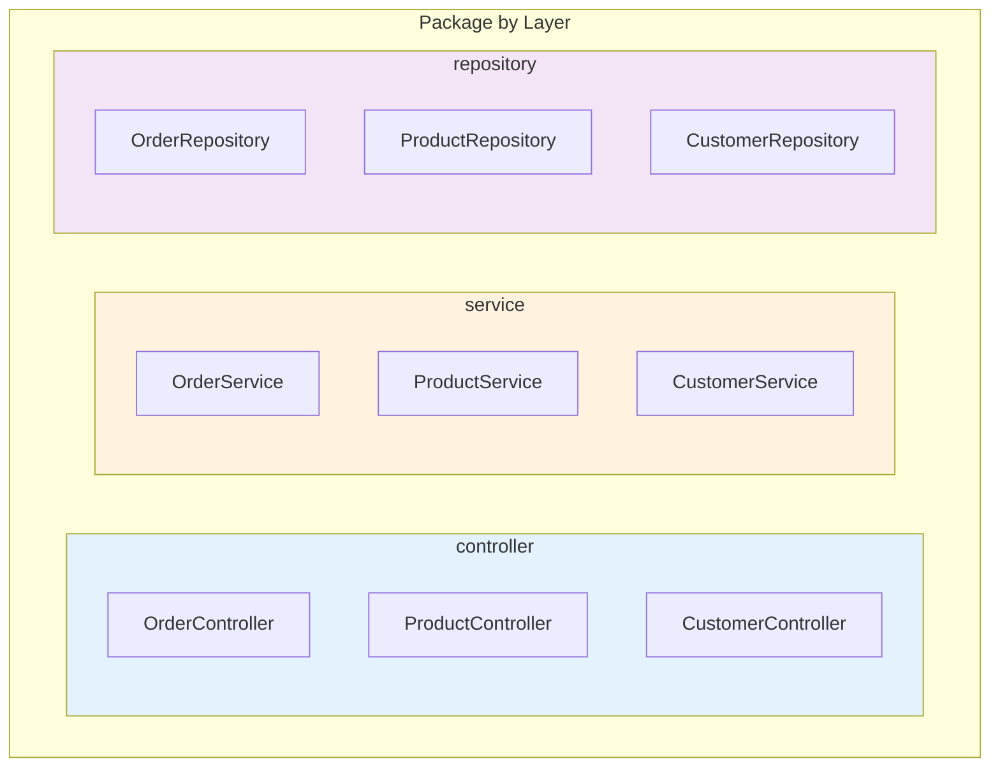
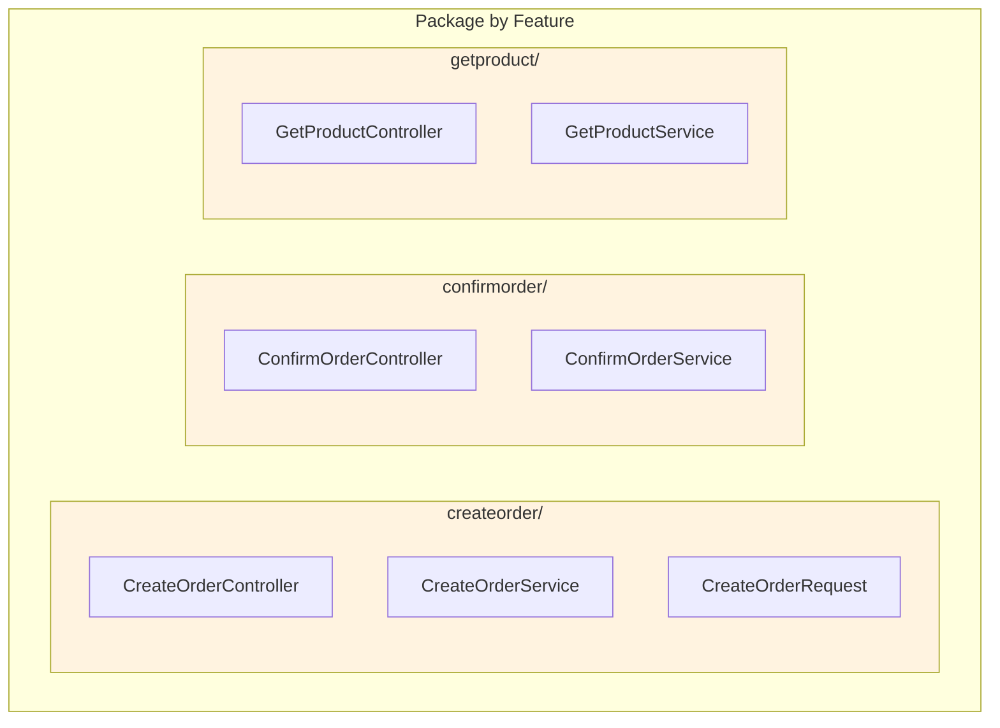
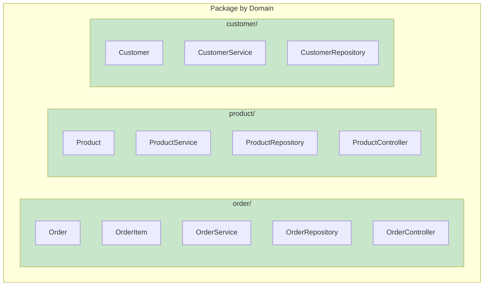
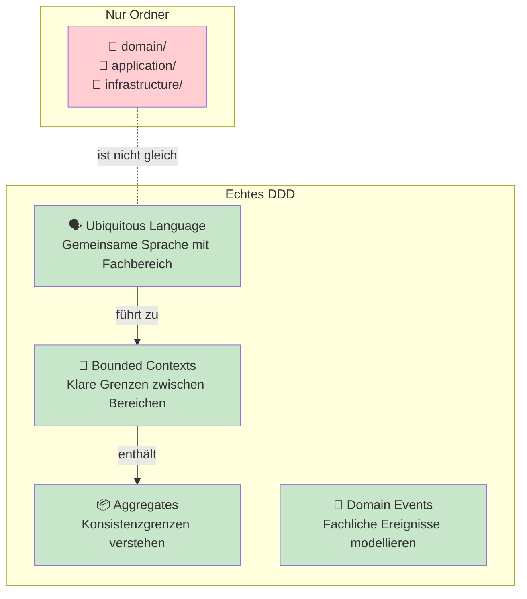

# DDD vs Package-Struktur - Was wird oft verwechselt?

Dieses Tutorial erklärt den Unterschied zwischen **Domain-Driven Design (DDD)** und **Package-Strukturen** - zwei Konzepte, die oft vermischt werden.

---

## Inhaltsverzeichnis

1. [Das Missverständnis](#1-das-missverständnis)
2. [Was ist eine Package-Struktur?](#2-was-ist-eine-package-struktur)
3. [Was ist DDD?](#3-was-ist-ddd)
4. [Die drei Package-Strategien](#4-die-drei-package-strategien)
5. [Package by Layer](#5-package-by-layer)
6. [Package by Feature](#6-package-by-feature)
7. [Package by Domain (Component)](#7-package-by-domain-component)
8. [DDD-Konzepte vs Package-Struktur](#8-ddd-konzepte-vs-package-struktur)
9. [Kombinationen](#9-kombinationen)

---

## 1. Das Missverständnis

### Oft gehört:

> "Wir machen DDD - wir haben einen `domain/` Ordner"
> "Das ist Package by Feature, also DDD"
> "Unser Projekt ist nach DDD strukturiert"

### Die Wahrheit:

**Package-Struktur ≠ DDD**

| Konzept | Was es ist |
|---------|------------|
| **Package-Struktur** | Wie du Dateien in Ordner sortierst |
| **DDD** | Wie du Software modellierst und über die Domäne nachdenkst |



Du kannst:
- DDD machen mit jeder Package-Struktur
- Package by Feature machen ohne DDD
- Einen `domain/` Ordner haben ohne DDD zu verstehen

---

## 2. Was ist eine Package-Struktur?

### Definition

> Wie du deine Dateien in Ordner organisierst.

### Die Frage

```
src/main/java/
└── ???
    └── ???
        └── OrderService.java
```

**Nach welchem Prinzip sortierst du?**

---

## 3. Was ist DDD?

### Definition

> **Domain-Driven Design** ist ein Ansatz zur Softwareentwicklung, der die Fachdomäne in den Mittelpunkt stellt.

### DDD-Konzepte (Auswahl)

| Konzept | Bedeutung |
|---------|-----------|
| **Ubiquitous Language** | Gemeinsame Sprache zwischen Devs und Fachexperten |
| **Bounded Context** | Abgegrenzter Bereich mit eigener Sprache/Modell |
| **Aggregate** | Cluster von Objekten, die zusammen konsistent sein müssen |
| **Aggregate Root** | Einstiegspunkt in ein Aggregate |
| **Entity** | Objekt mit Identität |
| **Value Object** | Objekt ohne Identität, definiert durch Werte |
| **Domain Service** | Logik, die nicht in eine Entity passt |
| **Repository** | Abstraktion für Datenzugriff |

### DDD ist NICHT:

- Ein Ordner namens `domain/`
- Eine bestimmte Package-Struktur
- Hexagonal/Onion Architecture (aber passt gut dazu)

---

## 4. Die drei Package-Strategien



---

## 5. Package by Layer

### Prinzip

> Sortiere nach **technischer Schicht** - alle Controller zusammen, alle Services zusammen, etc.


### Struktur

```
src/main/java/com/example/shop/
├── controller/
│   ├── OrderController.java
│   ├── ProductController.java
│   └── CustomerController.java
├── service/
│   ├── OrderService.java
│   ├── ProductService.java
│   └── CustomerService.java
├── repository/
│   ├── OrderRepository.java
│   ├── ProductRepository.java
│   └── CustomerRepository.java
├── model/
│   ├── Order.java
│   ├── Product.java
│   └── Customer.java
└── dto/
    ├── OrderDto.java
    ├── ProductDto.java
    └── CustomerDto.java
```

### Visualisierung



### Vorteile

| Vorteil | Erklärung |
|---------|-----------|
| Einfach | Jeder kennt es |
| Konsistent | Klare Regel: Typ → Ordner |
| Framework-nah | Spring Boot Tutorials zeigen es so |

### Nachteile

| Nachteil | Erklärung |
|----------|-----------|
| Skaliert schlecht | 50 Services in einem Ordner |
| Versteckt Zusammenhänge | Order-Dateien über 5 Ordner verteilt |
| Fördert Kopplung | Alles sieht alles |

---

## 6. Package by Feature

### Prinzip

> Sortiere nach **Feature/Use Case** - alles für "Order anlegen" zusammen.


### Struktur

```
src/main/java/com/example/shop/
├── createorder/
│   ├── CreateOrderController.java
│   ├── CreateOrderService.java
│   ├── CreateOrderRequest.java
│   └── CreateOrderResponse.java
├── confirmorder/
│   ├── ConfirmOrderController.java
│   ├── ConfirmOrderService.java
│   └── ConfirmOrderResponse.java
├── getproduct/
│   ├── GetProductController.java
│   ├── GetProductService.java
│   └── ProductResponse.java
└── shared/
    ├── Order.java
    ├── Product.java
    └── OrderRepository.java
```

### Visualisierung



### Vorteile

| Vorteil | Erklärung |
|---------|-----------|
| Feature-fokussiert | Alles für einen Use Case zusammen |
| Einfach zu löschen | Feature weg = Ordner weg |
| Weniger Kopplung | Features sind isoliert |

### Nachteile

| Nachteil | Erklärung |
|----------|-----------|
| Shared Code | Wo liegt `Order.java`? |
| Duplizierung | Ähnliche Features duplizieren Code |
| Kein Domänen-Denken | Fokus auf Use Cases, nicht Fachlichkeit |

---

## 7. Package by Domain (Component)

### Prinzip

> Sortiere nach **fachlichem Bereich** - alles zu "Order" zusammen, alles zu "Product" zusammen.


### Struktur

```
src/main/java/com/example/shop/
├── order/
│   ├── Order.java
│   ├── OrderItem.java
│   ├── OrderService.java
│   ├── OrderRepository.java
│   ├── OrderController.java
│   └── OrderNotFoundException.java
├── product/
│   ├── Product.java
│   ├── ProductService.java
│   ├── ProductRepository.java
│   ├── ProductController.java
│   └── ProductNotFoundException.java
└── customer/
    ├── Customer.java
    ├── CustomerService.java
    ├── CustomerRepository.java
    └── CustomerController.java
```

### Visualisierung



### Vorteile

| Vorteil | Erklärung |
|---------|-----------|
| Fachlich gruppiert | Alles zu "Order" ist zusammen |
| Skaliert gut | Neue Domäne = neuer Ordner |
| Bounded Context | Passt zu DDD-Denken |
| Microservice-ready | Ordner → Service Extraktion einfach |

### Nachteile

| Nachteil | Erklärung |
|----------|-----------|
| Schnittfindung | Wo gehört "OrderItem" hin? |
| Cross-Cutting | Logging, Security - wo? |
| Nicht immer klar | Ist "Payment" eigene Domäne? |

---

## 8. DDD-Konzepte vs Package-Struktur


### Die Verwechslung

| Das ist NICHT DDD | Das IST DDD |
|-------------------|-------------|
| Einen `domain/` Ordner haben | Ubiquitous Language definieren |
| Package by Domain nutzen | Bounded Contexts identifizieren |
| `OrderAggregate.java` nennen | Verstehen was ein Aggregate ist |
| Ordner wie DDD-Bücher benennen | Mit Fachexperten modellieren |

### DDD-Konzepte in Package-Struktur abbilden

Du KANNST DDD-Konzepte in Ordnern reflektieren:

```
src/main/java/com/example/shop/
├── order/                          ← Bounded Context
│   ├── domain/
│   │   ├── model/
│   │   │   ├── Order.java          ← Aggregate Root
│   │   │   ├── OrderItem.java      ← Entity im Aggregate
│   │   │   ├── OrderId.java        ← Value Object
│   │   │   └── Money.java          ← Value Object
│   │   └── service/
│   │       └── OrderPricingService.java  ← Domain Service
│   ├── application/
│   │   └── OrderApplicationService.java  ← Use Cases
│   └── infrastructure/
│       ├── OrderRepositoryImpl.java
│       └── OrderController.java
```

**ABER:** Die Ordner machen es nicht zu DDD!

### Was macht es zu DDD?



---

## 9. Kombinationen

### Package by Layer + DDD-Konzepte

```
src/main/java/
├── controller/
├── service/
├── repository/
└── domain/           ← "DDD" Ordner, aber...
    ├── Order.java    ← ...ist das ein Aggregate?
    └── Product.java  ← ...was sind die Grenzen?
```

**Problem:** Nur der Ordner-Name ist "DDD", nicht das Denken.

### Package by Domain + DDD-Konzepte

```
src/main/java/
├── order/                    ← Bounded Context: Order
│   ├── Order.java            ← Aggregate Root
│   ├── OrderItem.java        ← Teil des Aggregates
│   └── OrderService.java
├── product/                  ← Bounded Context: Product
│   └── Product.java          ← Eigenes Aggregate
└── shipping/                 ← Bounded Context: Shipping
    └── Shipment.java
```

**Besser:** Struktur spiegelt DDD-Konzepte wider.

### Package by Domain + Onion Architecture + DDD

```
src/main/java/
├── order/                              ← Bounded Context
│   ├── core/                           ← Innerster Kern
│   │   ├── model/
│   │   │   ├── Order.java              ← Aggregate Root (Rich!)
│   │   │   ├── OrderItem.java          ← Entity
│   │   │   └── Money.java              ← Value Object
│   │   └── OrderConfirmationCalculator.java  ← Domain Service
│   ├── application/
│   │   ├── OrderApplicationService.java
│   │   └── repository/
│   │       └── OrderRepository.java    ← Interface
│   └── infrastructure/
│       ├── persistence/
│       │   └── InMemoryOrderRepository.java
│       └── web/
│           └── OrderController.java
```

**Das ist der Sweet Spot:** Architektur + Packaging + DDD-Konzepte zusammen.


---

## Zusammenfassung

### Die Unterscheidung

| Konzept | Frage die es beantwortet |
|---------|--------------------------|
| **Package-Struktur** | Wie sortiere ich Dateien in Ordner? |
| **Architektur** (Onion etc.) | Wie fließen Abhängigkeiten? |
| **DDD** | Wie modelliere ich die Fachdomäne? |

### Die drei Package-Strategien

| Strategie | Sortiert nach | Beispiel-Ordner |
|-----------|---------------|-----------------|
| **Package by Layer** | Technische Schicht | `controller/`, `service/`, `repository/` |
| **Package by Feature** | Use Case | `createorder/`, `confirmorder/` |
| **Package by Domain** | Fachbereich | `order/`, `product/`, `customer/` |

### Häufige Fehler

| Fehler | Wahrheit |
|--------|----------|
| "`domain/` Ordner = DDD" | Nein, DDD ist Modellierung, nicht Ordner |
| "Package by Feature = DDD" | Nein, Features ≠ Bounded Contexts |
| "Onion = DDD" | Nein, Onion ist Architektur, DDD ist Modellierung |

### Der Kern in einem Satz

> **Package-Struktur** ist WO du Code hinlegst.
> **DDD** ist WIE du über Code nachdenkst.

---

### Pragmatismus-Hinweis

> **Wichtig:** Die "beste" Package-Struktur ist die, die dein Team versteht.
>
> - Ein konsistentes Package by Layer ist besser als ein chaotisches Package by Domain
> - Du kannst migrieren: Starte mit by Layer, wechsle zu by Domain wenn es wehtut
> - Code Reviews werden mit Package by Domain einfacher (PR ändert nur `order/` → klarer Scope)
> - Der Wechsel von by Layer zu by Domain dauert typischerweise 1-2 Wochen pro Bounded Context
>
> **Faustregel:** Wenn du mehr als 30 Sekunden brauchst, um alle Dateien zu einem Feature zu finden, ist by Layer zu klein geworden.

---

## Weiterführend

- [tutorialOnion.md](tutorialOnion.md) - Onion Architecture erklärt
- [tutorialHexagonal.md](tutorialHexagonal.md) - Hexagonal Architecture erklärt
- [tutorialRichVsAnemic.md](tutorialRichVsAnemic.md) - Rich vs Anemic Domain Model
