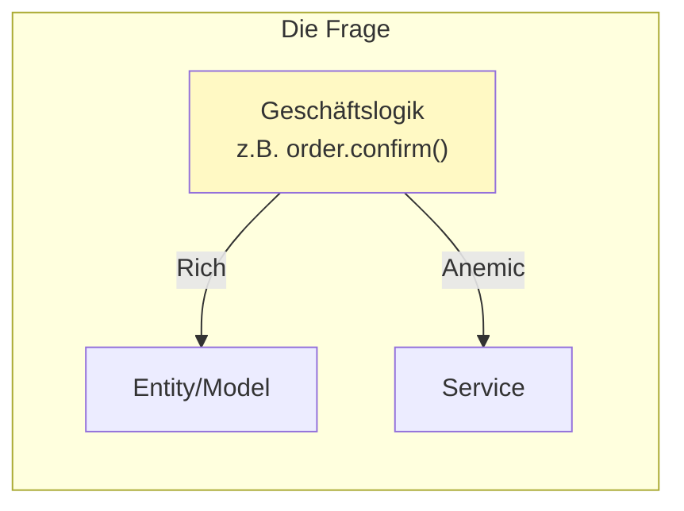
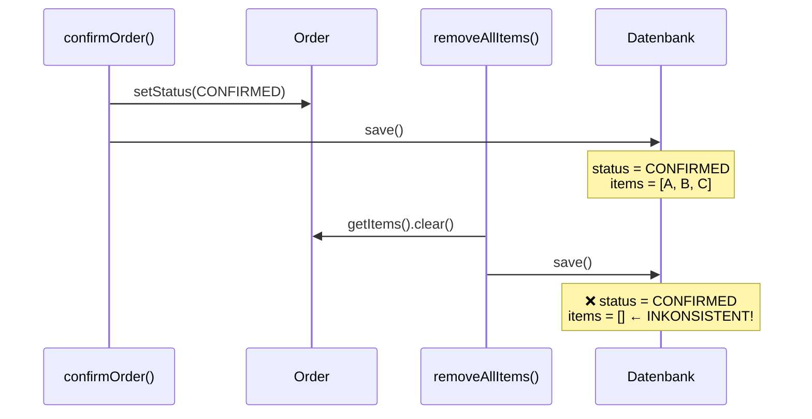
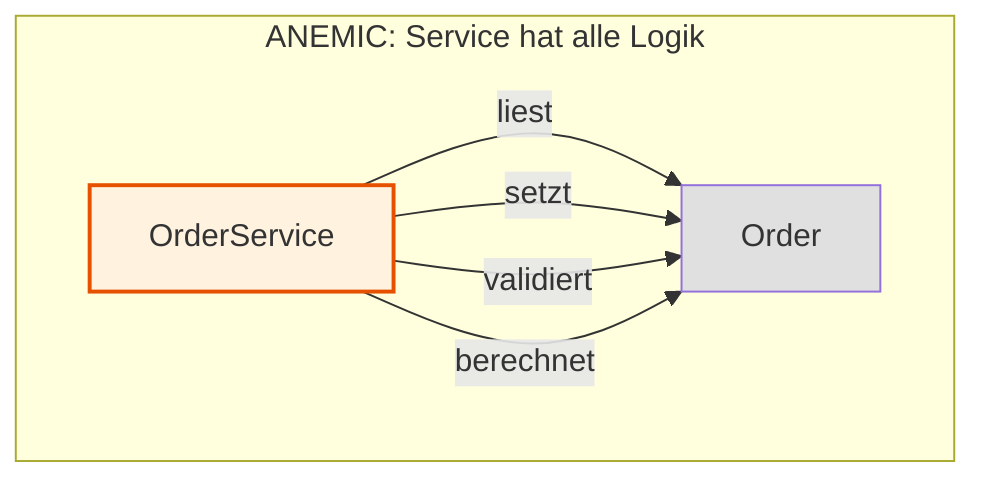
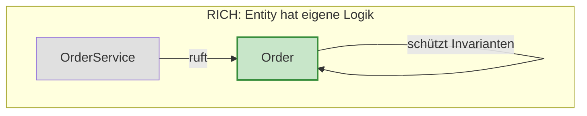
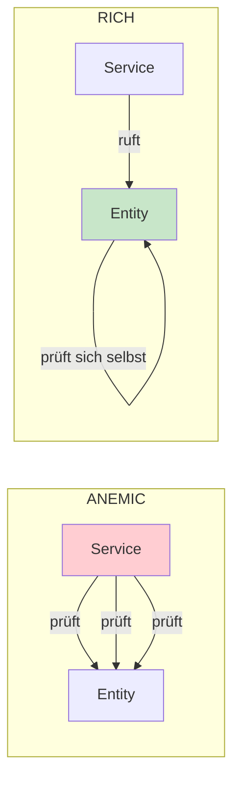
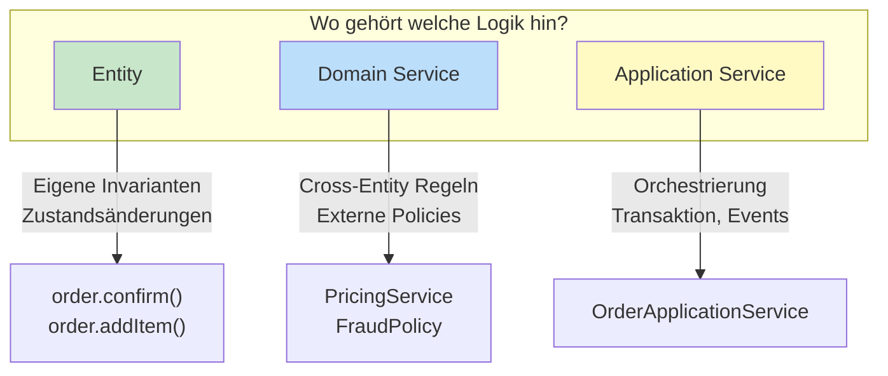
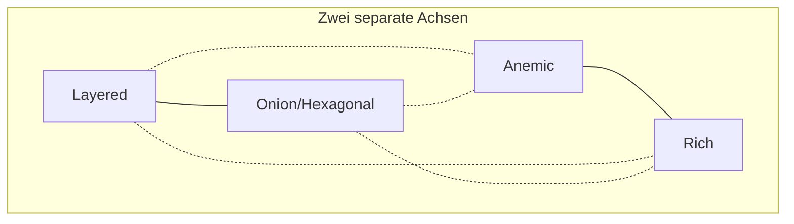
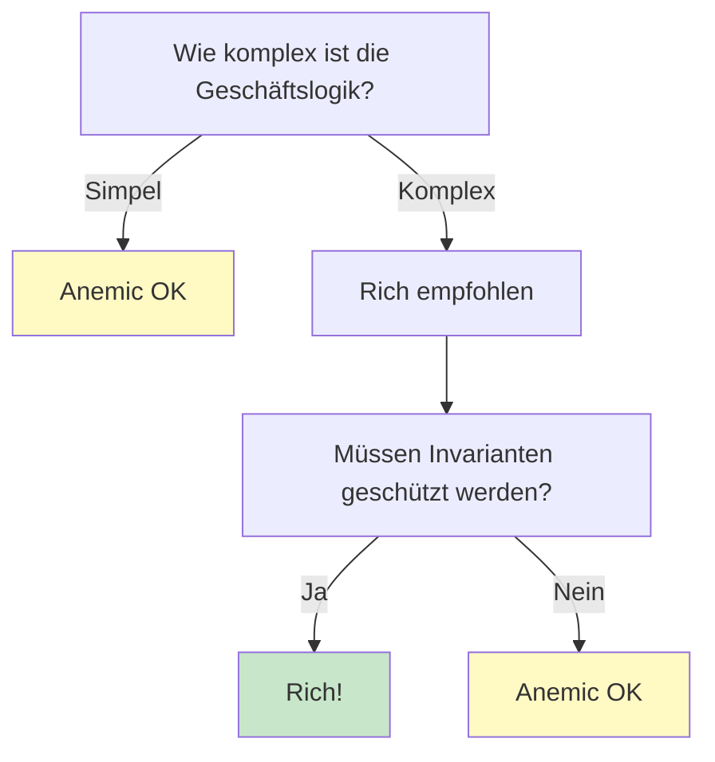

# Rich vs Anemic Domain Model

Dieses Tutorial erklärt den Unterschied zwischen **Rich** und **Anemic Domain Models** - und warum das oft mit Architektur (Onion/Layered) verwechselt wird.

---

## Inhaltsverzeichnis

1. [Was ist ein Domain Model?](#1-was-ist-ein-domain-model)
2. [Was sind Invarianten?](#2-was-sind-invarianten)
3. [Anemic Domain Model](#3-anemic-domain-model)
4. [Rich Domain Model](#4-rich-domain-model)
5. [Der Vergleich](#5-der-vergleich)
6. [Wohin mit komplexer Logik? (Domain Services)](#6-wohin-mit-komplexer-logik-domain-services)
7. [Das Missverständnis: Architektur ≠ Domain Model](#7-das-missverständnis-architektur--domain-model)
8. [Warum Spring Boot oft zu Anemic führt](#8-warum-spring-boot-oft-zu-anemic-führt)
9. [Wann welches Model?](#9-wann-welches-model)

---

## 1. Was ist ein Domain Model?

Das Domain Model sind deine **Geschäftsobjekte** - die Klassen, die deine Fachlichkeit abbilden:

```
Order, OrderItem, Product, Customer, Money, Address, ...
```

Die Frage ist: **Wo liegt die Geschäftslogik?**



---

## 2. Was sind Invarianten?

### Definition

> **Invariante = Eine Regel, die IMMER gelten muss.**

Eine Invariante ist eine Bedingung, die zu jedem Zeitpunkt wahr sein muss - egal welche Operation ausgeführt wird.

### Beispiele für Invarianten

| Objekt | Invariante | Bedeutung |
|--------|-----------|-----------|
| `Order` | `items.size() > 0` wenn `CONFIRMED` | Eine bestätigte Bestellung muss mindestens einen Artikel haben |
| `Money` | `amount >= 0` | Geld kann nicht negativ sein |
| `OrderItem` | `quantity > 0` | Ein Artikel muss mindestens einmal bestellt werden |
| `Account` | `balance >= overdraftLimit` | Konto darf Überziehungsrahmen nicht überschreiten |

### Warum sind Invarianten wichtig?

**Beispiel: Was passiert ohne Schutz?**

```java
// Irgendwo im OrderService...
public void confirmOrder(Long orderId) {
    Order order = orderRepository.findById(orderId);
    order.setStatus(OrderStatus.CONFIRMED);
    orderRepository.save(order);
}

// Irgendwo anders im OrderService (oder einem anderen Service)...
public void removeAllItems(Long orderId) {
    Order order = orderRepository.findById(orderId);
    order.getItems().clear();
    orderRepository.save(order);
}

// Was passiert wenn beide Methoden aufgerufen werden?
// → Bestätigte Bestellung OHNE Artikel in der DB!
```



**Das Problem:** Zwei unabhängige Methoden können das Objekt in einen ungültigen Zustand bringen, weil die Entity ihre Invariante nicht selbst schützt.

### Die Kernfrage bei Rich vs Anemic

| Wer schützt die Invarianten? | Modell |
|------------------------------|--------|
| **Service** muss aufpassen | Anemic |
| **Entity** schützt sich selbst | Rich |

```java
// ANEMIC: Service muss die Invariante kennen und prüfen
public void confirmOrder(Order order) {
    if (order.getItems().isEmpty()) {  // Service kennt die Regel
        throw new EmptyOrderException();
    }
    order.setStatus(CONFIRMED);  // Hoffentlich hat niemand vorher items geleert...
}

// RICH: Entity schützt ihre eigene Invariante
public void confirm() {
    if (items.isEmpty()) {  // Entity prüft selbst
        throw new EmptyOrderException(id);
    }
    this.status = CONFIRMED;  // Sicher, weil Entity sich selbst schützt
}
```

---

## 3. Anemic Domain Model

### Definition

> **Anemic = Blutarm.** Die Entities haben keine Logik - nur Daten.


### So sieht es aus

```java
// Entity: NUR Daten, keine Logik
public class Order {
    private Long id;
    private CustomerId customerId;
    private List<OrderItem> items;
    private OrderStatus status;

    // Nur Getter und Setter!
    public Long getId() { return id; }
    public void setId(Long id) { this.id = id; }

    public OrderStatus getStatus() { return status; }
    public void setStatus(OrderStatus status) { this.status = status; }

    public List<OrderItem> getItems() { return items; }
    public void setItems(List<OrderItem> items) { this.items = items; }
}
```

```java
// Service: ALLE Logik liegt hier
public class OrderService {

    public void confirmOrder(Order order) {
        // Validierung im Service
        if (order.getItems() == null || order.getItems().isEmpty()) {
            throw new EmptyOrderException();
        }

        // Status-Änderung im Service
        order.setStatus(OrderStatus.CONFIRMED);

        // Berechnung im Service
        BigDecimal total = BigDecimal.ZERO;
        for (OrderItem item : order.getItems()) {
            total = total.add(item.getPrice().multiply(item.getQuantity()));
        }

        orderRepository.save(order);
    }
}
```

### Das Muster



**Die Entity ist nur ein Daten-Container** - wie eine Datenbank-Zeile mit Gettern/Settern.

---

## 4. Rich Domain Model

### Definition

> **Rich = Reich an Verhalten.** Die Entities enthalten ihre eigene Logik.


### So sieht es aus

```java
// Entity: Daten UND Logik zusammen
public class Order {
    private final OrderId id;
    private final CustomerId customerId;
    private final List<OrderItem> items;
    private OrderStatus status;

    // Private Constructor - Factory Methods erzwingen
    private Order(OrderId id, CustomerId customerId) {
        this.id = id;
        this.customerId = customerId;
        this.items = new ArrayList<>();
        this.status = OrderStatus.DRAFT;
    }

    public static Order create(OrderId id, CustomerId customerId) {
        return new Order(id, customerId);
    }

    // Geschäftslogik IN der Entity
    public void confirm() {
        if (items.isEmpty()) {
            throw new EmptyOrderException(id);
        }
        if (status == OrderStatus.CONFIRMED) {
            throw new OrderAlreadyConfirmedException(id);
        }
        this.status = OrderStatus.CONFIRMED;
    }

    public void addItem(ProductId productId, Quantity quantity, Money price) {
        if (status == OrderStatus.CONFIRMED) {
            throw new OrderAlreadyConfirmedException(id);
        }
        items.add(OrderItem.create(productId, quantity, price));
    }

    public Money calculateTotal() {
        return items.stream()
            .map(OrderItem::getSubtotal)
            .reduce(Money.ZERO, Money::add);
    }

    // Keine Setter! Nur kontrollierte Methoden.
    public OrderId getId() { return id; }
    public OrderStatus getStatus() { return status; }
    public List<OrderItem> getItems() {
        return Collections.unmodifiableList(items);  // Immutable!
    }
}
```

```java
// Service: Nur Orchestrierung, keine Geschäftslogik
public class OrderService {

    public void confirmOrder(OrderId orderId) {
        Order order = orderRepository.findById(orderId)
            .orElseThrow(() -> new OrderNotFoundException(orderId));

        order.confirm();  // Logik ist IN der Entity!

        orderRepository.save(order);
    }
}
```

### Das Muster



**Die Entity ist ein vollwertiges Objekt** - sie kennt ihre Regeln und schützt sich selbst.

---

## 5. Der Vergleich

### Code-Vergleich: Order bestätigen

**ANEMIC:**
```java
// Service macht alles
public void confirmOrder(Order order) {
    if (order.getItems().isEmpty()) {          // Service validiert
        throw new EmptyOrderException();
    }
    if (order.getStatus() == CONFIRMED) {      // Service prüft Status
        throw new AlreadyConfirmedException();
    }
    order.setStatus(OrderStatus.CONFIRMED);    // Service ändert Status
}
```

**RICH:**
```java
// Entity macht es selbst
public void confirm() {
    if (items.isEmpty()) {                     // Entity validiert sich
        throw new EmptyOrderException(id);
    }
    if (status == CONFIRMED) {                 // Entity prüft sich
        throw new AlreadyConfirmedException(id);
    }
    this.status = OrderStatus.CONFIRMED;       // Entity ändert sich
}

// Service ruft nur auf
order.confirm();
```

### Übersichtstabelle

| Aspekt | Anemic | Rich |
|--------|--------|------|
| **Logik liegt in** | Service | Entity |
| **Entity ist** | Daten-Container | Vollwertiges Objekt |
| **Setter** | Public, überall nutzbar | Keine/Private |
| **Validierung** | Im Service | In der Entity |
| **Invarianten** | Service muss aufpassen | Entity schützt sich selbst |
| **Getter** | Geben alles preis | Oft immutable Collections |

### Wo liegt die Validierung?



---

## 6. Wohin mit komplexer Logik? (Domain Services)

### Das Problem: Entity wird zu groß

Ein häufiger Fehler beim Rich Domain Model: **Alles** wird in die Entity gepackt.

```java
// ANTI-PATTERN: Entity wird zum "God Object"
public class Order {
    public void confirm() { ... }
    public void cancel() { ... }
    public void calculateTotal() { ... }
    public void applyDiscount(DiscountCode code) { ... }
    public void checkFraud() { ... }           // Braucht externe Daten!
    public void validateCredit() { ... }       // Braucht externe Daten!
    public void checkInventory() { ... }       // Braucht externe Daten!
    public void sendConfirmationEmail() { ... } // Infrastruktur!
    // ... 500+ Zeilen Logik
}
```

### Die Lösung: Drei Arten von Logik unterscheiden

| Logik-Art | Gehört in | Beispiel |
|-----------|-----------|----------|
| **Entity-Logik** | Entity | `order.confirm()`, `order.addItem()` |
| **Domain Service** | Domain Layer | `OrderPricingService`, `FraudCheckPolicy` |
| **Application Service** | Application Layer | Transaktion, Laden/Speichern, Events |



### Beispiel: Order bestätigen mit Kreditprüfung

**Falsch:** Alles in Entity (braucht externe Abhängigkeiten)

```java
public class Order {
    public void confirm(CreditService creditService, InventoryService inventory) {
        if (!creditService.hasCredit(customerId, calculateTotal())) {
            throw new InsufficientCreditException();
        }
        if (!inventory.isAvailable(items)) {
            throw new OutOfStockException();
        }
        this.status = CONFIRMED;
    }
}
```

**Richtig:** Entity + Domain Service + Application Service

```java
public class Order {
    public void confirm() {
        if (items.isEmpty()) {
            throw new EmptyOrderException(id);
        }
        this.status = CONFIRMED;
    }
    
    public Money calculateTotal() {
        return items.stream()
            .map(OrderItem::getSubtotal)
            .reduce(Money.ZERO, Money::add);
    }
}

public class OrderConfirmationPolicy {
    private final CreditCheckService creditCheck;
    private final InventoryService inventory;
    
    public boolean canConfirm(Order order, Customer customer) {
        if (!creditCheck.hasCredit(customer, order.calculateTotal())) {
            return false;
        }
        return inventory.isAvailable(order.getItems());
    }
}

public class OrderApplicationService {
    public void confirmOrder(OrderId orderId) {
        Order order = orderRepository.findById(orderId).orElseThrow();
        Customer customer = customerRepository.findById(order.getCustomerId()).orElseThrow();
        
        if (!confirmationPolicy.canConfirm(order, customer)) {
            throw new OrderCannotBeConfirmedException(orderId);
        }
        
        order.confirm();
        
        orderRepository.save(order);
        eventPublisher.publish(new OrderConfirmedEvent(orderId));
    }
}
```

### Heuristik: Was gehört wo?

| Frage | Ja → | Nein → |
|-------|------|--------|
| Braucht es nur Daten aus der Entity selbst? | Entity | Weiter prüfen |
| Braucht es Daten aus anderen Aggregaten? | Domain Service | Entity |
| Braucht es externe Systeme (API, DB-Query)? | Application Service orchestriert | Domain Service |
| Ist es reine Infrastruktur (Email, Logging)? | Application Service | Domain |

### Wie viele Zeilen pro Entity?

Es gibt keine fixe Regel, aber Heuristiken:

| Entity-Größe | Bewertung | Aktion |
|--------------|-----------|--------|
| < 100 Zeilen | ✅ Gut | - |
| 100-200 Zeilen | ⚠️ Aufpassen | Prüfen ob Domain Services helfen |
| 200-500 Zeilen | ⚠️ Kritisch | Refactoring planen |
| > 500 Zeilen | ❌ Zu groß | Aufteilen in Aggregate/Services |


**Warnsignale für "zu viel Logik in Entity":**
- Entity braucht Abhängigkeiten im Konstruktor (Services, Repositories)
- Methoden brauchen viele externe Parameter
- Logik ist nicht testbar ohne Mocks
- Entity kennt Konzepte außerhalb ihres Aggregats

---

## 7. Das Missverständnis: Architektur ≠ Domain Model

### Oft gehört:

> "Onion Architecture = Rich Domain Model"
> "Layered Architecture = Anemic Domain Model"

### Die Wahrheit:

**Das sind zwei unabhängige Entscheidungen!**



### Alle Kombinationen sind möglich

| Architektur | Domain Model | Möglich? | Häufigkeit |
|-------------|--------------|----------|------------|
| Layered | Anemic | ✅ | ⭐⭐⭐⭐⭐ Sehr häufig |
| Layered | Rich | ✅ | ⭐⭐ Selten |
| Onion | Anemic | ✅ | ⭐ Sehr selten |
| Onion | Rich | ✅ | ⭐⭐⭐⭐ Häufig |

### Warum die Korrelation?

**Onion fördert Rich Models:**
- Core hat keine Framework-Abhängigkeiten
- Entities sind "rein" - keine `@Entity`, `@Column`
- Natürlicher, Logik in Entities zu packen

**Layered + Spring Boot fördert Anemic:**
- JPA Entities brauchen Default-Constructor
- JPA braucht Setter für Hydration
- Annotationen "verschmutzen" die Entity
- "So macht man das halt" - Gewohnheit

**Aber:** Das ist Korrelation, keine Kausalität!

---

## 8. Warum Spring Boot oft zu Anemic führt

### Das typische Spring Boot + JPA Setup

```java
@Entity
@Table(name = "orders")
public class Order {

    @Id
    @GeneratedValue(strategy = GenerationType.IDENTITY)
    private Long id;

    @Column(name = "customer_id")
    private Long customerId;

    @Enumerated(EnumType.STRING)
    private OrderStatus status;

    @OneToMany(mappedBy = "order", cascade = CascadeType.ALL)
    private List<OrderItem> items;

    protected Order() {}

    public void setStatus(OrderStatus status) {
        this.status = status;
    }
}
```

### Die Probleme (und Nuancen!)

| JPA-Anforderung | Problem | Workaround |
|-----------------|---------|------------|
| Default-Constructor nötig | Kann ungültige Objekte erzeugen | `protected` oder package-private |
| Setter "nötig" | Jeder kann Status ändern | **Falsch!** Field Access nutzen |
| Annotations | Entity wird Infrastructure-Concern | Trennung Domain/JPA Entity |
| Lazy Loading | Entity braucht Session-Kontext | DTOs oder Projektionen für Queries |

> **Wichtig:** JPA braucht **keine** Setter! Mit Field Access (`@Access(AccessType.FIELD)`) greift JPA direkt auf private Felder zu.

### JPA mit Rich Model - es geht!

```java
@Entity
@Access(AccessType.FIELD)
public class Order {
    
    @Id
    private Long id;
    
    @OneToMany(cascade = CascadeType.ALL)
    private List<OrderItem> items = new ArrayList<>();
    
    @Enumerated(EnumType.STRING)
    private OrderStatus status = OrderStatus.DRAFT;
    
    protected Order() {}
    
    public Order(Long id) {
        this.id = Objects.requireNonNull(id);
    }
    
    public void confirm() {
        if (items.isEmpty()) {
            throw new EmptyOrderException(id);
        }
        this.status = OrderStatus.CONFIRMED;
    }
    
    public List<OrderItem> getItems() {
        return Collections.unmodifiableList(items);
    }
}
```

### Der Ausweg bei maximaler Trennung

Wenn die JPA-Annotationen stören oder komplexes Mapping nötig ist:

```
Domain Entity (Rich)     ←→     JPA Entity (Anemic)
     Order                         OrderJpaEntity

Geschäftslogik                  Persistenz-Mapping
```

**Trade-offs dieser Trennung:**

| Vorteil | Nachteil |
|---------|----------|
| Sauberes Domain Model | Mapping-Aufwand |
| Keine JPA im Core | Mehr Boilerplate |
| Einfacher testbar | Inkonsistenz-Gefahr beim Mapping |

**Empfehlung:** Starte mit JPA-Annotationen im Domain Model. Trenne erst, wenn es echte Probleme gibt.

---

## 9. Wann welches Model?


### Anemic ist OK wenn:

- CRUD-Anwendung mit wenig Logik
- Prototyp / MVP
- Reporting / Admin-UIs (nur Lesen/Anzeigen)
- Team kennt nur diesen Stil
- Logik ist wirklich simpel

### Rich ist besser wenn:

- Komplexe Geschäftsregeln
- Invarianten müssen geschützt werden
- Domain-Driven Design
- Langlebiges System
- Mehrere Teams arbeiten am Code

### Entscheidungshilfe



### Detaillierte Entscheidungskriterien

| Kriterium | → Anemic | → Rich |
|-----------|----------|--------|
| Komplexität | CRUD, wenig Regeln | Viele Geschäftsregeln |
| Invarianten | Keine/wenige | Müssen zur Laufzeit geschützt werden |
| Änderungsrate der Regeln | Selten | Häufig (bessere Kapselung hilft) |
| Teststrategie | Integration Tests reichen | Unit Tests für Domain wichtig |
| Team-Erfahrung | Unerfahren mit DDD | Erfahren mit OOP/DDD |
| Lebensdauer | Kurzlebig/Prototyp | Langlebiges Produkt |
| Konsistenz | Eventual OK | Starke Konsistenz nötig |

---

## Zusammenfassung

| Frage | Antwort |
|-------|---------|
| **Was ist Anemic?** | Entities nur mit Daten, Logik im Service |
| **Was ist Rich?** | Entities mit Daten UND Logik |
| **Was sind Invarianten?** | Regeln, die immer gelten müssen (z.B. Order braucht Items wenn CONFIRMED) |
| **Wohin mit cross-aggregate Logik?** | Domain Services / Policies im Domain Layer |
| **Ist Anemic schlecht?** | Nicht per se - hängt vom Kontext ab |
| **Ist Onion = Rich?** | Nein! Aber Onion fördert Rich Models |
| **Warum oft Anemic?** | Spring Boot + JPA macht es einfacher (aber es geht auch anders!) |

### Der Kern-Unterschied in einem Satz:

> **Anemic:** Der Service sagt der Entity, was sie tun soll.
> **Rich:** Die Entity weiß selbst, was sie tun kann.

### Die drei Logik-Schichten:

| Schicht | Verantwortung | Beispiel |
|---------|---------------|----------|
| **Entity** | Eigene Invarianten, Zustandsänderungen | `order.confirm()` |
| **Domain Service** | Cross-aggregate Regeln, Policies | `FraudCheckPolicy` |
| **Application Service** | Orchestrierung, Transaktion, Events | `OrderApplicationService` |

---

### Pragmatismus-Hinweis

> **Wichtig:** Weder Anemic noch Rich ist "richtig" oder "falsch".
>
> - Ein funktionierendes Anemic-Projekt ist besser als ein over-engineertes Rich-Projekt
> - Du kannst Anemic und Rich im selben Projekt mischen (z.B. Rich für Order, Anemic für AuditLog)
> - Der Übergang von Anemic zu Rich kann inkrementell erfolgen: Starte mit einer Entity
> - Value Objects (Money, OrderId) sind ein Quick Win - auch in Anemic-Projekten
>
> **Faustregel:** Wenn du im Service mehr als 3 `if (entity.getX() == Y)` Prüfungen hast, bevor du etwas änderst, gehört diese Logik in die Entity.

---

## Weiterführend

- [tutorialOnion.md](tutorialOnion.md) - Onion Architecture erklärt
- [tutorialHexagonal.md](tutorialHexagonal.md) - Hexagonal Architecture erklärt
- [tutorialPackaging.md](tutorialPackaging.md) - Package-Strukturen erklärt
